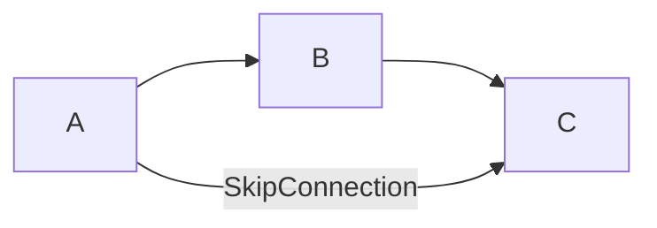

Test post for fancy Markdown with LaTeX & Mermaid.

<!--more-->

| Column 1 | Column 2 |
|----------|----------|
| a        | b        |

- Item 1
- Item 2
  - Item 2.1
  - Item 2.2
- Item 3

Success
{:.success}

$$
\text{ReLU(x)}=
\begin{cases}
x&x\ge 0\\
0&x\lt 0\\
\end{cases}
$$

