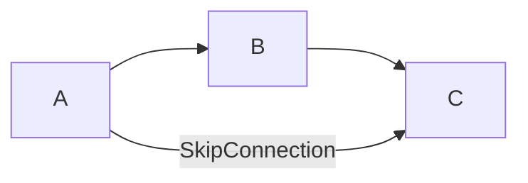

Test post for fancy Markdown with LaTeX & Mermaid.

<!--more-->

| Item Index | Item Name |
|------------|-----------|
| 1          | Apple     |
| 2          | Grapes    |

- Item 1
- Item 2
  - Item 2.1
  - Item 2.2
- Item 3

Success Message
{:.success}

{:.circle.shadow}

$$
\text{ReLU(x)}=
\begin{cases}
x&x\ge 0\\
0&x\lt 0\\
\end{cases}
$$

