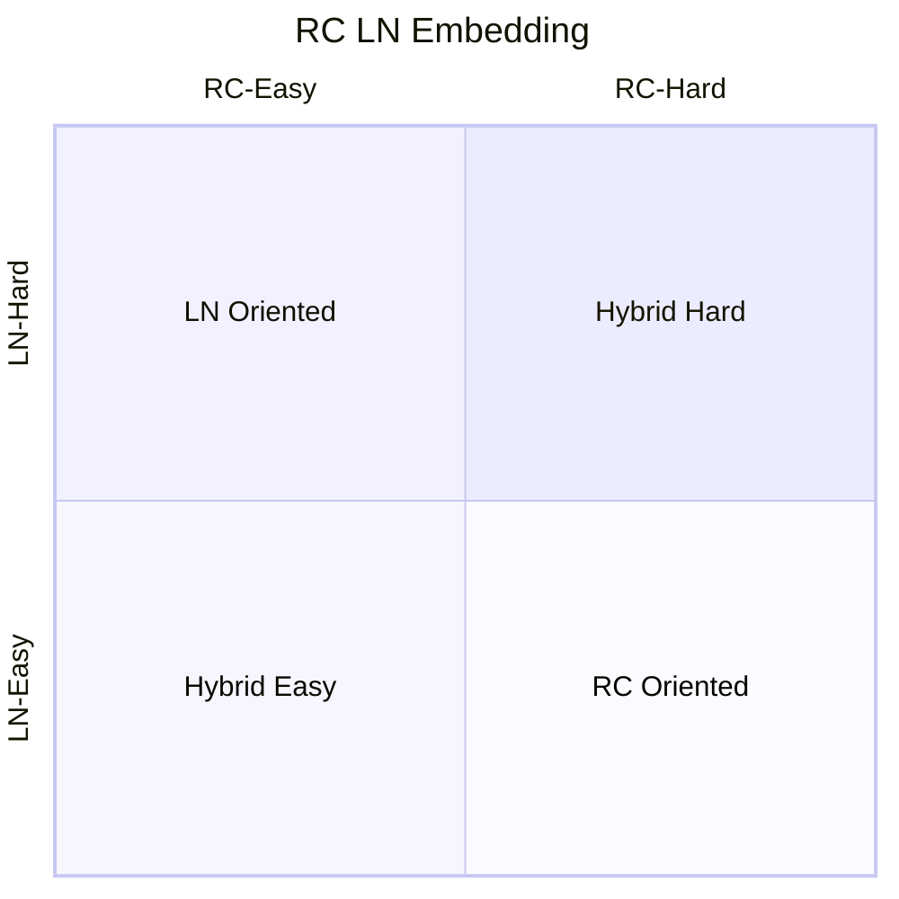
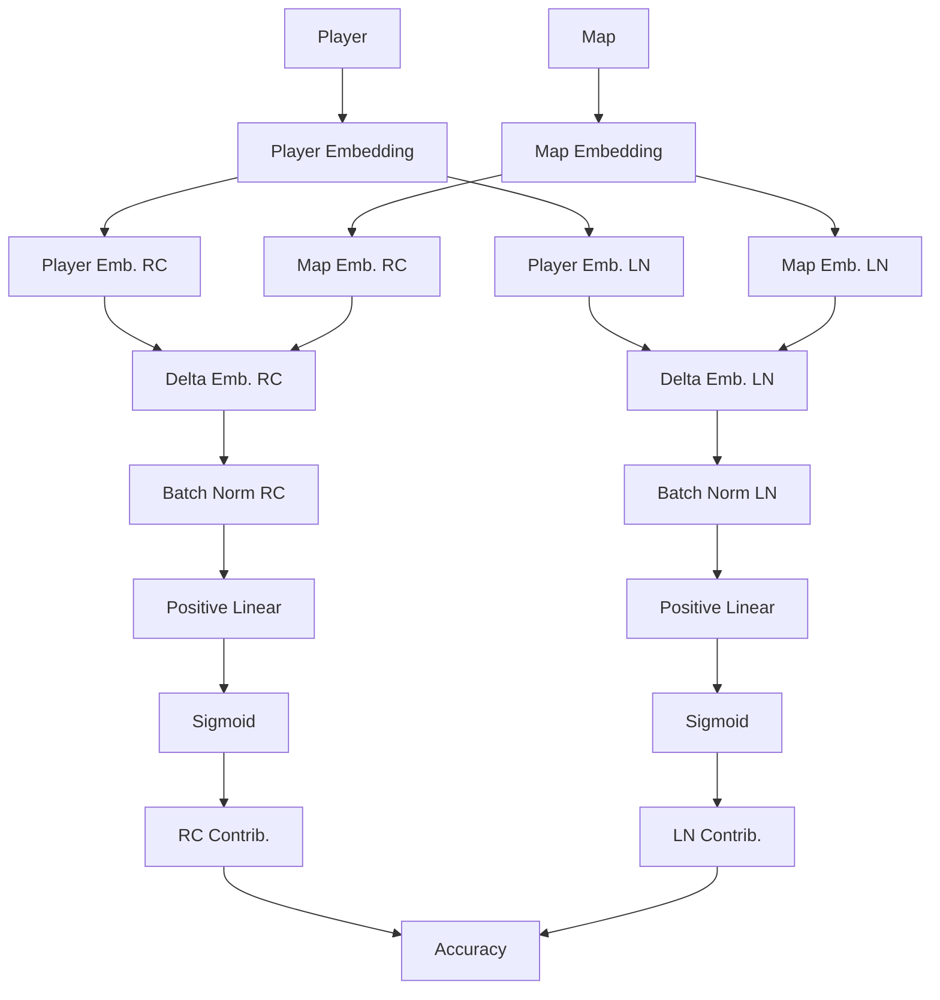

How we created opal v2, and most importantly, how we avoided the black-box
problem by guiding the optimization with LN Ratio priors, and Positive Weight
constraints within the network.

<!--more-->
> Hello friends, thanks for checking out this post! This is still
> work-in-progress, thus writing will be rough and information will be lacking.

# Introduction

## Map Difficulty Estimation

Vertical Scrolling Rhythm Games (VSRGs) usually runs into the problem of
automating difficulty estimation of beatmaps, a custom-made rhythm game level
accompanied with a song (which we will refer to as maps). This is largely due to
the fact that many proposed approaches rely on disambiguating extremely
high-dimenional representation of a map, which falls into 2 major categories

1. The approach is too simple, leading to underfitting of niche maps.
2. The approach is too complex, leading to overfitting of some maps, which
   severely imbalances the inferred leaderboards. Furthermore, complex rules
   leads to low explainability and difficulty of maintenance.

Thus, many games, such as O2Jam, Pump It Up, Chunithm, resolve to manually
estimating the difficulty by hand. This approach, while easier, must be well
regulated by a consistent team of experts to avoid incorrect labelling, and
unintended shift of perceived difficulty over time.

Other VSRGs that runs on community-made maps do not have the luxury of these
experts, and must rely on algorithmic approaches, as manually labelled maps are
prone to bad-will tampering.

## Player Skill Estimation

Additionally, the estimation of competence of players, measured by accuracy of
plays (which we will refer to as Skill), is also a target of interest in
competitive games. VSRGs often combine the estimated Map Difficulty, alongside
the accuracy achieved to evaluate the final Skill Level metric of each player.

A complexity of measurement of Player Skill, not only suffers possible incorrect
Map Difficulty estimation, but may not have sufficient, and consistent data to
estimate Skill Level.

1. Despite the same player, accuracies achieved will always be sampled from some
   unknown distribution.
2. Leaderboards often only save the best score, which makes distribution
   estimation difficult.
3. Players often don't play many of the maps, estimating for players with less
   plays is difficult
4. Players continually improve and deprove, thus the assumption that each player
   has a distinct skill level doesn't hold.

## An Alternative Approach

Therefore, the task of ranking the performance of players & difficulties of
maps, is often extremely complex. As shown above, this is largely due to
approaches stemming from maps.

We take an alternative approach in this paper, which is to perform Collaborative
Filtering on the many leaderboard Accuracy records. We hypothesize that given
sufficient information, the solution if well generalized, can inform a good
prediction of Accuracy. This can then provide a good estimate on player Skill
and map Difficulty.

We fit an embedding-driven model that minimizes score prediction error, which
yields an optimal embedding vector for each player and map. This vector exists
in the shared learned feature space $\Omega$, in which their displacement
well-informs their "Skill Level".

To improve explainability, we set reasonable constraints to the learned feature
space, such as:

1. Positive Embeddings indicate high "Skill Level"
2. The displacement difference of Player and Map is proportional to "Accuracy"
3. Extremely low Embedding Space dimensionality

Setting these constraints also increases regularization and convergence, we
found these experiments often converge more consistently and quickly.

### Departations from Collaborative Filtering

The closest related task in this field is Collaborative Filtering (CF), which
aims to predict scores by evaluating feature neighbours. To draw parallel to CF
terms, Players are "Users", and maps known as "Items", with accuracy known as "
Score".

A common CF use case is in Recommendation Systems. For example, a task could be
to predict user is predicted to rate an unseen movie (item) high, it'll be
recommended to them in their "For You" page.

One of the most important departations of CF from our VSRG problem, is that if a
player is far away from a map it could mean 2 different things:

1. The player is skillful enough to easily achieve a high accuracy
2. The player doesn't have enough skill to play the map properly

Without modification this will fail. Accuracy is predicted by the dot product,
which maximizes when embeddings with equal magnitude are both aligned. In our
approach, we create a custom function that takes in displacement that maps to
accuracy. Furthermore, to enforce embedding alignment, we use a positive weight
constraint, we discuss further later how we achieved it.

## Our Contributions

We will demonstrate a simple custom network architecture that not only achieves
low error in score prediction, but also provides valuable insights in map
difficulty and player skill estimation when embeddings are learnt.

### Structure

This paper, for important components are written high-level, supplemented with
low-level proof in their subsections.

# Opal

Unlike many Neural Network design approaches, opal prioritizes explainability,
over highly-accurate models.
Therefore, parameter choices are carefully selected with opal, and we'll explain
all decision choices in the following sections.

## Related Work

The landscape of VSRG ML is scarce, as admittedly, not much value is gained from
uncoverring this mystery.

Some common solutions in untangling this mess:

- AlphaOsu: A recommendation system that can be considered an adverserial
  approach against the current algorithm, it suggests maps to players that will
  provide the largest gain in measured "Skill". We say "adverserial" as the game
  target (osu!mania) doesn't have an optimal difficulty calculation algorithm,
  this means that the best recommendations are often due to flaws in the
  difficulty calculation.
- MugDiffusion: A map generation algorithm based on Stable Diffusion. It learns
  from existing maps by encoding them with a Variational AutoEncoder (VAE),
  trains a denoising model on these embeddings, and generates maps with a
  similar approach to many Diffusion networks. The key takeaway we found from
  this is that VAE is a potential target for encoding the complex
  high-dimensional map, and can be considered as an additional input to opal in
  further research.
- ELO-Based Approach: (We do not have an exact source) The ELO approach is based
  heavily off of Chess games, where an ELO system is updated based on results of
  tournament matches. The dataset, when scraped from tournaments, is often
  reliable as players can be assumed with high confidence that they are playing
  at a consistent skill, which is an important assumption for CF. However, this
  method falls short in extrapolating to unseen maps and players.
- Opal (V1): A score recommendation system, which this paper supersedes. This
  approach naively implements NeuMF, a class of Neural Collaborative Filtering
  networks, which we found only worked as we highly-parameterized the embedding
  space. The fundamental flaw was that player and map embeddings were compared
  with dot-product, losing its directional component, we hypothesize that our
  extremely high embeddings made up for this error.

Built upon lessons learned from opal v1, we not only want to provide a
score-recommendation system, we also want to provide explainable introspection
to the embeddings.

## Background

In our CF problem, we can construct our optimization function:

$$
\frac{1}{MP}\sum_i^P\sum_j^M \mathbb{E}
_a\left[\ell(f(p_i, m_j), a_{i,j})\right]: a_{i,j}\sim A(\theta_{i,j})
$$

Where:

- $P$: Number of Players
- $M$: Number of Maps
- $f$: Predictor function
- $p_i$: $i^{th}$ player
- $m_j$: $j^{th}$ map
- $a_{i,j}$: Actual accuracy, sampled from $A(\theta_{i,j})$. (A player playing
  a map is sampling)
- $A(\theta_{i,j})$: Accuracy distribution for the $i^{th}$ player, $j^{th}$
  map.
- $\ell$ is our loss function between the prediction and actual accuracy

The function attempts to minimize the error for the predictor $f$, however, many
caveats starts to surface:

- We don't know the distribution $A$ and how $\theta$ is even parameterizing it.
- We don't have all $p_i, m_j$ for all $i, j$ combinations (not all players have
  played all maps).

### Maximal Score Simplification

We thus target a much more simpler function, which more closely aligns with the
data we possess.

$$
\begin{align}
&\frac{1}{MP}\sum_i^P\sum_j^M\ell(f(p_i, m_j), \hat{a}_{i,j})\\
&: \hat{a}_{i,j}=
\max(\{a_1, a_2, ..., a_L\}), a
\sim A(\theta_{i,j})
\end{align}
$$

We modified it such that the accuracy metric is yield from the maxima of $L$
records in the leaderboards. This function is not equivalent to the prior
equation, however this compromise must be made to conform to possible datasets.

This new function will now optimize to predict the **best** accuracy possible
instead of the most likely (mean). There's not enough hard evidence to dissuade
from using the sampled maxima over the mean as a feature to infer player skill
and map difficulty. Therefore, we still used this as the target.

### Missing Score Simplification

As mentioned, many scores are missing, which is also a reason why we use CF. To
overcome this, we simply minimize the function across only our observed samples

$$
\frac{1}{N}\sum_i^N\ell(f(p_i, m_i), \hat{a}_i)
$$

This comes with its own issues too as we observe that:

- Some players play more than others, therefore minimizing uniformly will
  suppress information by players that play less
- Some maps have less plays, therefore will likely have large variance in
  estimated performance, which can lead to large errors in Map Difficulty
  estimates.

This calls for a way to somehow balance the optimization problem.

Going back to the fundamentals, it'll be optimal to yield players and maps that
is well distributed within some expected manifold within the feature space
$\Omega$. To make sure that the model doesn't overfit in certain regions, it's
vital to undersample heavily dense regions. However, it's not trivial to do so,
as the embeddings of players and maps are learnt on the fly, thus we don't even
have the criterion to weigh sampling importances. We do not perform this
on-the-fly sampling, though we hypothesize is a possible method to improve
generalization.

An alternative, simpler approach, is to weigh the sampling probability by the
number of maps the player has played, multiplied by the number of players the
map has been played, for each accuracy.

- $\mid p_i\mid$ represents the number of maps the player played,
- $\mid m_i\mid$ number of players that play the map

Where the unnormalized sampling probability $s=|m_i|\cdot|p_i|$.
This approach prevents the model from fixating on reducing losses for certain
players, this guides the model to reducing loss more uniformly across players
and maps, which can be assumed to be representative of the feature manifold.

On top of this, we need to avoid players and maps that has too little records,
as they are extremely prone to overfitting. Thus we filter out scores that have
low $\deg$ via $\tau$.

The optimization then is approximately.

$$
\frac{1}{N}\sum_i^N\left(\ell(f(p_i, m_i), \hat{a}_i)\cdot
\frac{|p_i|\cdot|m_i|}{N}\forall |p_i| \ge \tau_p \wedge |m_i| \ge \tau_m\right)
$$

We embed the sampling probability as a loss scaler here as an example, in
practice one would just perform sampling directly from the dataset.

### Feature Space

The feature space, we expect, is to be mainly driven by 2 known features, which
may contain more subfeatures. These 2 features: RC (Rice), LN (Long Note) are
unique and significant characteristics that divide player and map style. Thus we
expect good separation during embedding.



To guide the model to understand these 2 features, we use the **proportional
contribution** of RC and LN to accuracy, weighing each dimension by how much
they impact the resulting accuracy.
This **proportion** is yield from the map statistics, which counts how many RC
and LN notes are in the map. Each note contributes equally to the accuracy,
which is why we can simplify scale it by the ratio.

It's likely that these features has subfeatures that differentiate the
contributions of RC and LN further, however unlike the RC/LN proportion, we do
not have enough information to guide each feature. This poses a problem when
labelling each axis of a stochastic model, therefore, we avoid splitting it
further with Opal V2.

### Embeddings

We expect all our player and map vectors to reside within this 2-dimensional
feature space $RC,LN$. We denote their vector embeddings as $E_P, E_M$
respectively. We attempt to create a model $\Delta$ that maps the difference in
displacement $\Delta(E_P - E_M)$ to predict our accuracy vector $A$.

We expect that $\Delta$ to be a **positive-monotonous** function, as larger,
positive distances in each feature should contribute positively to higher
accuracies.
One of the troubles in enforcing this specific constraint is that creating a
sub-neural network to find this function will usually lead to a non-monotonic
solution. This is because embeddings are unconstraint, thus exists a solution
where $\Delta$ is negative-monotonous. And even a solution where the function
may not be monotonous at all. This is because weights in each Linear layer are
not always positive.

### Positive Weight Constraint for Embedding Guidance

To make sure that the network only searches for positive monotonic functions,
all weights must are positive. However, it's crucial that this constraint does
not impede learning.
To achieve this, we injected $\text{SoftPlus}(w)$ before the weights are fed
into the Linear layer.

We have tried other approaches, such as:

- $\exp(w)$: Which had the side-effect of discouraging low weights due to
  weight-decay. This means that the model will attempt to avoid low accuracies,
  which is not hollistic.
- $\text{ReLU}(w)$: While we found that this worked better than $\exp$, we
  didn't want to encourage dead neurons
- $\Phi(w)$: The inverse CDF of a normal distribution, while it works, it felt
  more complicated than necessary.

We implement this new Linear Layer like so, overriding the `forward`
of `nn.Linear` in PyTorch.

```
class PositiveLinear(nn.Linear):
    def __init__(self, in_features, out_features, bias=True):
        super().__init__(in_features, out_features, bias)
        self.fn = torch.nn.Softplus()

    def forward(self, x):
        return F.linear(x, self.fn(self.weight), self.bias)
```

While the function now is monotonous, its range is unbounded, to transform to
accuracy, we simply wrap it with sigmoid $\sigma$

`rc_emb` is the size of the RC feature space, we can create this transform with
the follow code.

```
self.delta_rc_to_acc = nn.Sequential(
		PositiveLinear(rc_emb, 1),
		nn.Sigmoid(),
)
```

Same goes with LN.

### Architecture

Following all this background, we can now finally construct the architecture:



## Results

### Detecting Gimmick Maps

One of the key problems with developing a score-prediction system, is that you
usually want to avoid training on maps with gimmicks, as they logically, throw
off the prediction accuracy.
However, after months of analyzing metrics to separate these maps from the pool,
there is no easy way to do so.

A simple logical assumption is that

1. For gimmick maps, some players will "defy" the order if they are good at the
   gimmick
2. This implies that the prediction errors of the map will be abnormally large
3. Therefore, if the map sees many high prediction errors, then the map is
   likely a gimmick map.

However, this trend isn't necessarily true

1. Gimmick maps, can be inferred as a "difficult" map, if **everyone** is
   finding difficult with the gimmick, it's not discernable from a difficult map
2. Gimmick maps, are avoided by players that don't plan to play gimmick maps.
   This means that those who play it tend to come from the same group, which are
   good at gimmicks. This will violate our assumption, where players "defy". If
   all players "defy", then they aren't defying any control group.

The unfortunate, yet best solution, is to simply train with them, or create a
blacklist of maps to avoid training on.

### Uncertainty

One way previously proposed to detect gimmicks is the uncertainty measure. This
measures how "unsure" the model is at predicting certain scores, we implement
this via the "Deep Ensembles" approach, with some modifications. There were some
problems getting the actual variance to scale, however, by inspection of the
order, we can see a clear trend for maps that have the highest uncertainty.

Here's the 5 maps with highest **MEDIAN** uncertainty.

- Kikuo - Gangu Kyou Sou Kyoku -Shuuen- (Lirai) [7K ADVANCED]
- xi - FREEDOM DiVE (razlteh) [Blocko's 7K Normal]
- REDALiCE - Acceleration (YunoFanatic) [Arcwin's 7K HD]
- James Landino & Kabuki - Birdsong (_Kobii) [AncuL's Hard]
- Sota Fujimori - polygon (Player0) [polyhedron]

Without domain knowledge, this is hard to explain, however those who've played
osu!mania long enough will know that:

1. All of these maps are **extremely easy**
2. `polygon` is an easy map, but also a gimmicked map!

However, if we took a look at some notable maps (fraction denotes their rank in
uncertainty

- Camellia - Singularity (Evening) [Technical Breakdown] 1623 / 2593: is a
  gimmick map. But it ranks roughly the middle of the uncertainty spectrum. This
  means that it's not possible to remove this without removing a lot of other
  maps.
- Aphex Twin - Avril 14th (webodan's 8-bit GXSCC cover) (Nivrad00) [Challenge]
  2103 / 2593: is not a gimmick map, but it's known to be a huge anomaly. It
  ranks quite low on uncertainty, which is great.
- Tokisawa Nao - BRYNHILDR IN THE DARKNESS -Ver. EJECTED- (
  NaxelCL) [Million's 7K EX] 2409 / 2593 : is odd, as it's a gimmick map,
  however, the bigger problem is the following
- Tokisawa Nao - BRYNHILDR IN THE DARKNESS -Ver. EJECTED- (
  NaxelCL) [Yuuto's 7K HD] 86 / 2593 : is also a gimmick map, but both have the
  same gimmicks.

This doesn't necessarily give us the silver bullet to remove gimmicks, however,
it's a decent feature to sort by, as it seems to filter them
