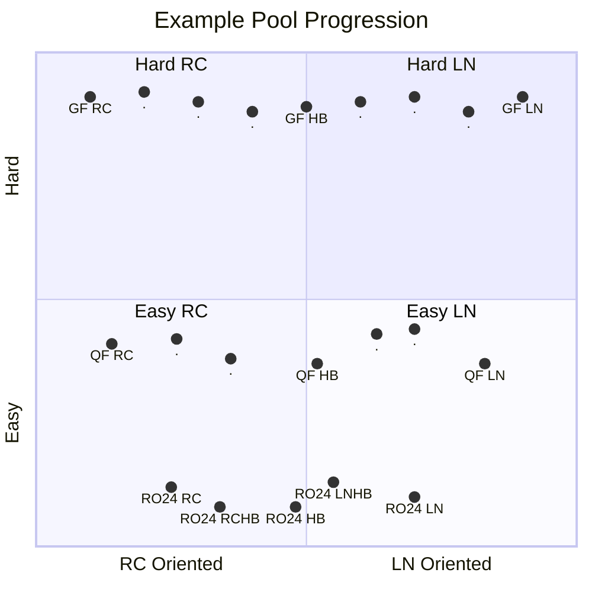
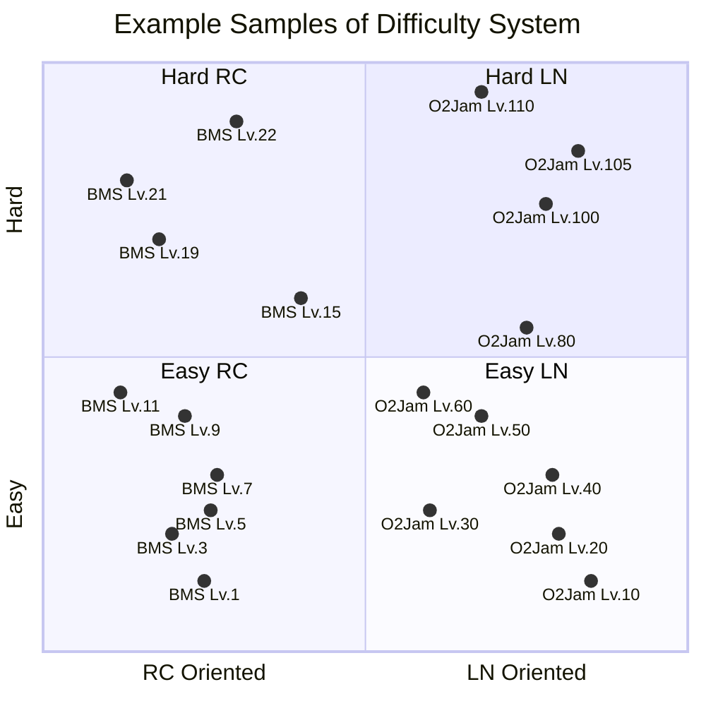

How could we statistically set a guideline for difficulty of each pool?

<!--more-->

# Visualizing the Pool Framework

Before we jump the gun on how we should approach defining pool difficulty
progression, we should revisit the fundamentals and motivations. There are 2
reasons why a well-regulated and well-defined difficulty is beneficial to a
tournament:

1. Players are **fairly** judged at every stage
2. Mappers and poolers will have an approximate reference on target difficulty,
   **reducing confusion**, improving **difficulty accuracy**.

There are 2 key dimensions of a pool:

1. **Depth**: The progression of the pool, difficulty of each stage.
2. **Width**: The diversity of the pool, the mapping style to target.

We can describe this using the following diagram:

We illustrate a few details in the quadrant above:

1. Easier rounds cover less width, while later covers more. This follows the
   idea that some skill-sets, especially niche ones, only occur in higher
   difficulties. Therefore, this will form a "cone-like" shape
2. Easier rounds tend to have fewer maps than later ones. This follows the above
   idea: in later rounds new skill-sets surface, therefore, a pool should adapt
   and cover more ground.

Assuming this ideal framework, we just have to find, or create maps that best
match the placements on the quadrant.

## Finding Appropriate Maps through Difficulty Systems

To find maps that best match these points, we need to have a well-recognized
definition for both axes, and this is where referencing a commonly used
*difficulty system* like **Stella**, **osu!mania Dans**, **O2Jam Level System**
comes in handy.

Similar to how we describe the pool, these *difficulty systems* tend to be:
1. **Deep in Depth**: These systems often consider a large span of difficulties
   that many players engage with.
2. **Narrow in Width**: However, they tend to only consider a smaller subset
   of patterns. For example, BMS Systems often focus on Rice, and O2Jam on LNs.

As an example, we may envision some samples of these systems like the following.

As shown, we do see how each difficulty system has good coverage in depth,
however because they focus on a certain play style, their width naturally is
thinner.

This diagram gives intuition on the difficulties that poolers/mappers face when
selecting/creating maps for the pool:
1. In the diagram, we assumed that certain O2Jam Levels equated to certain BMS
   levels. However, this is up to debate, experts that are accustomed to
   both systems should be consulted to balance.
2. We observe that difficulty systems tend to avoid the middle column. This
   intersection of styles is uncommon for several reasons we do not expand upon.
   But it's easy to see that if there's less reference points, more
   disagreements arise, and thus trustworthiness of difficulty accuracy
   is impeded.

Additionally, maps not in the dan courses, but yet are accurately manually rated
can be considered too!
{:.info}

