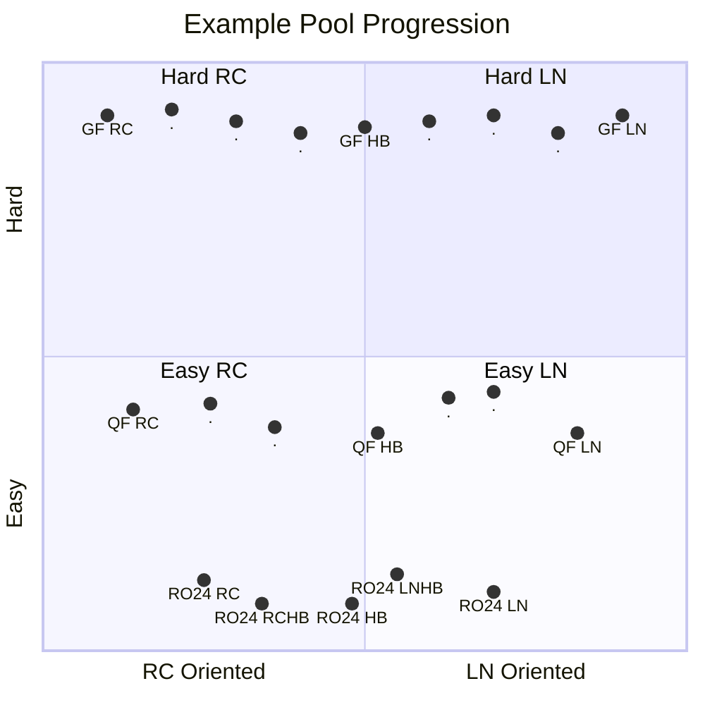
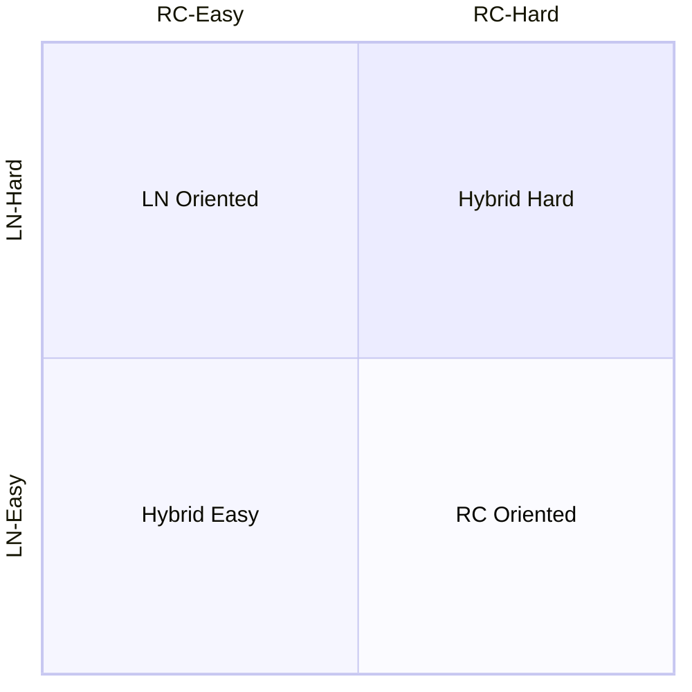

How could we statistically set a guideline for difficulty of each pool?

<!--more-->

# Visualizing the Pool Framework

Before we jump the gun on how we should approach defining pool difficulty
progression, we should revisit the fundamentals and motivations. There are many
reasons why a well-regulated and well-defined difficulty is beneficial to a
tournament:

1. Players are **fairly** judged at every stage
2. Mappers and poolers will have an approximate reference on target difficulty,
   **reducing confusion**, improving **difficulty accuracy**.

There are 2 key dimensions of a pool:

1. **Depth**: The progression of the pool, difficulty of each stage.
2. **Width**: The diversity of the pool, the mapping style to target.

We can describe this using the following diagram:

We illustrate a few details in the quadrant above:

1. Easier rounds cover less width, while later covers more. This follows the
   idea that some skill-sets, especially niche ones, only occur in higher
   difficulties. Therefore, this will form a "cone-like" shape
2. Easier rounds tend to have fewer maps than later ones. This follows the above
   idea: in later rounds new skill-sets surface, and form their own categories
   that are testable.

We can assume this as the ideal framework to design the pool, where we have to
find, or create maps that best match the placements on the quadrant.

---

One of the most common problems in tournament pooling is defining the optimal
difficulty of the pool at each stage. The most common, and simplest approach is
through using some difficulty chart, e.g. **Stella**, **osu!mania Dans**,
**O2Jam Level System**, etc.

Many benefits come from referencing a difficulty system, not only are those
Dan systems well recognized, many maps too, use these systems to define what
their map difficulties are. As a result, when the pooling team constructs a new
pool, they have many references to refine their map difficulty.

However, there are still some variables that are still free for poolers to
define.

1. The progression of difficulty from stage to stage
2.

