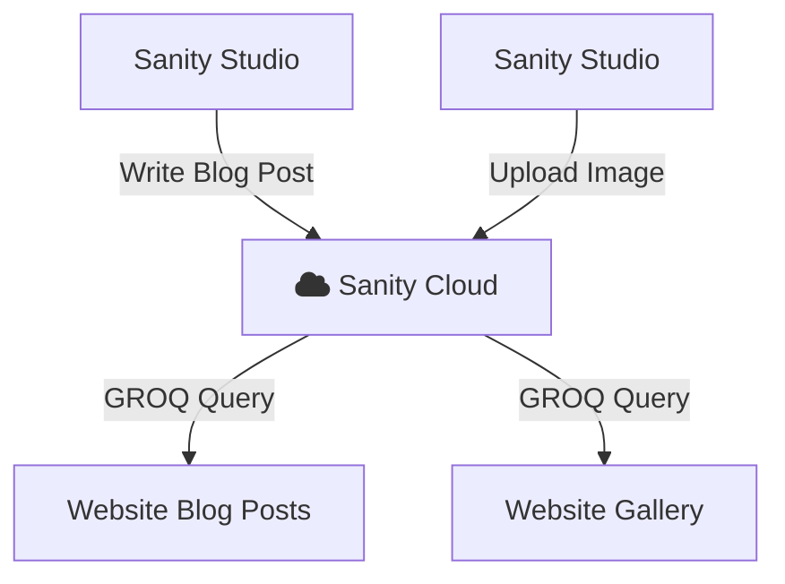
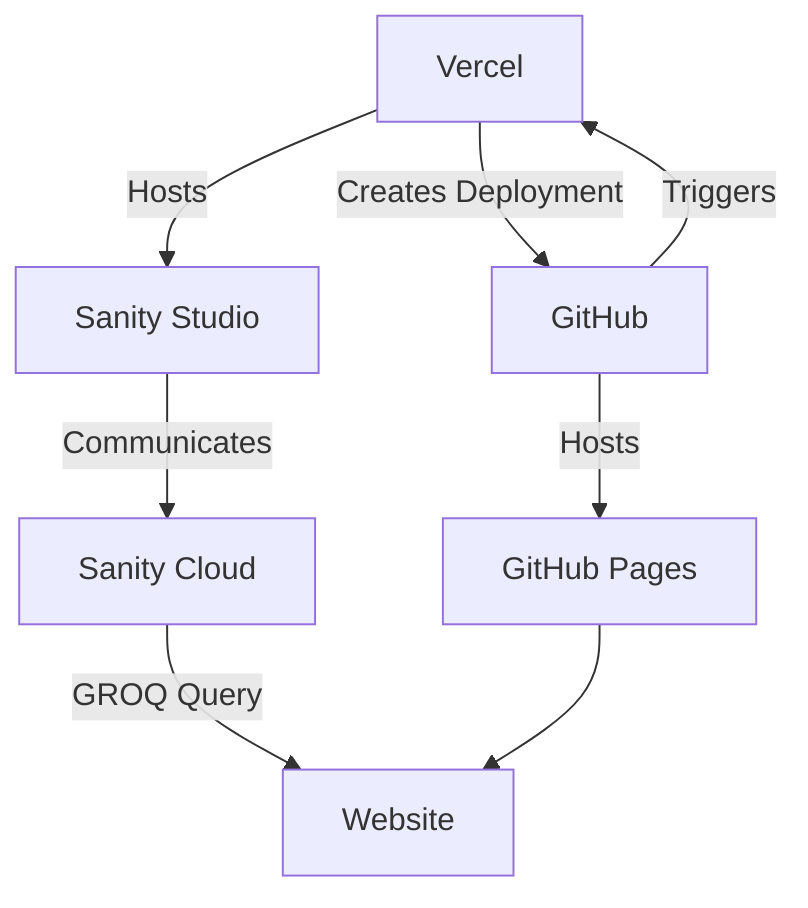

Svelte? I had to choose the most niche language for the fun of it.

<!--more-->

> **Websites Directory**
> - [Ver. 1 Website (Jekyll)]()
> - [Ver. 2 Website (HTML)]()
> - [Ver. 3 Website (Vue 1)]()
> - [Ver. 4 Website (Vue 2)]()
> - [Ver. 5 Website (Svelte)]()
> - Ver. 6 Website (this one!)

# The 5th Website


## Svelte

I was scouring through Reddit's [r/webdev](https://www.reddit.com/r/webdev/),
seeing what people have been using for web development. As expected, the usual
React, Angular, Vue, Next.JS, Nuxt ... and many more. At that time, I was
genuinely confused on what to pick, but I wanted to pick one that's easy on
the eyes and brain.

I slowly homed in on this more uncommon framework known as
[Svelte.JS](https://svelte.dev/). One of the key things that caught my eye
was how easy it was to do anything interactive with it.

```sveltehtml

<script>
  let name = 'world';
</script>

<h1>Hello {name}!</h1>
```

I loved how intuitive it was, and envisioned how many more complex web apps I
could achieve! I decided to give it a try

## Sanity CMS

One of the key problems I identified on my
[previous project]() and many of my
prior ones, was that I spent so much time trying to wrangle with HTML tags in
order to write a post. To avoid that, people tend to have a separate web app
that you can write in a simpler language (like Markdown), which then transpiles
into HTML. This is known as the "Content Management System" (CMS)

I found Sanity to be the best approach for me, as it includes a free tier that
hosts my content on the cloud, which I can then pull it into my website. It
works something like this.



Under the hood, Sanity handles the translation of Markdown, to something
displayable when queried.

### Integration with Vercel

Having to run `npm run dev` on the repository was getting a bit annoying, mainly
because if I **needed** an urgent change on my post, I had to launch IntelliJ,
load the project, go into `/studio`, then launch it. I decided to at least move
the Studio to the cloud, so that I can access it 24/7. That's where I integrated
Sanity with Vercel!

That wasn't the only benefit though, with Vercel, I automated the deployment of
any change on GitHub, so it builds and deploys it into another `gh-pages`
branch, which is then served through GitHub Pages. This was quite nifty

It works something like this:



## DaisyUI

So far, I have now the front-end framework, the back-end (CMS), now I just need
to add some style to my web page. I've used Bootstrap, some TailwindCSS, so to
try something new I went with [DaisyUI](https://daisyui.com/).

I'm not too sure if there's a huge difference between using this and
Bootstrap 5, but it seemed to be alright, it does its job!

## What went wrong

As you can imagine, this is a monolith of a web stack compared to what I want to
actually achieve. Even though we had the perfect setup, my Sanity Studio was
in a state of disrepair.

- I wanted to add MathJax, Mermaid, and more plugins but I just never figured
  out what was breaking the preview.
- I was excited to try
  out [Sanity Presentation](https://www.sanity.io/docs/configuring-the-presentation-tool)
  but it never worked.
- Often Sanity Studio's editor slows down dramatically for longer posts with
  images, Mermaid diagrams, and so on.

After time, again, it became more of a chore to fix. I eventually stopped trying
and here we are, with this simple website, built with Jekyll.

## Gallery

But hey at least I got to show off my cat


