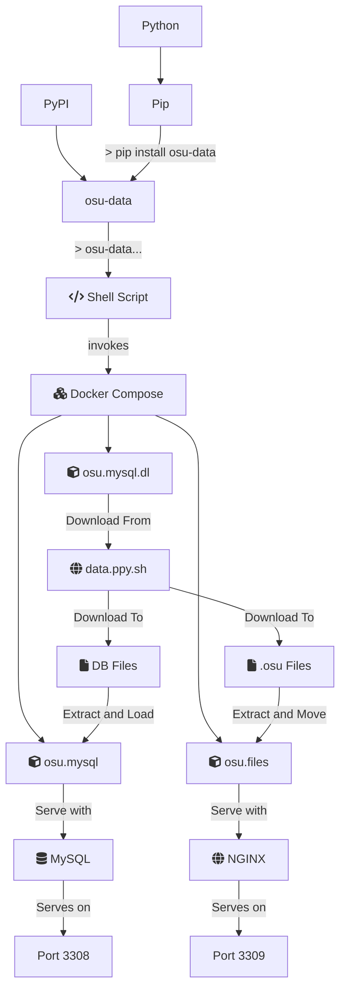

Load osu! database data into Docker through `pip`

<!--more-->

# What's osu-data?

Get started: `pip install osu-data; osu-data -m mania -v top_1000 -ym YYYY_MM`

You need Docker and Pip (comes with Python) installed:
[Install Docker](https://docs.docker.com/engine/install/),
[Install Python](https://www.python.org/downloads/)
{:.info}

**osu-data** abstracts away the pain of downloading the data from `data.ppy.sh`
then loading it into MySQL efficiently.
We wrap this entire process into a bash script,
which can be downloaded, installed via `pip` and ran as a shell command.

The entire back-end process can be described in the following diagram:

In short, we automate the downloading, loading and serving of the score
MySQL database, and optionally the `.osu` files.
Take a look at the repository linked above for details on the arguments in
`osu-data`, or you can get help via `osu-data -h`.

## Optimizations

Normally, when you load the MySQL database dump with default configs, it'll be
magnitudes slower than `osu-data`. This is attributed to redundant integrity
checks when data is populated in the MySQL DB. As expected, we remove the
integrity checks to speed up the process.

Furthermore, there are some large redundant tables in the data provided in
`data.ppy.sh`. `osu-data` has a pre-config of only loading important data for
analytics purposes only which can be modified.

## (Deprecated) osu-files

There was another project called `osu-files` prior, which separates the download
of `.osu` files to another shell script. We found it unnecessarily complicated
to separate them, so it's now merged into `osu-data`
