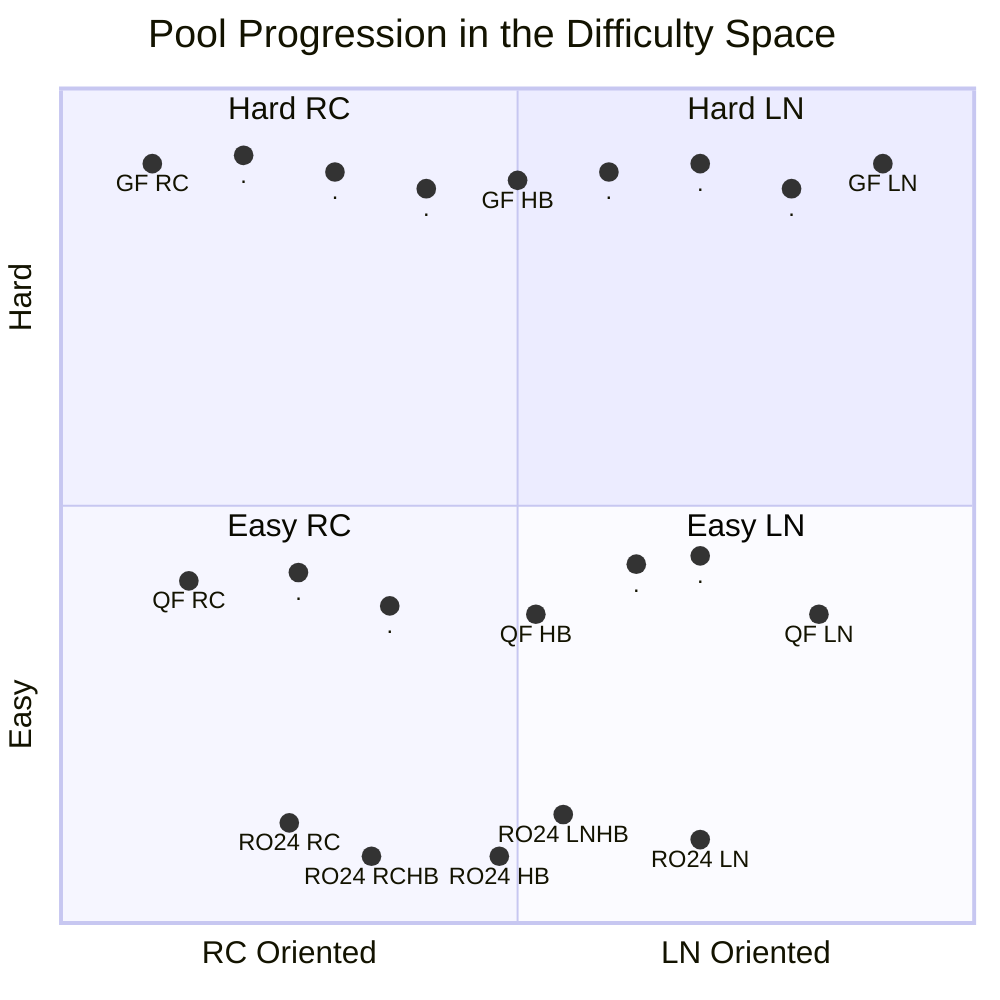
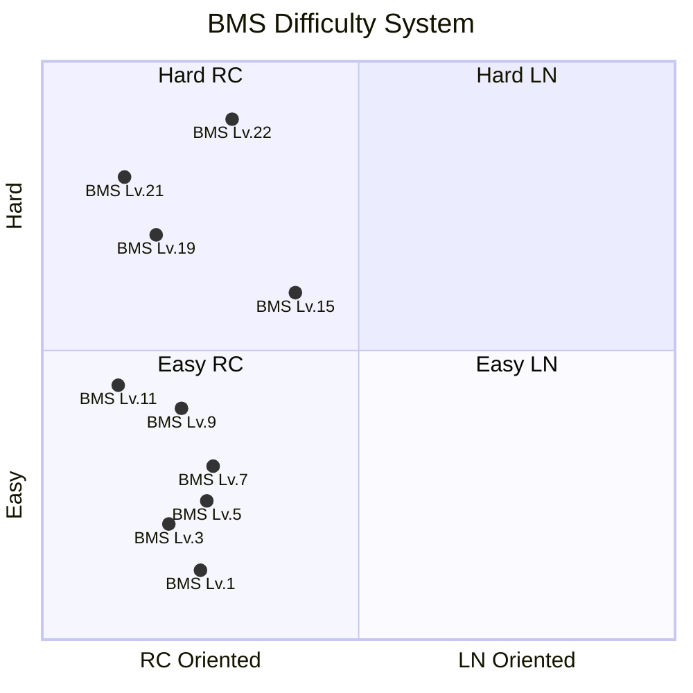
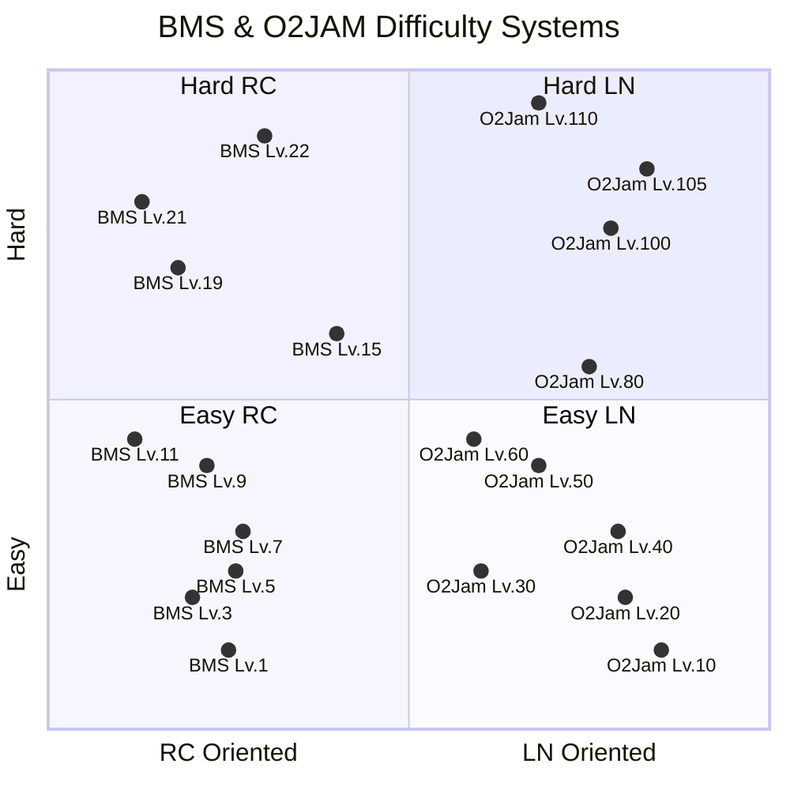
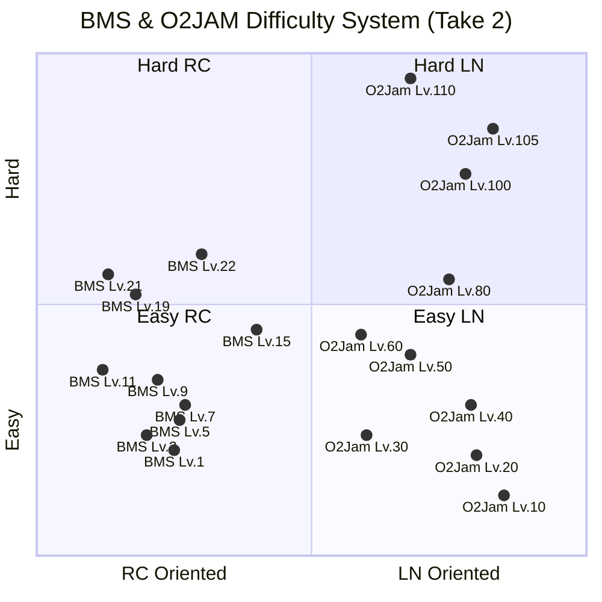

How could we statistically set a guideline for difficulty of each pool?

<!--more-->

This is still in draft
{:.warning}

# Motivation

There are 2 reasons why a well-regulated and well-defined difficulty is
beneficial to a tournament:

1. Players are **fairly** judged at every stage
2. Mappers and poolers will have an approximate reference on target difficulty,
   **reducing confusion**, improving **difficulty accuracy**.

Difficulty regulation is difficult, because the definition of difficulty is
weak, subjective. Commonly, and acceptably, just defining the pool difficulty
through "vibes" is sufficient, and it has worked well, for the past few
hundred tournaments.

As a member of many pooling teams, I've seen common patterns that could be
documented in an aggregated manner, to act as a possible reference point for
future pooling. This reference point is the **difficulty space**

# Visualizing the Pool on the _Difficulty Space_

This "space" is a 2-dimensional space that roughly defines attributes of maps.
Using this space, we can define what types of maps should go into the poolp.

The 2 dimensions, vertical and horizontal are defined by:

1. **Depth** (Vertical): Further up are maps that are more difficult,
   further down are easier ones.
2. **Width** (Horizontal): Left and right defines different styles, we define
   left as RC and right as LN. If necessary, we can extend to memorization skills
   and so on.

For example, a pool could be described like the following diagram.

Assuming we agree with this _abstract_ sketch of how we can define the ideal
pool, we now have to put _actual_ definitions onto each point. E.g. what does
$(x=0.2, y=0.8)$ mean? There are several methods that poolers usually resort to
for the above problem:

1. Referencing Difficulty Systems (and related maps)
2. Score Matching
3. Qualitative Feedback

## Referencing Difficulty Systems

To understand the **difficulty space**, we can first reference
well-established difficulty systems like **Stella**, **osu!mania Dans**,
**O2Jam Level System**.

We can roughly describe these *difficulty systems* in the space:

1. **Deep in Depth**: These systems often consider a large span of difficulties
   that many players engage with.
2. **Narrow in Width**: Unfortunately, they tend to only consider a subset
   of patterns. For example, BMS Systems often focus on Rice, and O2Jam on LNs.

As shown, one difficulty system only targets a thin "column" in the
**difficulty space**. However, if we added another system...

It can populate the empty space... however, the immediate issue that veteran
players have is the assertion that BMS Lv. X is equal in difficulty to O2Jam LV. Y.

You see, difficulty systems are mostly correct **within** each system,
however, there's no guarantee that it works **between** systems.
Therefore, an RC player could see the space as follows:

Because their strong suit is RC, anything that's LN is substantially more
difficult.

This isn't all for naught though, we do have a way to relatively estimate
difficulty for each system by referencing these difficulty systems, however
it calls for a robust approach to match levels across systems.

Additionally, maps not in the dan courses, but yet are accurately manually rated
can be considered too!
{:.info}

### Difficulty System Matching

To recap, when we use 2 separate difficulty systems,
we have difficulty determining what "levels" of the system should equate.
In other words, determining if a BMS Lv.X be slotted in the same pool as a
O2Jam Lv.Y.
The simplest approach is to ask multiple test-players to play maps across these
systems, effectively, connecting the dots.
However, it's easy to see that conducting this large-scale experiment is
not only a logistics hell but also high effort.
