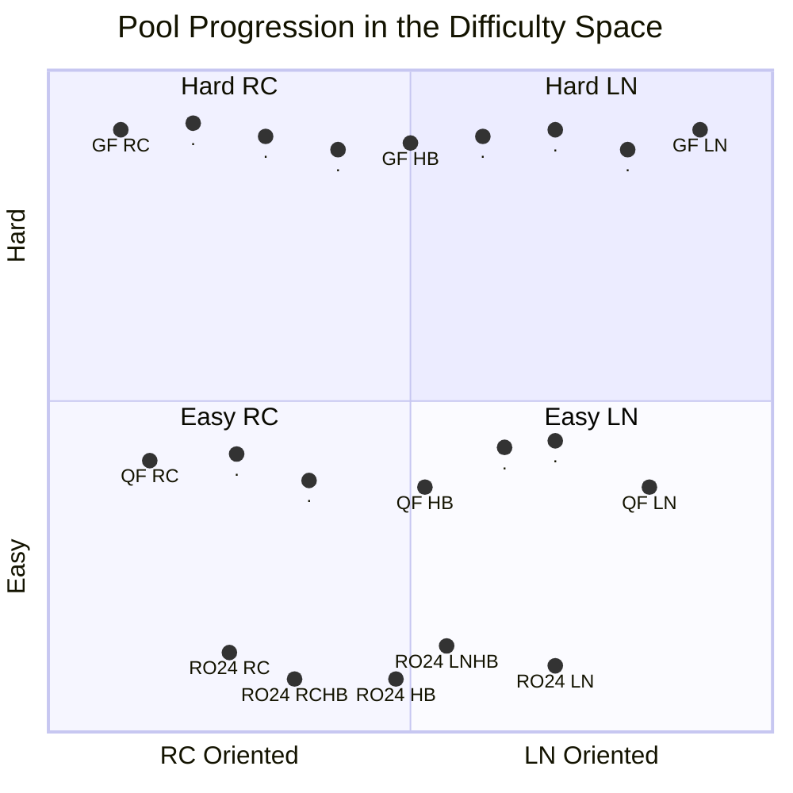
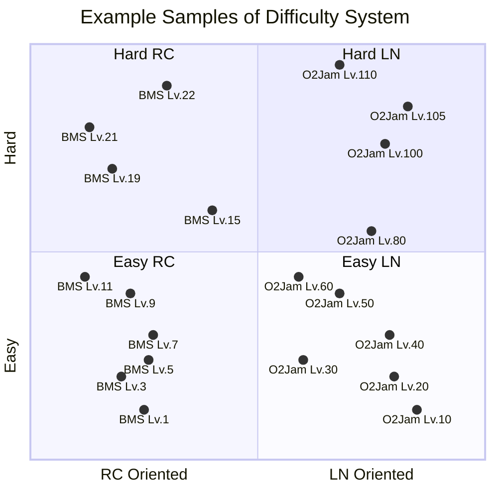
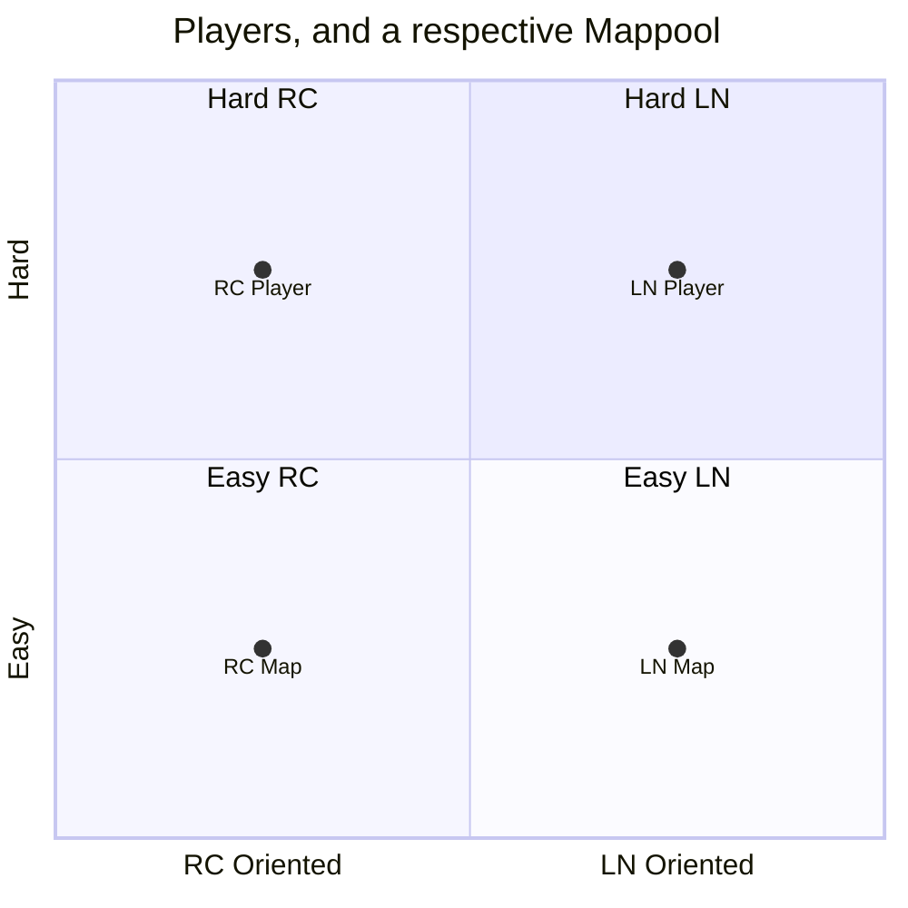

How could we statistically set a guideline for difficulty of each pool?

<!--more-->

# Motivation

There are 2 reasons why a well-regulated and well-defined difficulty is
beneficial to a tournament:

1. Players are **fairly** judged at every stage
2. Mappers and poolers will have an approximate reference on target difficulty,
   **reducing confusion**, improving **difficulty accuracy**.

Difficulty regulation is difficult, because the definition of difficulty is
weak, subjective. Commonly, and acceptably, just defining the pool difficulty
through "vibes" is sufficient, and it has worked well, for the past few
hundred tournaments.

As a member of many pooling teams, I've seen common patterns that could be
defined in a more robust manner, which will be outlined as the "framework" in
this article.

# Visualizing the Pool on the _Difficulty Space_

There are 2 key dimensions of a pool:

1. **Depth**: The progression of the pool, difficulty of each stage.
2. **Width**: The diversity of the pool, the mapping style to target.

We can describe this using the following diagram:

We define the diagram above as the `difficulty space`{:.info}, which we will
reference repeatedly in the following sections. In the _space_ above we see
that:

1. Easier rounds cover less width, later covers more. This follows the
   idea that some skill-sets, especially niche ones, only occur in higher
   difficulties. Therefore, this will form a "cone-like" shape
2. Easier rounds tend to have fewer maps than later ones. This follows the above
   idea: in later rounds new skill-sets surface, therefore, a pool should adapt
   and cover more ground.

Assuming this `difficulty space`{:.info}, we have to determine the following:

- `1`{:.info} The **extent** of the space we want to test
- `2`{:.info} The **points** on the space we need to sample

There are several methods that poolers usually use to tackle the above problems:

1. Referencing Difficulty Systems (and related maps)
2. Score Matching
3. Qualitative Feedback

## Referencing Difficulty Systems

`1`{:.info} To find maps that best match these points, we need to firstly
understand the extent of x and y-axes. This means, answering the questions:

- What does it mean to have a point exactly at $(x, y)$?
- What subset of this space are we testing?

To do so, we need to have a well-recognized
definition for both axes, and this is where referencing a commonly used
*difficulty system* like **Stella**, **osu!mania Dans**, **O2Jam Level System**
comes in handy.

Similar to how we describe the pool, these *difficulty systems* tend to be:

1. **Deep in Depth**: These systems often consider a large span of difficulties
   that many players engage with.
2. **Narrow in Width**: However, they tend to only consider a smaller subset
   of patterns. For example, BMS Systems often focus on Rice, and O2Jam on LNs.

As an example, we may envision some samples of these systems like the following.

As shown, we do see how each difficulty system has good coverage in depth,
however because they focus on a certain play style, their width naturally is
thinner.

This diagram gives intuition on the difficulties that poolers/mappers face when
selecting/creating maps for the pool:

1. **Difficulty System Matching**:
   In the diagram, we assumed that certain O2Jam Levels equated to certain BMS
   levels. However, this is up to debate, experts that are accustomed to
   both systems should be consulted to balance.
2. **Hybrids**:
   We observe that difficulty systems tend to avoid the middle column. This
   intersection of styles is uncommon for many reasons.
   But it's easy to see that with less reference points, more
   disagreements arise, and thus accuracy of difficulty estimate comes into
   question.

Additionally, maps not in the dan courses, but yet are accurately manually rated
can be considered too!
{:.info}

### Difficulty System Matching

As expected, when 2 separate systems are proposed, for LN and RC respectively,
we have difficulty determining what "levels" of the system should equate.
As an example: determining if a BMS Lv.X be slotted in the same pool as a
O2Jam Lv.Y.

If we want to measure skill level of a map, the simplest way is to measure
score.

1. If **one** player scores the same across both maps, they *should* be the same
   difficulty, therefore, can be put in the same pool.
2. If **more** players agree on (1.), then it's further evidence

The following is described in more detail to provide a robust understanding
{:.info}

As we know, there are some randomness and bias. Therefore, to make our claim
more robust, we resort to some probability & statistics.

Let $P(s|p=A,m=X)$ be the Probability Distribution Function (PDF) of score, for
**Player A** on **Map X**. As expected, if a player, plays any map, they aren't
guaranteed a score, only likely to attain a score within some range.
With that definition:

1. If $P(s|p=A,m=X)\approx P(s|p=A,m=Y) \approx \dots$ this means that Player A
   scored **similar scores** for all maps $X, Y, ...$. Which implies that they
   should be on the **same pool** according to Player A
2. If, **other players** $B, C, \dots$ also follow the same verdict. E.g.
   $P(s|p=\cdot,m=X)\approx P(s|p=\cdot,m=Y) \approx \dots$ where $\cdot$ is the
   Player. Then we have more evidence that they should be on the same pool.

What this math tells us is not only a way for the map-pooling team to decide
if a map is well-designed/chosen, it can provide a retrospective analysis after
each round to determine if it was fair.

A common way to determine the difference in distribution is the
[Jensen-Shannon Divergence](https://en.wikipedia.org/wiki/Jensen%E2%80%93Shannon_divergence).
Very simply, big number, big difference, which implies a certain map may be too
difficult or easy!

Now back to the normal schedule
{:.info}

However, (1.) doesn't hold true as many players are biased against another
skill-set. Take for example, comparing BMS/O2Jam player were to evaluate a fair
pool, they would naturally get different scores.

