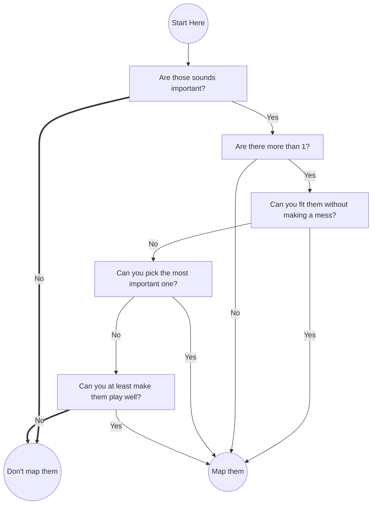

We'll illustrate how we sculpted this piece

<!--more-->

# Background

[Link to Map](https://osu.ppy.sh/beatmapsets/2210134#mania/4681404)

_sculpteur d'émotion_ is one of my more unique entries. It's mapped for
[osu!mania 4K French Tournament](https://osu.ppy.sh/community/forums/topics/1929981?n=1)
(therefore the difficulty name).

The approach, as mentioned in the description, is to have **singular focus**
and **negative space**.

## Singular Focus

Many maps, especially harder maps, tend to achieve difficulty through more
layers. This approach, while valid, tend to over-saturate the playfield. Take
for example below:

```osumania-4
451130|3|R,
451130|0|R,
451262|1|R,
451393|3|R,
451393|2|R,
451525|0|R,
451656|3|R,
451656|1|R,
451788|2|R,
451920|3|R,
451920|0|R,
452051|2|R,
452183|0|R,
452183|1|R,

451218|2|P,
451306|0|P,
451481|1|P,
451569|2|P,
451744|0|P,
451832|1|P,
452007|1|P,
452095|3|P,
```

The pattern layers a 1/4 stream (in red) and 1/6 fill (in purple).
For this, it plays well as long as you don't accidentally throw in a 1/6 or 1/4
jack.
On the surface, this seem fine, but the intended perspective by the mapper
often differs greatly from what the player sees.

```osumania-4
451130|3|R,
451130|0|P,
451218|2|R,
451262|1|R,
451306|0|R,
451393|2|P,
451393|3|P,
451481|1|B,
451525|0|B,
451569|2|B,
451656|3|B,
451656|1|B,
451744|0|R,
451788|2|G,
451832|1|R,
451920|3|G,
451920|0|R,
452007|1|R,
452051|2|R,
452095|3|R,
452183|0|B,
452183|1|B,
```

The above is how the player would **break down** such a complex pattern, by
glue-ing together neighbouring notes. In the end, the player likely didn't even
notice they were playing 1/6 and 1/4 together.

Commonly, a remedy to this is to glue 1/6s and 1/4s together, so it's easier to
see.

```osumania-4
451130|3|P,
451218|2|P,
451306|3|P,
451393|2|P,
451481|3|P,
451569|2|P,
451656|0|P,
451744|1|P,
451832|0|P,
451920|1|P,
452007|0|P,
452095|1|P,


451130|0|R,
451262|0|R,
451393|1|R,
451525|1|R,
451656|3|R,
451788|3|R,
451920|2|R,
452051|2|R,
452183|3|R,
452183|0|R,
```

However, the more you try to separate denser patterns, the more likely you'll
get unintentionally difficult patterns. Here we introduced 1/4 jacks and 1/6
trills. If it's truly impossible to separate them such that it's both
**easy to play** and **easy to understand**. **Just remove notes**.

### Players have limited Cognitive Capacity

Sometimes, the simpler solution is to remove notes.

> But there are sounds there!



I roughly follow the above train of thought when considering what to map, what
to ignore, and such. Remember that people, while complex, likes simple.

We show some variants that can be achieved, if we just skip some sounds entirely

<table>
<tr>
  <td>
    <div class="osumania-4">
      451130|0|P,
      451130|3|R,
      451218|1|P,
      451306|2|P,
      451393|0|R,
      451481|2|P,
      451569|1|P,
      451656|3|R,
      451744|1|P,
      451832|2|P,
      451920|0|R,
      452007|2|P,
      452095|1|P,
      452183|3|R,
      452183|0|P,
    </div>
  </td>
  <td>
    <div class="osumania-4">
      451130|0|R
      451130|3|P
      451218|1|P
      451306|3|P
      451393|1|P
      451481|2|P
      451569|0|P
      451656|2|P
      451656|3|R
      451744|0|P
      451832|2|P
      451920|1|P
      452007|3|P
      452095|1|P
      452183|3|P
      452183|0|R
    </div>
  </td>
  <td>
    <div class="osumania-4">
      451130|1|P,
      451218|0|P,
      451481|3|P,
      451569|2|P,
      451656|1|P,
      451744|2|P,
      451832|3|P,
      452095|0|P,
      452183|1|P,
      451130|3|R,
      451262|2|R,
      451393|1|R,
      451525|0|R,
      451788|0|R,
      451920|1|R,
      452051|2|R,
      452183|3|R,
    </div>
  </td>
  <td>
    <div class="osumania-4">
      451130|3|P,
      451218|2|P,
      451306|1|P,
      451393|0|P,
      451481|1|P,
      451569|2|P,
      451656|3|P,
      451744|2|P,
      451832|1|P,
      451920|0|P,
      452007|1|P,
      452095|2|P,
      452183|3|P,
      451130|0|R,
      451393|3|R,
      451656|0|R,
      451920|3|R,
      452183|0|R,
    </div>
  </td>
</tr>
</table>

<style>
canvas{
  display: block;
  margin-left: auto;
  margin-right: auto;
}

</style>


<script></script>

