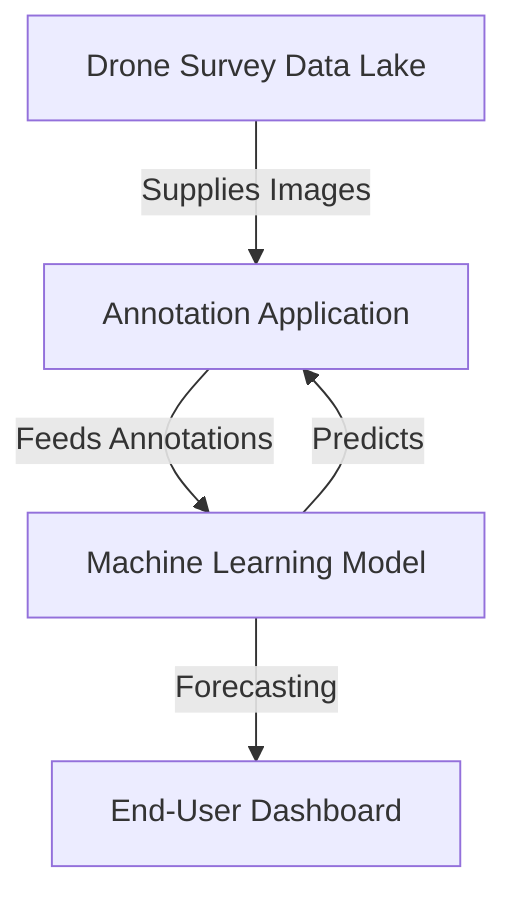
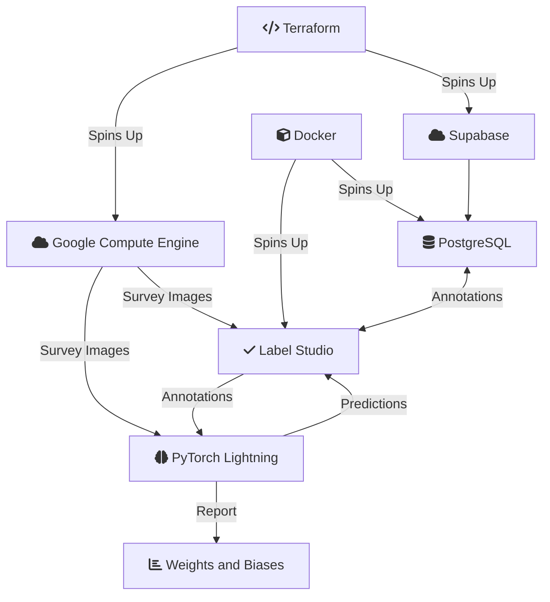

Computer-Vision Tree Classification from Drone Multispectral Imagery

<!--more-->

This project aims to develop a "companion" as a application that aids ecologists
in forecasting the secondary forest recovery process by using metrics
derived from aerial drone imagery. This project has quite a few moving
components, we'll discuss them in the following sections.

# Roles

I completed these tasks, I've categorized them into roles.

**ML Engineering**:

- Developed an end-to-end PyTorch Lightning model training pipeline for
  automated tree classification.
- Automated the entire training process using GitHub Actions for improved
  efficiency and reproducibility.

**ML Research**:

- Increased classification accuracy from 40% to 65% by combining FixMatch, a
  state-of-the-art semi-supervised learning framework, with a performant
  backbone network, EfficientNetB1.

**DevOps**:

- Implemented Infrastructure as Code (IaC) with Terraform for easy cloud
  infrastructure provisioning with a single command.
- Implemented a CI/CD pipeline using GitHub Actions promoting robust model
  performance and production stability.
- Enabled continuous model training with CML and real-time performance
  monitoring through Weights & Biases (W&B) to detect unintentional model
  degradation.

**MLOps**:

- Implement Continuous ML Training with PyTorch Lightning and reporting with
  W&B.

**Management**:

- Onboarded team of 6 onto Agile Project Management platform Jira, significantly
  improving project progress tracking, transparency and individual
  contributions.

**High-Performance Computing**:

- Developed an open-sourced high-performance GLCM algorithm on CUDA, 6000x
  increase in efficiency over standard industry
  methods. [https://github.com/Eve-ning/glcm-cupy](https://github.com/Eve-ning/glcm-cupy)

## ML Engineering: Foundational Architecture



The high-level architecture is the above, drone images are dropped off
in **GCP**, which is then fetched in the self-hosted annotation web app
**Label Studio**. Then, our server, spins up the **PyTorch Lightning**
machine learning model training and evaluation to output forecasts
into the dashboard on **Weights & Biases**.

To prepare all of these, we used

- **Terraform** to spin up **GCP Compute Engines** hosting **Label Studio**,
  which uses an external persistent **PostgreSQL** database on **Supabase**.
  - For local development, we used **Docker Compose** to spin up
    **Label Studio** and manage our own **PostgreSQL**
- **PyTorch Lightning** fetches images from **GCP Cloud Storage**, and
  annotations from **Label Studio** (whether online or offline). Constructs
  the ML Training procedure, and outputs artifacts to **Weights & Biases**



The above shows the entire system we architected to realize this solution.

## ML Research: Transforming Images to Numbers

We achieve this complex transformation of
imagery to metric using a performant CNN
backbone ([EfficientNetB1](https://pytorch.org/vision/main/models/generated/torchvision.models.efficientnet_b1.html))
and
further improve its performance through Semi-Supervised
Learning ([FixMatch](https://arxiv.org/abs/2001.07685)).

We can think of the backbone, EfficientNetB1, as a function that transforms
an image into numbers. To give some intuition, we show some pseudocode below on
how it works analogously.

```python
from models import EfficientNetB1

features_cat = EfficientNetB1.transform("cat.jpg")
print(features_cat["feature_a"])
# 1.434

features_jeff = EfficientNetB1.transform("jeff.jpg")
print(features["feature_a"])
# -0.934
```

Keep in mind that the `features` is not a set of well-defined english keys,
instead some abstract representation of the image. These features are optimized
such that they are important in distinguishing `cat.jpg` from other images like
`frog.jpg` or `jeff.jpg`.

Next, FRDC suffers from the fact that we have too little labelled data in
comparison to unlabelled. If we had gone forth with classical supervised ML
approaches, we'd be neglecting a large portion of our data. Fortunately,
despite without labels, unlabelled data can help contribute in improving
model generalization performance!

This approach is known as Semi-Supervised Learning (SSL). While it is applicable
to most situations, its additional effort may not be significant if the labelled
data is already generalizing well.
{:.warning}

I won't go into detail about the ML side, but take a look at
[FRML: Semi-Supervised & Active Learning Applied Machine Learning for Aerial Tree Classification]() for more details on how it works.
