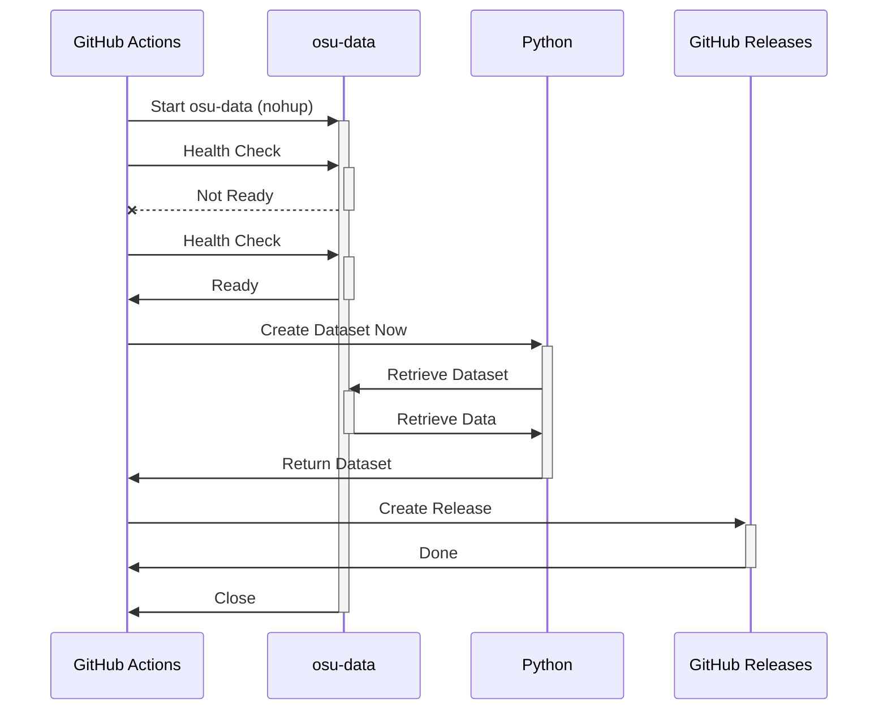

Auto exporting osu!mania datasets to GitHub Actions using osu-data

<!--more-->

# Introduction

If you've attempted to use osu!'s database dump in data.ppy.sh, you may know
that it takes some elbow-grease and sweaty hands to load in data locally.
That's the reason why I created [osu-data](),
a **Dockerized** solution to load in your dataset through 2 commands:

```bash
pip install osu-data
osu-data -m mania -v top_1000 -ym YYYY_MM
```

Take a look at the article linked above if you want to know how `osu-data`
works. In this article, we'll discuss how we automated the exporting the
dataset to GitHub Releases.

As an overview, this is our GitHub Action (job) at a high level.



## Memory Limited GitHub Action Runner

One of the surprising revelations was that this worked on the default free
GitHub Actions runner. If one tries to run too big of a workload, they may face
[Error 143](https://github.com/actions/runner-images/issues/6680), indicating
that the job was too "heavy" (it's as vague as that).

I ran into that problem once during the project, I had to cut down many
unnecessary columns, and reduce merging, we discuss how we
reduced this computational load and resulting size in the next section

## Optimizing Artifact Sizes

> Never thought I'm using something I learnt from databases a few years ago.

One of the key considerations of creating the dataset is if I should create
the dataset like:

**Schematic A**

`score.csv`

| Map ID | Map Name  | Map Speed | Player ID | Player Name | Player Year | Accuracy |
|--------|-----------|-----------|-----------|-------------|-------------|----------|
| 1234   | A - B (C) | DT        | 2345      | Alice       | 2000        | 99.83    |

Or...

**Schematic B**

`score.csv`

| Map ID | Map Speed | Player ID | Player Year | Accuracy |
|--------|-----------|-----------|-------------|----------|
| 1234   | DT        | 2345      | 2000        | 99.83    |

`map_metadata.csv`

| Map ID | Map Name  |
|--------|-----------|
| 1234   | A - B (C) |

`player_metadata.csv`

| Player ID | Player Name |
|-----------|-------------|
| 2345      | Alice       |

If our goal is to

- **reduce computation**, we choose A
- **reduce size**, we choose B

Notice that if we had 2 scores on the same map,
- **Schematic A** `score.csv` would have to **repeat the entire Map ID & Name**
- **Schematic B** `score.csv` only repeats the **Map ID**

This is because Map ID and Map Name are One-to-One coupled together, in other
words, the ID implies the Map Name, and vice versa (usually). Thus, it's
**redundant** to include both columns! In database theory, we call this
optimization **normalization**, and this phenomenon, **Data Redundancy**.

This doesn't mean that **Schematic A** is useless though, if you **rarely**
encounter this redundancy, it may not be worth it to split it out at all.
{:.warning}
