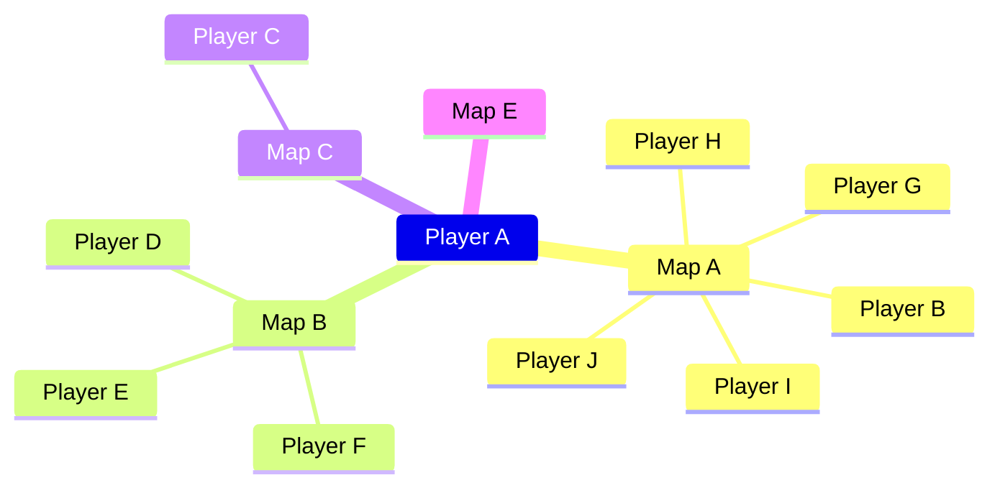
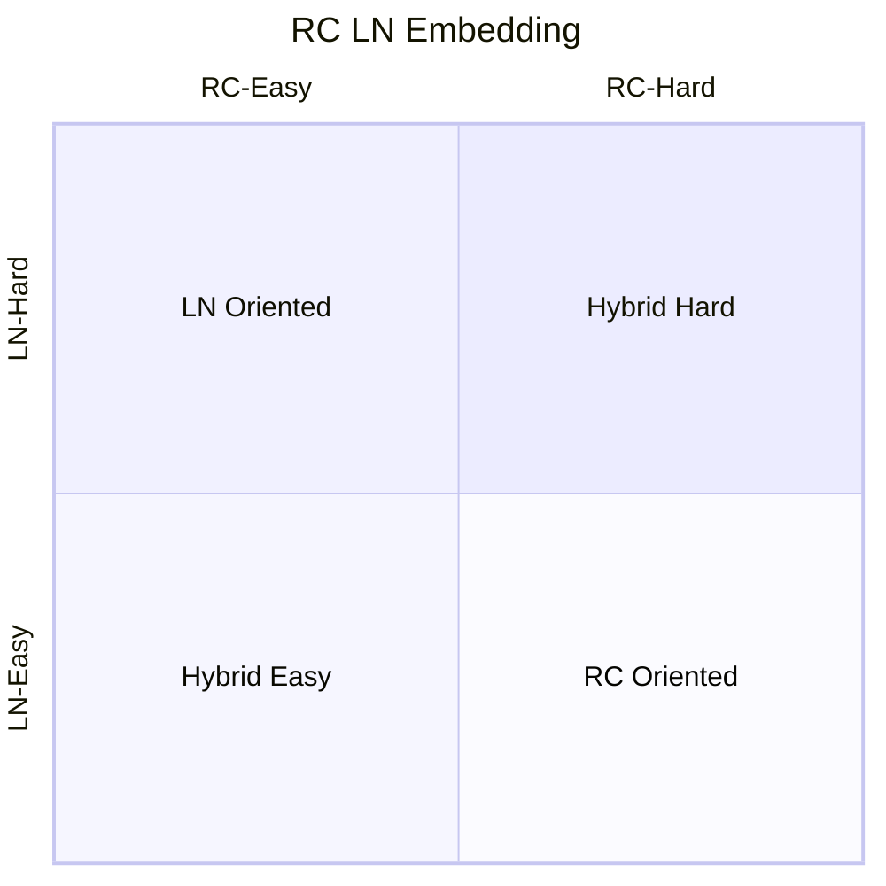
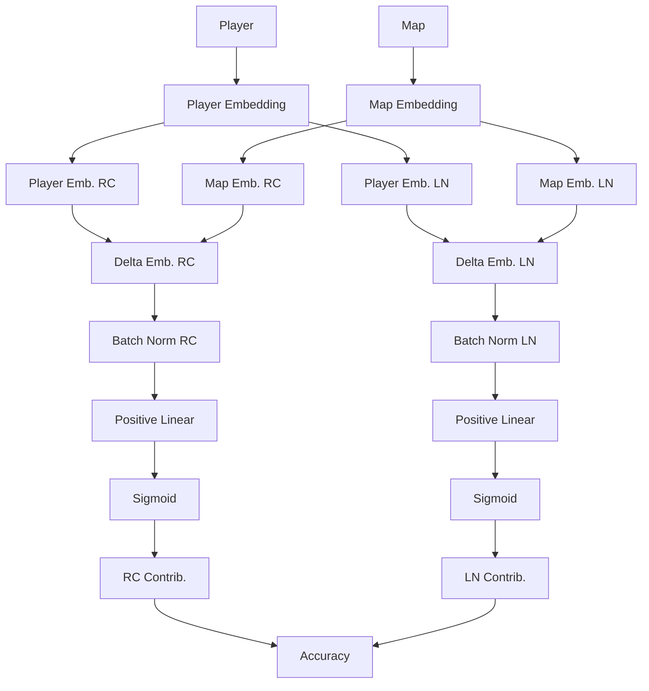

How we created opal v2, and most importantly, how we avoided the black-box
problem by guiding the optimization with LN Ratio priors, and Positive Weight
constraints within the network.

<!--more-->
> Hello friends, thanks for checking out this post! This is still
> work-in-progress, thus writing will be rough and information will be lacking.

# Introduction

> This article assumes you have some knowledge in rhythm games

## Rating Estimation

As we know, the fundamental components of Rhythm Games are the:

- Players
- Beatmaps (in short: maps)
- Results

A player would play a map, which would yield a result. Maps and Players are
usually given some rating value that estimates the expected result of the play.
For example, in osu!mania:

- maps are given a difficulty rating (Star Rating)
- players are given a performance rating (Performance Points)

The fundamental motivation of an accurate rating is that players can find maps
that suit their current goal.
For example, different players of different ratings perceives different
map ratings to feel different. If a player want a casual playthrough, they may
choose Easy or Medium maps, respective to their rating.

| Player Rating | Easy | Medium | Hard | Impossible |
|---------------|------|--------|------|------------|
| 5000          | 3    | 4      | 5    | 6          |
| 10000         | 5    | 7      | 8.5  | 11         |
| 15000         | 6    | 7.5    | 9    | 12         |

However, evaluating the rating on both players and maps is nothing short of
difficult, which explains why most rhythm games still struggle to nail this.
Rating algorithms such as:

- osu!mania's
- Etterna's
- Quaver's

are some variants of automated rating algorithms. Yet, none of them seem to be
unanimously agreed to be the best. This is largely due to the fact that
humans evaluating them is far from objective. Who's to say who's more right?
As hinted, the solution is something closer to objectiveness, that detaches
itself from human biases.

Though, how do we achieve this? To answer this, we need to understand how
players attach a rating to a map. There are 2 ways that are best detached
from human bias:

**Map Analysis**: By looking at the map objectively, we can estimate how
difficult it is through observing its patterns.
There's a **major difference** between rating systems available out there and
what we want to achieve. One, because rating systems have algorithms
that are designed by humans, it's still, opinionated by the algorithm designer.
For example, if `if map = mine then rating = 1000 else 500` is a possible
algorithm, but it's clear that it's far from objective. Though fortunately,
most advanced rating systems out there are more nuanced than this, removing as
much bias as necessary.

**Referencing Player Scores**: By referencing scores of other players, and their
known rating, we can infer how difficult the map is. This is surprisingly
simpler as we do not need to understand the intricacies of complex patterns,
we just need to know the rating of the players who played the map.

For example, the following score table:

| Player Rating | Map A Score | Map B Score |
|---------------|-------------|-------------|
| 1500          | 95%         | 90%         |
| 1000          | 90%         | 85%         |
| 500           | 85%         | 80%         |

If we have the rule that if the Map Rating is equivalent to the Player Rating
that achieves 90%, then Map A is rated 1000, B is rated 1500.

Simple enough! However, this is a recursion optimization problem, to know the
Player Rating, we need to know the Map Rating, vice versa! This is what we want
to tackle in this article.

We'll propose an algorithm that uses player scores to optimize Player and Map
Rating.

## Our Contributions

We will demonstrate a simple custom network architecture that not only achieves
low error in score prediction, but also provides valuable insights in map
difficulty and player skill estimation when embeddings are learnt.

### Structure

This paper, for important components are written high-level, supplemented with
low-level proof in their subsections.

# Opal

Unlike many Neural Network design approaches, opal prioritizes explainability,
over highly-accurate models. Therefore, parameter choices are carefully selected
with opal, and we'll explain all decision choices in the following sections.

## Related Work

The landscape of VSRG ML is scarce, as admittedly, not much value is gained
from
uncoverring this mystery.

Some common solutions in untangling this mess:

- AlphaOsu: A recommendation system that can be considered an adverserial
  approach against the current algorithm, it suggests maps to players that will
  provide the largest gain in measured "Skill". We say "adverserial" as the
  game
  target (osu!mania) doesn't have an optimal difficulty calculation algorithm,
  this means that the best recommendations are often due to flaws in the
  difficulty calculation.
- MugDiffusion: A map generation algorithm based on Stable Diffusion. It learns
  from existing maps by encoding them with a Variational AutoEncoder (VAE),
  trains a denoising model on these embeddings, and generates maps with a
  similar approach to many Diffusion networks. The key takeaway we found from
  this is that VAE is a potential target for encoding the complex
  high-dimensional map, and can be considered as an additional input to opal in
  further research.
- ELO-Based Approach: (We do not have an exact source) The ELO approach is
  based
  heavily off of Chess games, where an ELO system is updated based on results
  of
  tournament matches. The dataset, when scraped from tournaments, is often
  reliable as players can be assumed with high confidence that they are playing
  at a consistent skill, which is an important assumption for CF. However, this
  method falls short in extrapolating to unseen maps and players.
- Opal (V1): A score recommendation system, which this paper supersedes. This
  approach naively implements NeuMF, a class of Neural Collaborative Filtering
  networks, which we found only worked as we highly-parameterized the embedding
  space. The fundamental flaw was that player and map embeddings were compared
  with dot-product, losing its directional component, we hypothesize that our
  extremely high embeddings made up for this error.

Built upon lessons learned from opal v1, we not only want to provide a
score-recommendation system, we also want to provide explainable introspection
to the embeddings.

## Background

We first define the high-level problem we're tackling:

- We want to **find the best model** such that it minimizes the
  **prediction error**: $\arg\min_f[\text{error}]$.
- The error is defined by the **difference** between the **predicted** accuracy
  and **actual** accuracy: $\text{error}=a\_\text{pred} - a\_\text{actual}$
- Since we know how to get the **actual** accuracy, it leaves us with how to
  predict it. We define this predicting operation to be $f$, which takes in the
  **player** $p$ and **map** $m$ and must output a prediction $a$.
- We **normalize** the error with this $\frac{1}{MP}\sum_i^P\sum_j^M$

Putting it all together, we get this optimization

$$
\arg\min_f
\left[
\sum^P\sum^M
\left(
\underbrace{f(p_i, m_j)}_{a_\text{pred}} - a_\text{actual}
\right)
\right]
$$

Let's take a look at how it'll look like to compute this minimization

| Actual   | Map A | Map B |
|----------|-------|-------|
| Player A | 100%  | 90%   |
| Player B | 80%   | 70%   |

| Predict  | Map A             | Map B             |
|----------|-------------------|-------------------|
| Player A | $f(m_A, p_A)$ 90% | $f(m_B, p_A)$ 90% |
| Player B | $f(m_A, p_B)$ 80% | $f(m_B, p_B)$ 80% |

| Difference | Map A | Map B |
|------------|-------|-------|
| Player A   | -10%  | 0%    |
| Player B   | 0%    | 10%   |

As shown, $f$ is a way to simply deduce the true accuracy depending on the
player $p$ and map $m$. The smaller the difference, the better the model $f$.

At this point, we're hit with various questions:

- :one: How does $f(m, p)$ even work? Neither $m$ nor $p$ are numbers
- :two: Not all players $p$ have played all maps $m$, what do we do about them?
- :three: Players change and improve across days, how do we deal with that?

---

### Embedding

> :one: How does $f(m, p)$ even work? Neither $m$ nor $p$ are numbers

To understand this, imagine $m$ and $p$ can be described by a list of values.
For example, I could describe my abilities with some numbers:

- Jack: 10/100
- Speed: 70/100
- Stamina: 50/100
- ... and so on

In other words, I could describe with numbers! Let's visualize this as a radar
chart below:

```chart
{
  "type": "radar",
  "data": {
      "labels": [
      "Speed",
      "Jack",
      "Long Notes",
      "Stamina",
      "Coordination"
    ],
    "datasets": [{
      "label": "Evening",
      "data": [70, 10, 30, 50, 35],
      "borderColor": "#F00"
    }]
  },
  "options": {
    "aspectRatio": 2,
    "scale": {
      "r": {
        "min": 0,
        "max": 100
      }
    }
  }
}
```

As shown, we can represent a non-numerical concept numerically like this. But
what's more interesting, and intuitive is when you also place a map in the same
chart

```chart
{
  "type": "radar",
  "data": {
      "labels": [
      "Speed",
      "Jack",
      "Long Notes",
      "Stamina",
      "Coordination"
    ],
    "datasets": [
    {
      "label": "Evening",
      "data": [70, 10, 30, 50, 35],
      "borderColor": "#F00"
    },
    {
      "label": "Map A",
      "data": [30, 10, 10, 40, 10],
      "borderColor": "#0F0"
    },
    {
      "label": "Map B",
      "data": [80, 50, 50, 80, 60],
      "borderColor": "#00F"
    }
    ]
  },
  "options": {
    "aspectRatio": 2,
    "scale": {
      "r": {
        "min": 0,
        "max": 100
      }
    }
  }
}
```

Intuitively, if a map's statistics are smaller than mine, then I'll do well,
that alludes to me playing **Map A**. Consequently, if the map's statistics
are larger, then I'll do worse, alluding to me playing **Map B**.

This hints on something amazing...

Let's say we took the values of the player, then subtracted the values of the
map, we have a set of values that describe the score in some way! Take for
example something simple, an LN player playing a simple LN map

|                           | Rice | LN  |
|---------------------------|------|-----|
| Player                    | 30   | 100 |
| Map                       | 10   | 60  |
| Difference (Player - Map) | 20   | 40  |

We expect a high score here because Player A is strong at LNs,
we then need to describe how this difference is mapped to score

#### Linear Contribution

The simplest model is to assume that each difference linearly contributes to
the resulting accuracy, in other words:

$$
w_1\text{Diff}_1 + w_2\text{Diff}_2 + ... + w_n\text{Diff}_n + b = a_
\text{pred}
$$

Where $w$ is the multiplicative weight of each $\text{Diff}$ component, and
$b$ is the additive bias of the entire equation.

### Missing Scores and Reliability

> :two: Not all players $p$ have played all maps $m$, what do we do about them?

As mentioned, many scores are missing, it's not uncommon to see the table be
less than populated:

| Actual   | Map A | Map B |
|----------|-------|-------|
| Player A | 100%  |       |
| Player B |       | 70%   |

What this means is that some players and maps can be wildly inaccurate with
scarce data. Take for example an extreme case:

| Actual           | Map A | Map B  | ... | Map Z (Gimmick) |
|------------------|-------|--------|-----|-----------------|
| Rank 1 Player    | 100%  | 99.95% | ... | 80%             |
| Rank 100K Player |       |        |     | 96%             |

We have a Rank 1 Player, who has played 100s of maps, while a new Rank 100K
player, who has played only 1. Coincidentally, they both played a
**Gimmick Map**, a map so severely out of the norm, it might as well have
its own skill set. If we went through with optimizing this as-is, we'd infer
that the Rank 100K Player would score higher than the Rank 1 Player in all
other maps which is egregiously wrong.

This leads us to the discussion of **reliability**, which is the measure on
how out-of-the-norm the player, or map is.

Take For example below:



- **High Reliability**: Player A has played 5 separate maps, and Map A has been
  played by 6 different players.
- **Low Reliability**: However, Player C rarely played any maps and Maps C and E
  have rarely been played.

One way to measure reliability is as the above bullet points, counting the
number of immediate associations with each player. In Graph Theory, this is
simply the **degree** of each node. As a matter of fact, this is an easy way to
evaluate reliability. However, the degree only considers the immediate
neighbours. To improve on this, we opted for PageRank, which considers the
global context.

To simplify this explanation:

- **Degree**: Reliability is relative to the number of **associated** nodes
- **PageRank**: Reliability is relative to the number of **reliable** nodes

Now we can quantify reliability of each player, what do we do with them?

There are 3 choices

1. We train the model as is, then report the reliability of each Player and Map
2. We use the reliability as a importance weight when training
3. We drop samples that are non-reliable, then train

We can't choose (1.), because low-reliability players or maps will strongly
affect the resulting embeddings when training. (3.) is a safe choice, however,
finding the threshold to drop samples can be troublesome. That leaves us with
(2.).

### Player Rating Variability

Player Ratings naturally change over time, whether it is rising or decaying,
it's easy to see that we cannot pin a single rating to a player. Furthermore,
considering the nature of our data, it's not possible to do so.

| Date | Player Score | Map Rating |
|------|--------------|------------|
| Jan  | 90%          | 1500       |
| May  | 95%          | 1500       |
| Dec  | 98%          | 1500       |

I believe it's quite obvious why, I'll not explain that deeply.

Instead of assigning a single value, we need to express the natural change in
Player Rating. To do so, we use _parameterized splines_. In other words,
the rating algorithm should take in, the Player $p_i$, the time $t$ we want to
estimate the Player Rating, and some parameters $\theta_i$ for the algorithm.

$$
f(p_i, t, \theta_i) = \text{Rating}
$$

For example, we could have functions like these:

```chart
{
  "type": "line",
  "data": {
    "labels": ["Year 1", "Year 2", "Year 3", "Year 4", "Year 5", "Year 6"],
    "datasets": [
      {
        "label": "Rating Estimatino (Stepped)",
        "data": [1000, 1200, 1150, 1200, 1250, 1200],
        "borderColor": "#F00",
        "fill": "false",
        "stepped": "true"
      },
      {
        "label": "Rating Estimation (Smooth)",
        "data": [1000, 1200, 1150, 1200, 1250, 1200],
        "borderColor": "#0F0",
        "fill": "false",
        "tension": 0.4
      }
    ]
  }
}
```

A stepped function, would evaluate the Rating at every year, a smoothed function
would attempt to interpolate smoothly.

### Feature Space

The feature space, we expect, is to be mainly driven by 2 known features, which
may contain more subfeatures. These 2 features: RC (Rice), LN (Long Note) are
unique and significant characteristics that divide player and map style. Thus
we
expect good separation during embedding.



To guide the model to understand these 2 features, we use the **proportional
contribution** of RC and LN to accuracy, weighing each dimension by how much
they impact the resulting accuracy.
This **proportion** is yield from the map statistics, which counts how many RC
and LN notes are in the map. Each note contributes equally to the accuracy,
which is why we can simplify scale it by the ratio.

It's likely that these features has subfeatures that differentiate the
contributions of RC and LN further, however unlike the RC/LN proportion, we do
not have enough information to guide each feature. This poses a problem when
labelling each axis of a stochastic model, therefore, we avoid splitting it
further with Opal V2.

### Embeddings

We expect all our player and map vectors to reside within this 2-dimensional
feature space $RC,LN$. We denote their vector embeddings as $E_P, E_M$
respectively. We attempt to create a model $\Delta$ that maps the difference in
displacement $\Delta(E_P - E_M)$ to predict our accuracy vector $A$.

We expect that $\Delta$ to be a **positive-monotonous** function, as larger,
positive distances in each feature should contribute positively to higher
accuracies.
One of the troubles in enforcing this specific constraint is that creating a
sub-neural network to find this function will usually lead to a non-monotonic
solution. This is because embeddings are unconstraint, thus exists a solution
where $\Delta$ is negative-monotonous. And even a solution where the function
may not be monotonous at all. This is because weights in each Linear layer are
not always positive.

### Positive Weight Constraint for Embedding Guidance

To make sure that the network only searches for positive monotonic functions,
all weights must are positive. However, it's crucial that this constraint does
not impede learning.
To achieve this, we injected $\text{SoftPlus}(w)$ before the weights are fed
into the Linear layer.

We have tried other approaches, such as:

- $\exp(w)$: Which had the side-effect of discouraging low weights due to
  weight-decay. This means that the model will attempt to avoid low accuracies,
  which is not hollistic.
- $\text{ReLU}(w)$: While we found that this worked better than $\exp$, we
  didn't want to encourage dead neurons
- $\Phi(w)$: The inverse CDF of a normal distribution, while it works, it felt
  more complicated than necessary.

We implement this new Linear Layer like so, overriding the `forward`
of `nn.Linear` in PyTorch.

```
class PositiveLinear(nn.Linear):
    def __init__(self, in_features, out_features, bias=True):
        super().__init__(in_features, out_features, bias)
        self.fn = torch.nn.Softplus()

    def forward(self, x):
        return F.linear(x, self.fn(self.weight), self.bias)
```

While the function now is monotonous, its range is unbounded, to transform to
accuracy, we simply wrap it with sigmoid $\sigma$

`rc_emb` is the size of the RC feature space, we can create this transform with
the follow code.

```
self.delta_rc_to_acc = nn.Sequential(
		PositiveLinear(rc_emb, 1),
		nn.Sigmoid(),
)
```

Same goes with LN.

### Architecture

Following all this background, we can now finally construct the architecture:



## Results

### Detecting Gimmick Maps

One of the key problems with developing a score-prediction system, is that you
usually want to avoid training on maps with gimmicks, as they logically, throw
off the prediction accuracy.
However, after months of analyzing metrics to separate these maps from the
pool,
there is no easy way to do so.

A simple logical assumption is that

1. For gimmick maps, some players will "defy" the order if they are good at the
   gimmick
2. This implies that the prediction errors of the map will be abnormally large
3. Therefore, if the map sees many high prediction errors, then the map is
   likely a gimmick map.

However, this trend isn't necessarily true

1. Gimmick maps, can be inferred as a "difficult" map, if **everyone** is
   finding difficult with the gimmick, it's not discernable from a difficult
   map
2. Gimmick maps, are avoided by players that don't plan to play gimmick maps.
   This means that those who play it tend to come from the same group, which
   are
   good at gimmicks. This will violate our assumption, where players "defy". If
   all players "defy", then they aren't defying any control group.

The unfortunate, yet best solution, is to simply train with them, or create a
blacklist of maps to avoid training on.

### Uncertainty

One way previously proposed to detect gimmicks is the uncertainty measure. This
measures how "unsure" the model is at predicting certain scores, we implement
this via the "Deep Ensembles" approach, with some modifications. There were
some
problems getting the actual variance to scale, however, by inspection of the
order, we can see a clear trend for maps that have the highest uncertainty.

Here's the 5 maps with highest **MEDIAN** uncertainty.

- Kikuo - Gangu Kyou Sou Kyoku -Shuuen- (Lirai) [7K ADVANCED]
- xi - FREEDOM DiVE (razlteh) [Blocko's 7K Normal]
- REDALiCE - Acceleration (YunoFanatic) [Arcwin's 7K HD]
- James Landino & Kabuki - Birdsong (_Kobii) [AncuL's Hard]
- Sota Fujimori - polygon (Player0) [polyhedron]

Without domain knowledge, this is hard to explain, however those who've played
osu!mania long enough will know that:

1. All of these maps are **extremely easy**
2. `polygon` is an easy map, but also a gimmicked map!

However, if we took a look at some notable maps (fraction denotes their rank in
uncertainty

- Camellia - Singularity (Evening) [Technical Breakdown] 1623 / 2593: is a
  gimmick map. But it ranks roughly the middle of the uncertainty spectrum.
  This
  means that it's not possible to remove this without removing a lot of other
  maps.
- Aphex Twin - Avril 14th (webodan's 8-bit GXSCC cover) (Nivrad00) [Challenge]
  2103 / 2593: is not a gimmick map, but it's known to be a huge anomaly. It
  ranks quite low on uncertainty, which is great.
- Tokisawa Nao - BRYNHILDR IN THE DARKNESS -Ver. EJECTED- (
  NaxelCL) [Million's 7K EX] 2409 / 2593 : is odd, as it's a gimmick map,
  however, the bigger problem is the following
- Tokisawa Nao - BRYNHILDR IN THE DARKNESS -Ver. EJECTED- (
  NaxelCL) [Yuuto's 7K HD] 86 / 2593 : is also a gimmick map, but both have the
  same gimmicks.

This doesn't necessarily give us the silver bullet to remove gimmicks, however,
it's a decent feature to sort by, as it seems to filter them

<style>
@media (prefers-color-scheme: dark) {
    canvas {
        filter: invert(1) hue-rotate(180deg);
    }
}
</style>
