How do you sync every source of feedback in Rhythm Games? Are visual and audio
offsets important?

<!--more-->

# Introduction

Hitsounds in Rhythm Games are a way to give feedback on player inputs.

Ideally, the 2 major sources of feedback in Rhythm Games, *visual* and *aural*
are exactly synced together. Though syncing the **physical keyboard sound**
and **game hitsound** is just not physically possible.

## Background

To explain, let's take a look at a simple timeline on how a note is handled.

There are 4 critical timestamps to consider:

1. When the input is **demanded** by the game
2. When the input is **provided** by the player
3. When the input is **received** by the game
4. When feedback is **received** by the player

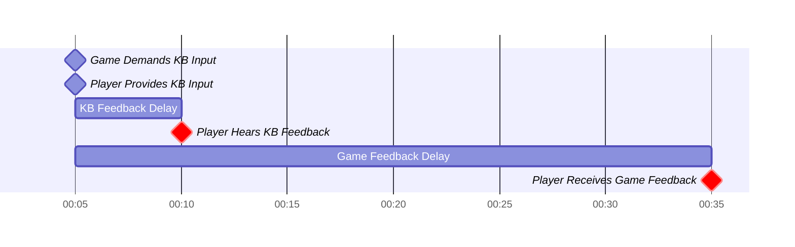

See the red diamonds:
As the KB hit sound (the clack of the KB) and the Game "hit sound" don't happen
at the same time players hear 2 different audio feedback sources.
This is especially disorientating for players using speakers,
they clearly hear themselves hitting the keyboard
then the game hit sound feedback. This explains why players often play with
headphones on to listen to the Game Hit Sound, or just entirely remove the
Game Hit Sound to hear their KB only.

To set the foundation, we firstly show the perfect scenario,
then illustrate solutions game take to work towards it.

### The Ideal Feedback Sync Scenario

Ideally, in a perfect world, we should **sense** these things sync exactly on
each other:

1. Keyboard Hit Sound (KB Feedback)
2. Game Hit Sound (Game Feedback)
3. Game Visual Feedback (Game Feedback)
4. Game Music Sync ("Feedback")

We extensively refer to these sources of feedback for the rest of the article.

Notably, the most difficult constraint is syncing KB Feedback with
Game Feedback because one is physical and the other is constrained by the
game processing speed, which can never be as fast.

While Game Music Sync is not exactly a source of feedback as it's
**independent** of the player keyboard input,
it's still vital to sync it exactly
on all sources. However, because it's easy to control the delay, we won't
include it in all future discussions unless necessary.

We have to now talk about the 2 main methods that games do this.

## Reactive Feedback

**Reactive Feedback** implies that the game only gives feedback **after** the
player provides an input.
As we know, physically, the Game Feedback will always lag milliseconds after KB
Feedback. Therefore, we can never achieve the ideal scenario.

See below:

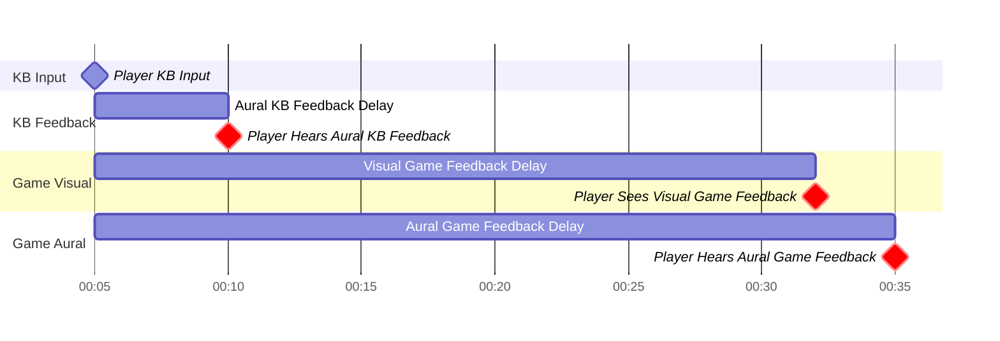

The number here are estimated by my experience, but most importantly,
Game Feedback will always take longer. There is no solution to make them all
sync... unless we compromise.

### Solution 1 & 2: Remove a Source of Feedback

Unsurprisingly, many players do not rely on all 3 sources of feedback.

1. Players don headphones, mostly blocking out KB Feedback
2. Players deafen Game Hit Sound
3. Some can remove the Game Visual Feedback, like hit lightning or judgements,
   removing.

Furthermore, players can independently choose their preferred combination of
feedback. The table below shows all possible combinations of feedback

| KB | Game Audio | Game Visual | Sync       | Notes                                                 |
|----|------------|-------------|------------|-------------------------------------------------------|
| O  | O          | O           | Impossible | Impossible due to technical limitations               |
| O  | O          |             | Impossible | Impossible due to technical limitations               |
| O  |            | O           | Compromise | Visual Sync may not be crucial, not necessary to sync |
|    | O          | O           | Possible   | w/ Headphones & appropriate delays                    |
| O  |            |             | Possible   | w/o Headphones and no Game Feedback                   |
|    | O          |             | Possible   | w/ Headphones and Hitsound without Hit Lightning      |
|    |            | O           | Possible   | w/ Headphones and no Hitsound                         |

As an example, players who don headphones rely on both Game Audio and Visual,
syncing them will be trivial with delays.

We show this solution graphically below

**SOLUTION 1**: Game Audio & Visual Sync

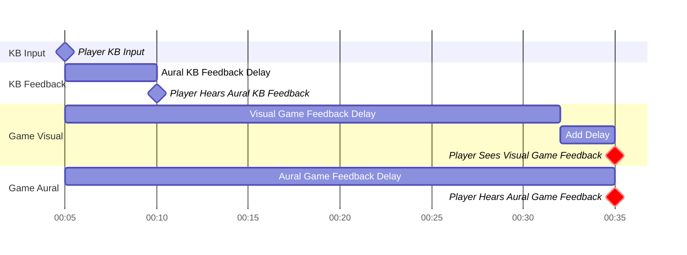

Another solution could be to remove game feedback entirely.
This solution brings the feedback much closer to the actual physical
hit, which may feel more natural.

**SOLUTION 2**: KB Only Sync

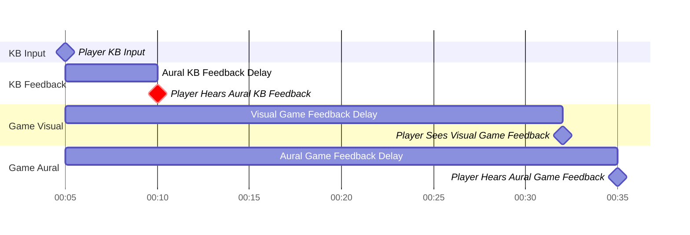

There are some solutions where it's still impossible though, mainly because
the KB Feedback **cannot** be delayed physically. For example, if the player
only removes the Game Visual Feedback, they will still run into the problem of
syncing both KB and Game Aural Feedback without any solution.

**NON SOLUTION**: KB & Game Audio Sync

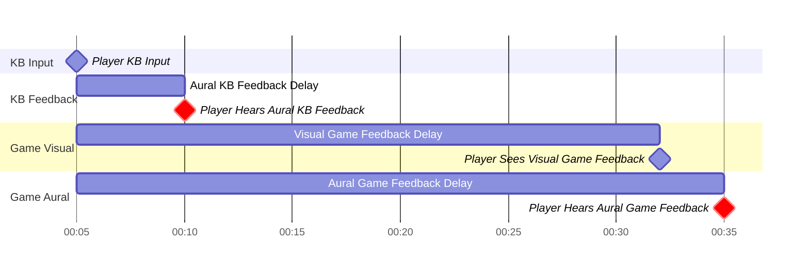

### Solution 3: Compromising w/ Delayed Visuals

While it's good to sync all 3 sources of feedback, many players choose to
compromise with a de-synced visual feedback.
From my experience, it's not particularly distracting as long as it's not too
off-sync. This compromise is usually worthwhile, as visual feedback are still
crucial during gameplay for players to adapt to their mistakes.

So, a 3rd option, graphically:

**SOLUTION 3**: KB Audio & Game Visual Off-sync

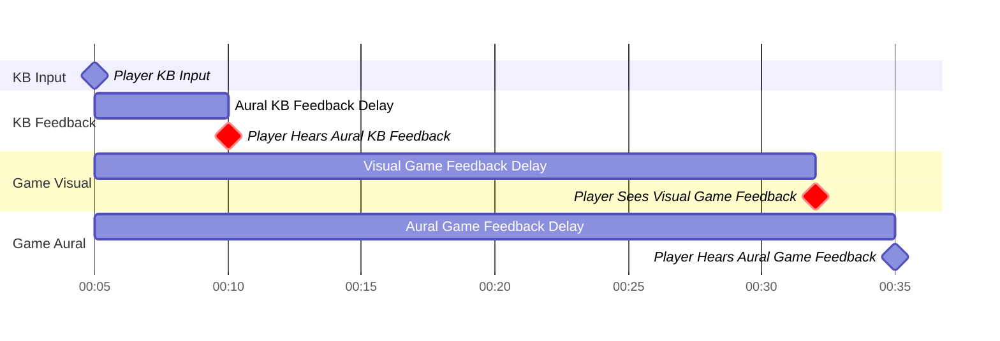

## Proactive Feedback

Unconventionally, we could **proactively** give feedback to the player. This
means that we **expect**, ahead of time, that the player will give some input.
This approach is definitely uncommon, but we provide some brief justification
on how it works.

One common way is to **assume** that the player performed the required input,
perfect, unless otherwise.

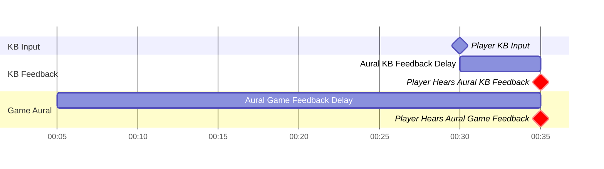

We see that because we're not limited to **reacting** to the KB Input, we have
the freedom to shift the Game Feedback Delays forward.

As expected, there's one gaping problem here:

> If we assume the player performed the input, doesn't it affect the judgement?

Remember how both the Game Visual and Aural feedback are separate? And how the
delayed Visual Feedback isn't as important? Therefore, in actuality, we can
play around with this leeway.

### Solution 4: Proactive Aural Feedback, Reactive Visual Feedback

Let's assume that we're not that picky about syncing visual feedback, but want
to perform proactive aural feedback. We can expect something like this:

**SOLUTION 4**: Proactive Aural Feedback Game

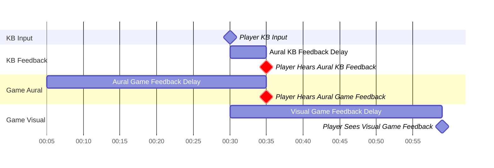

As expected, we do not sync the visual feedback.

Note that this option must be **embedded** within the game, and not a simple
customizable option Players can change freely, like using headphones or not.

### Nuances in Proactive Feedback

Proactive feedback is NOT just playing the feedback independently regardless
of the player input. If the player, actively hits significantly earlier than
expected, we could override the default proactive feedback.

For example, if the player hits around 35ms earlier than expected:

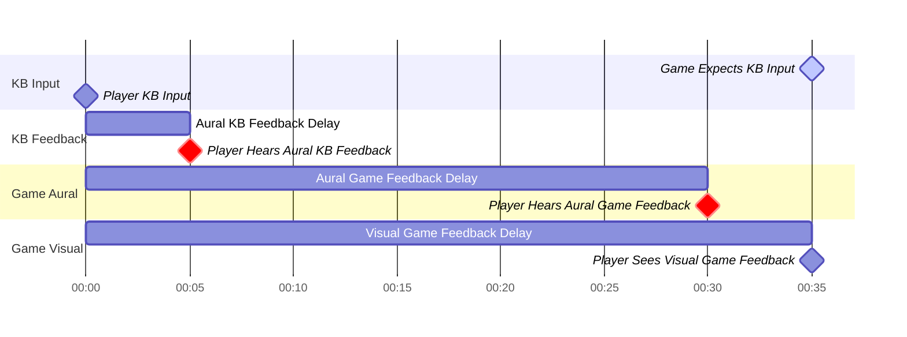

Though, this may not be **that** crucial when players are generally accurate.

## Demanding and Expecting Feedback

Before we go further, we need to quantify the concept of demand for feedback.
Generally, when the game demands, it signals the player to input **now**.

This has a simple consequence, the time of **demand** will affect the time of
**expectation**, accounting delays like KB Latency.

In the example following, we see that the game **must not expect** the input
**exactly** on the same millisecond as the **demand** due to latency.

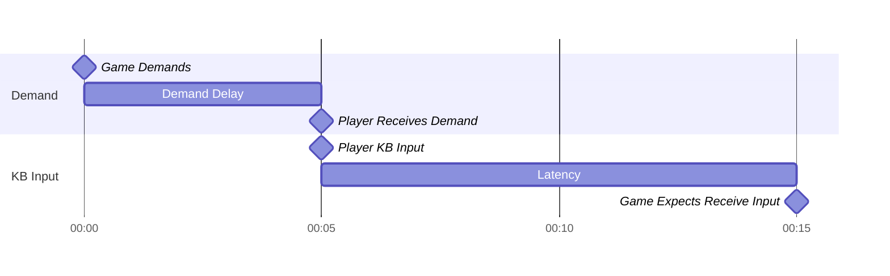

Note that this is **not necessary** to account for to **sync** all 3 feedback
sources, however, we will use this to holistically analyze the effects of
visual and aural offsetting.

## The Full Picture

Finally, we piece together everything we find:

1. The game demands input both visually and aurally
1. A visual demand can be a note approaching a receptor
2. An aural demand can be a rhythm in the music that the player predicts will
   be on that beat.
2. The player receives them, and hits exactly when they appear with no delay
3. The player will hear the keyboard hit sound as feedback
4. The game expects the KB input after some latency
5. The game will then play both visual and aural feedback.

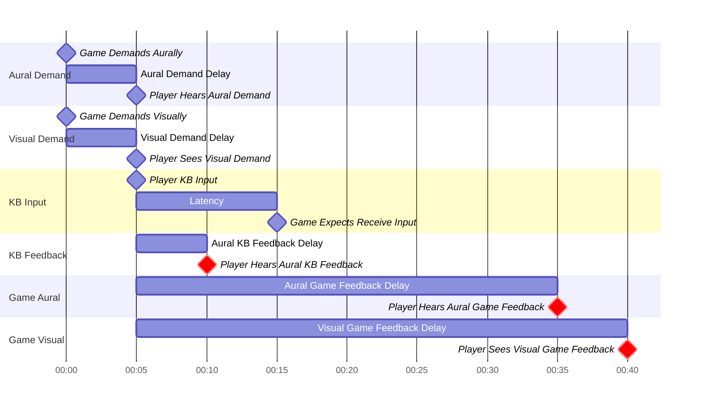

# What Offsetting do you need in a Game?

Now, we have to ask ourselves a few questions:

Do all VSRGs need:

1. Display Offsetting? (Delay)
2. Audio Offsetting? (Delay)
3. A separate feedback Offsetting mechanism?

An important note in offsetting is that there's

## Offsetting for Game Audio and Visual Sync

To recap, using headphones will mostly nullify KB Feedback.

To give an example, a player measured this weird de-synced Demand and Feedback
graph when playing.

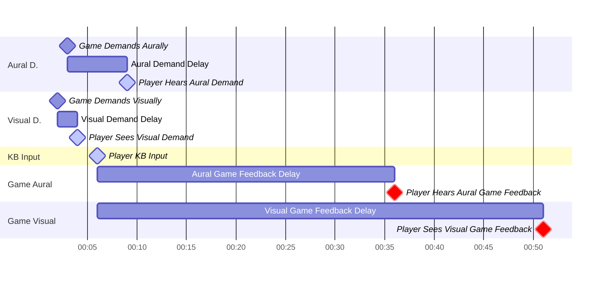

Assuming that we **must** input the note on 6ms (highlighted in light blue),
there are many ways to "align" this:

1. Shift Demand Audio Offset -3ms
2. Shift Demand Visual Offset +2ms
3. Delay Feedback Audio Offset +15ms

It's not conclusive if these small changes will improve how the game feels,
especially when nudging single digit offsets, but it's good to know for
optimization.

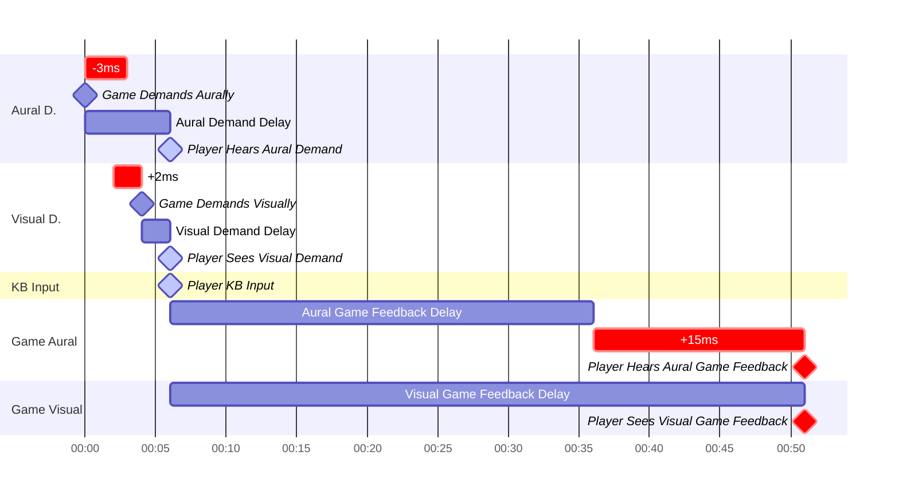

## Offsetting for Game Visual Sync

This is similar to the previous, except that we now don't need care about Game
Aural Feedback. The solution is much simpler.

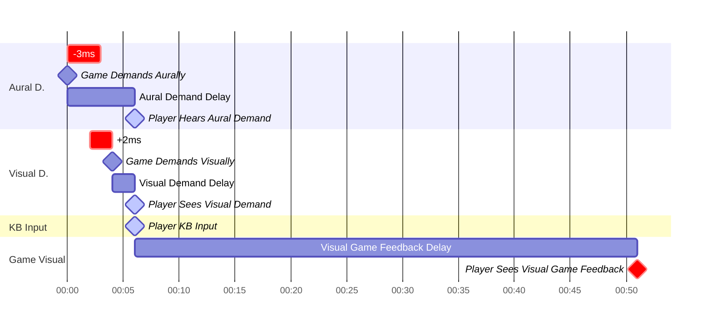
