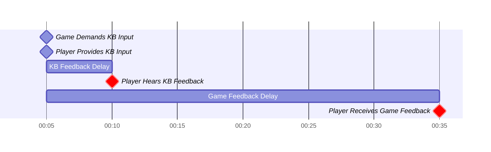
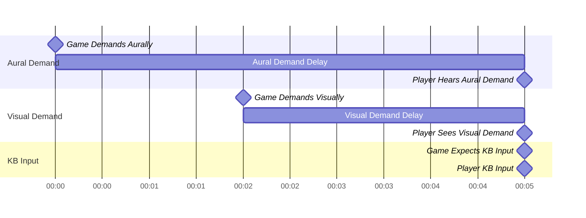
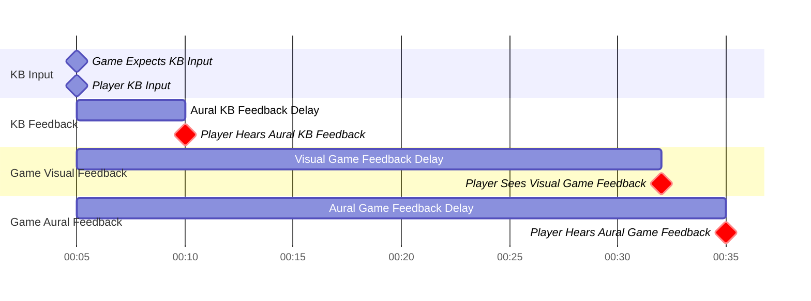
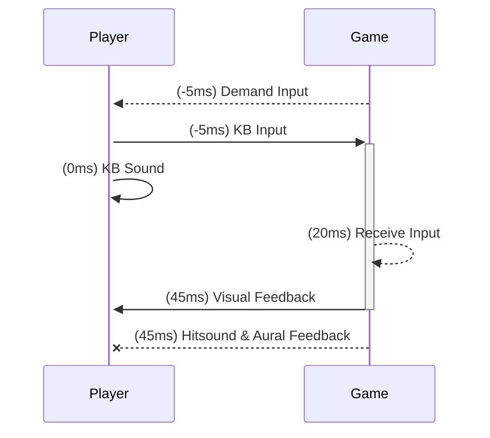
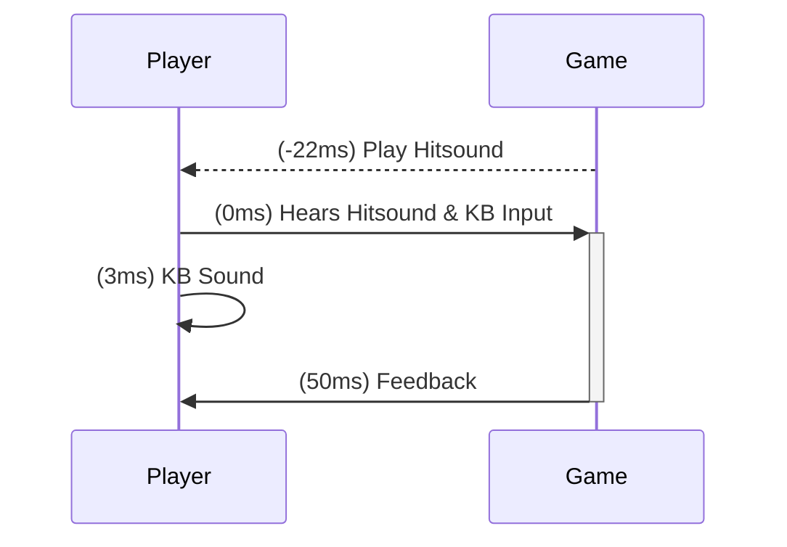
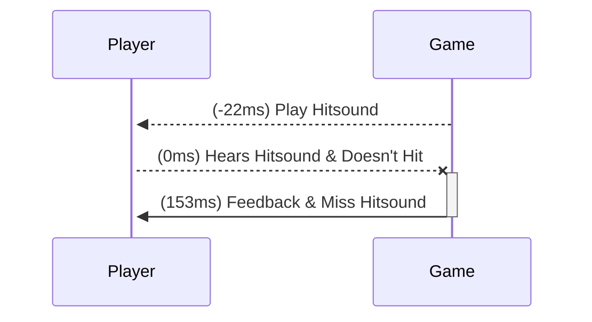
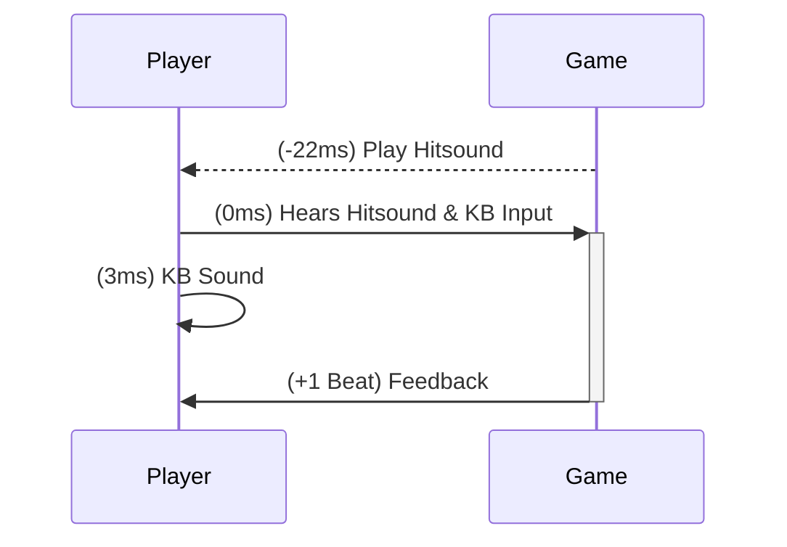

<!--more-->

# Introduction

Hitsounds in Rhythm Games are a way to give feedback on player inputs.

The IDEAL SETUP is:

> **When the game demands an input** (Demand KB Input):
>
> 1. the player will hit and **hear their keyboard clack** (KB Hit Sound)
> 2. and the **game responding with a hitsound** (Game Hit Sound)
>
> Both at the exact same time.

But syncing the **physical keyboard sound** and **game hitsound** is just
physically not possible.

## Background

To explain, let's take a look at a simple timeline on how a note is handled.

There are 4 critical timestamps to consider:

1. When the input is **demanded** by the game
2. When the input is **provided** by the player
3. When the input is **received** by the game
4. When feedback is **received** by the player

Observe the red diamonds:
The KB hit sound (the clack of the KB) and the Game "hit sound" don't occur at
the same time, due to delay when processing the input, and playing the audio.

As a result, players hear 2 different audio feedback sources. This is especially
confusing for players using speakers, they clearly hear themselves hitting the
keyboard then the game hit sound feedback.

As expected, this is especially disorientating, if possible, we should only
hear both at the same time, or just one, and preferably as close to the input
time as possible.

Though there's more to it than aural feedback, let's formulate the perfect
scenario, then figure out how games tackle this problem.

### The Ideal Scenario

Ideally, in a perfect world, we should hear these things sync exactly on each
other:

1. Keyboard Hit Sound
2. Game Feedback (Hit Sound)
3. Game Music Sync
4. Game Visual Sync

Notably, the most difficult constraint is syncing (1.) with the rest, as it's
physically impossible to adjust it. Thus, (2, 3, 4.) must somehow "shift" to
accommodate this.

This has a lot more elements though, so let's supplement our graph with more
detail.

Let's take a step back and consider what happens **before** the player
is expected to input.

Due to delays in audio and visual we consider that the actual demand must happen
earlier. Furthermore, because the Speed of Light is faster than Audio, there's
some necessary stagger.

This may seem like unnecessary semantics, but it'll be useful when we get to
"shifting" these elements independently!

Next, we consider what happens when we separate feedback aurally and visually.

Same scenario, the red diamonds, which should be exactly synced, are different!
Again, because KB Feedback can't be physically delayed, and Game Feedback always
has non-negative latency, we reach an impossible problem.

Though, not all is naught, some solutions, though requires compromise, works for
many rhythm games!

## Solutions

### Solution 1: Remove a Source of Feedback

Even though it's not possible to achieve the ideal, we can still compromise as
there
are some common alternative scenarios where the player won't hear both the KB
and Game Hit Sound:

1. The player turned off Game Hit Sound
2. The player has headphones on (No KB Sound)

That means, we can shift the goal post a bit:

> **When the game demands an input** (Demand KB Input):
>
> 1. the player will hit and **hear their keyboard clack** (KB Hit Sound)
> 2. and the **game responding with a hitsound** (Game Hit Sound)
>
> Both at the exact same time.

Thankfully, there are some workaround to this

There are ways that games tackle this problem:

1. **Reactive** Feedback
2. **Proactive** Feedback
3. **Lazy** Feedback

## Audio Offsetting

## Offsetting: osu! / Etterna

There are 2 types of ways players sync, Visually and Aurally (through audio).
To check if you're a Visual player, play charts without music:
if there's no difference, then you're likely more reliant on visuals to sync.

- "Demand" as in, the notes are on the receptor 5ms earlier than expected in
  the song.

Both games have the option to offset the visuals, such that they present
visually earlier compared to the song. This **doesn't solve** the fact that
the hitsounds will be out of sync! However, because most visual players don't
turn on hitsounds anyway, it still feels more in sync than if this is not
enabled.

Note that this is **preferable** if:

1. The player turns off hitsounds
2. The player doesn't care that visual feedback may be delayed.

Thankfully, for most VSRGs, players sync visually more

## Rhythm Doctor

Rhythm Doctor foresaw this problem literally.

> We set -22 because -22 + 25 (1 way delay) = 3 will sync exactly on the KB
> sound

By playing the hitsound early, it will always be in sync with the KB
input. There is a major question though, how do you "correct" cases where
the player fails to hit it?

Simply, the game will **wait** until it goes over the miss threshold, then
provide feedback. As expected, because it may be out of sync with the song,
the miss hitsound feedback can be disorientating, but this is how Rhythm Doctor
handles this

## Hi-Fi Rush

If you're not familiar with Hi-Fi, it's an action Beat 'em Up Game where all
actions are synced to some background track. Inputs that are **on-beat** deals
more damage to enemies and award more score.

This is an interesting "Rhythm Game", I included this because of it's
latency-sensitive... yet not latency-sensitive at the same time.

The saving grace of Hi-Fi is that it **doesn't require immediate feedback**.
Generally, songs in Hi-Fi are around 130BPM, so each beat spans ~460ms, way
more than necessary leeway.

