WIP Article.

How do you sync every source of feedback in Rhythm Games? Are visual and audio
offsets important? Furthermore, do Hit Sounds contribute positively or
negatively to player experience?

<!--more-->

# Introduction

To begin, we first lay down the importance of audio feedback. Whether it is
in the form of the keyboard hit making a "clack", or the game playing a sound
file whenever it receives your input. The first, we coin it the KB Feedback,
the second, the Game Feedback.

While there are other forms of feedback, such as

- **Visual Feedback** in the form of hit lighting, judgements.
- **Physical Feedback** from when you feel your hands hit the keyboard

**Aural Feedback**, being the medium as the song is best suited as the most
important feedback to accurately time every single action.

However, the biggest problem that has plagued all Rhythm Games is that it's
always less ideal to use the in-game Hit Sound Feedback.

> **Disclaimer:** The offsets in the graphs below are roughly estimated to
> simplify the point I'm making, though they can be analytically found through
> experiments.

## Background

To explain, let's take a look at a simple timeline on what happens when a player
plays a single note.

There are 4 critical timestamps to consider:

1. When the input is **demanded** by the game
2. When the input is **provided** by the player
3. When the input is **received** by the game
4. When feedback is **received** by the player

However, in the last step, if the player can hear both the KB Hit Sound and
Game Hit Sound, they'll likely be at different timestamps, disorientating the
player. Furthermore, the music should exactly sync whenever the Feedback is
heard; because there are 2 time stamps, it's uncertain when it should play.

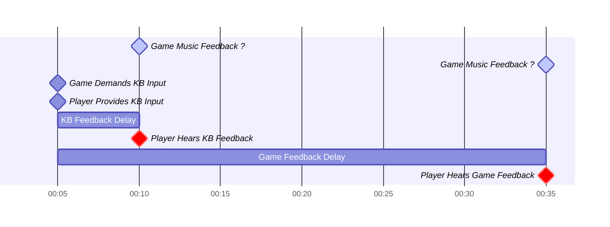

This delay is however, inevitable due to physical limitations, it's impossible
to hear the game feedback as fast as the tap on your keyboard.

### The Ideal Feedback Sync Scenario

To solve this, we have 3 choices, the players hear:

1. only the KB Feedback, synced to the music
2. only the Game Feedback, synced to the music
3. both feedback, exactly at the same time, also synced to the music

As far as we know, (3.) is generally impossible, however we'll discover an
interesting workaround in the **Proactive Feedback** section.

We discuss the major solutions many games do to *partially* reach this ideal
setup.

## Reactive Feedback

**Reactive Feedback** implies that the game only gives feedback **after** the
player provides an input. In most Rhythm Games, they always use
**reactive feedback**, and because of that, Game Feedback will always lag
milliseconds after KB Feedback.

As mentioned, we have 3 choices, thankfully, just isolating the KB or Game
Feedback is trivial

### Solution 1 & 2: Remove a Source of Feedback

Unsurprisingly, many players do not rely on both sources of feedback.

1. Players don headphones, mostly blocking out KB Feedback
2. Players deafen Game Hit Sound/Feedback

Furthermore, players can independently choose their preferred combination of
feedback. The table below shows all possible combinations of feedback

| KB | Game Audio | Sync       | Notes                                   |
|----|------------|------------|-----------------------------------------|
| O  | O          | Impossible | Impossible due to technical limitations |
| O  |            | Possible   | w/o Headphones and no Game Feedback     |
|    | O          | Possible   | w/ Headphones and Game Feedback         |

We show this solution graphically below

**SOLUTION 1**: Game Feedback only

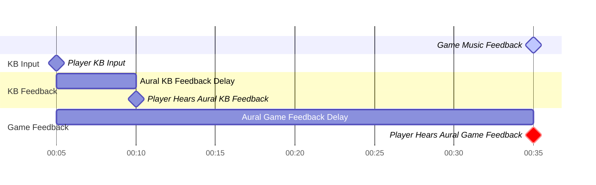

Another solution could be to remove game feedback entirely.
This solution brings the feedback much closer to the actual physical
hit, which may feel more natural.

**SOLUTION 2**: KB Feedback Only

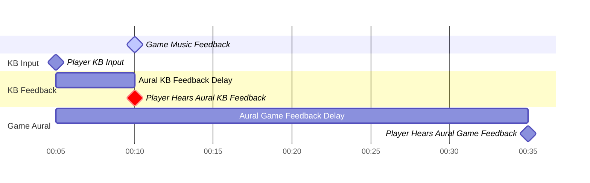

There are some solutions where it's still impossible though, mainly because
the KB Feedback **cannot** be delayed physically. For example, if the player
only removes the Game Visual Feedback, they will still run into the problem of
syncing both KB and Game Aural Feedback without any solution.

## Proactive Feedback

Unconventionally, we could **proactively** give feedback to the player. This
means that we **expect**, ahead of time, that the player will give some input.
This means we can solve the impossible, syncing both KB and Game Feedback on the
same timestamp!

This approach is definitely uncommon, we show how it works:

**SOLUTION 3**: Game and KB Feedback Synced
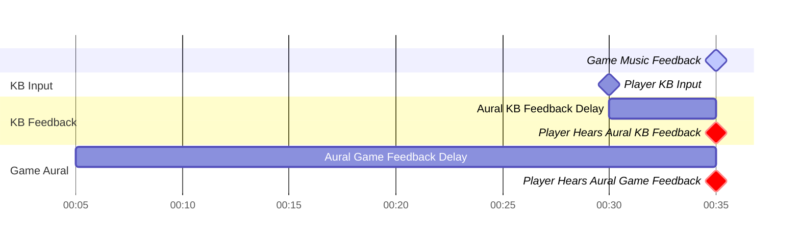

We see that because we're not limited to **reacting** to the KB Input, we have
the freedom to shift the Game Feedback Delays forward.

As expected, there's one gaping problem here:

> If we assume the player performed the input, doesn't it affect the gameplay?
> It's inconclusive due to lack of data, however it's worth to mention that
> it's successfully implemented in the game
> [Rhythm Doctor](https://rhythmdr.com/). Where its in-game hit sound is a
> crucial element in the game.

Note that this option must explicitly coded within the game, and not a simple
customizable option Players can change freely, like using headphones or not.

### Nuances in Proactive Feedback

Proactive feedback is NOT just playing the feedback independently regardless
of the player input. If the player, actively hits significantly earlier than
expected, we could override the default proactive feedback.

For example, if the player hits around 35ms earlier than expected:

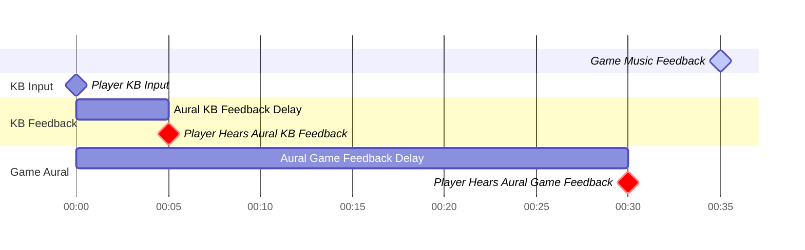

Though, this may not be **that** crucial when players are generally accurate.

## Expect Input with Latency

Before we go further, we need to quantify the concept of demand for feedback.
Generally, when the game demands, it signals the player to input **now**.

This has a simple yet surprising consequence, the timing where the game expects
to receive the input **must allow for a variable latency delay**, independent
of the music.

Take for example:

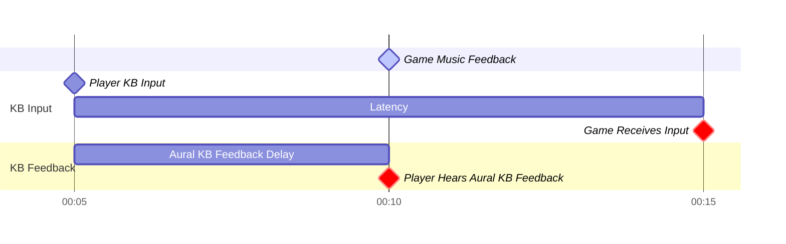

Very likely, you'll hear the KB Feedback way before the game knows you've input
the key. With different player profiles, this latency must be adjustable.

## Summary

Finally, we piece together everything we find.

In **Reactive Feedback**

1. The player should predict when the Game Music Feedback will play, and because
   sound has some delay, will hit slightly earlier, indicated by Player KB
   Input.
2. The player will then hear the KB Hit Sound as feedback
3. The game should expect the KB input after some latency, providing accuracy
   feedback.
4. The game will then play its own Game Hit Sound as feedback.

As mentioned, it's optional whether the player will hear the KB Hit Sound, or
the Game Hit Sound.

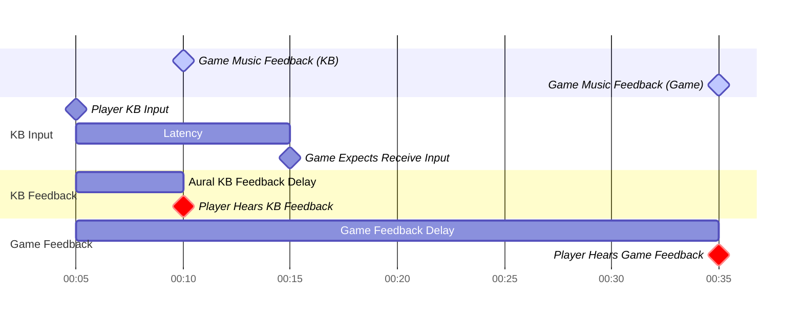

In **Proactive Feedback**

Much like Reactive Feedback, the sequence of events can change slightly, however
the perk of **Proactive Feedback** is the possibility to sync the KB, Game and
Music Feedback together

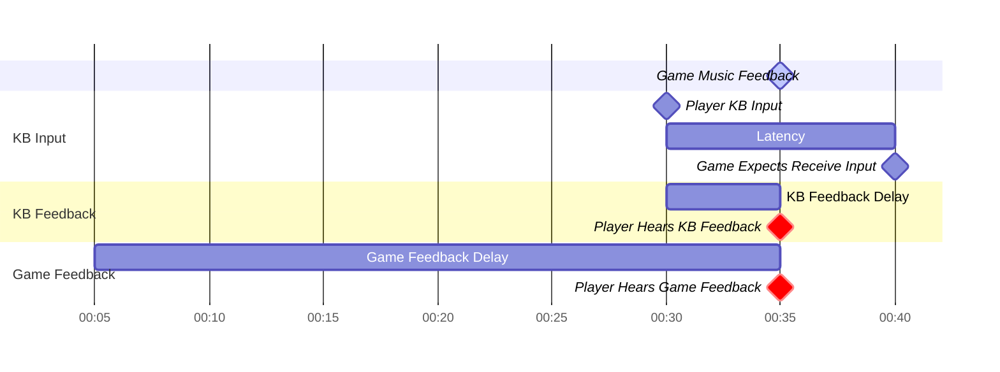

# Offsetting

Surprisingly, despite years of VSRGs being made, there's still contention on
if offsetting is necessary, and what offsets are needed.

As mentioned in the previous sections, there are 2 very important offsets.

1. Music Feedback Offset: A +- x millisecond config on the delay of the song.
2. KB Latency Offset: A +- x millisecond config on the delay between the player
   hitting the KB and the game receiving the input.

> (WIP) Below needs changing

Not surprisingly, these are crucial configurations for highly competitive games
where every setting counts.

To give an example, a player measured this weird de-synced Demand and Feedback
graph when playing.

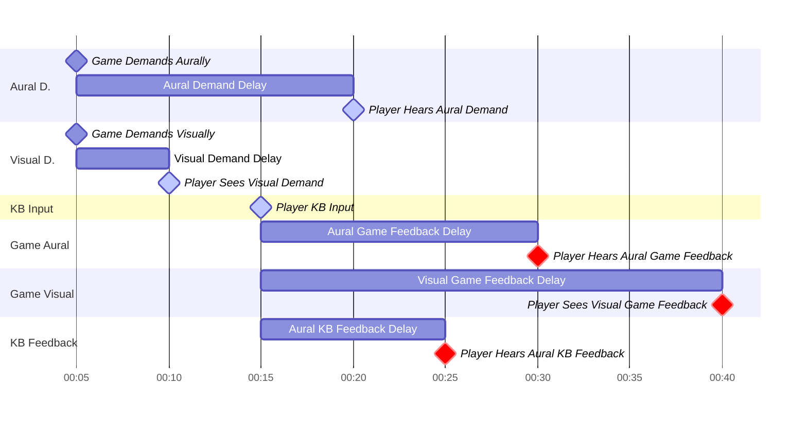

> This long of an Aural Demand delay is surprisingly common when you play on
> speakers!

Let's say they want to sync

1. (Light Blue) When they hit physically to the Aural and Visual Demand
2. (Red) When they receive Aural and Visual Feedback
3. Ignoring the Aural KB Feedback

We can apply:

1. -5ms Delay to the Aural Demand
2. +5ms Delay to the Visual Demand
3. +10ms Delay to the Aural Feedback

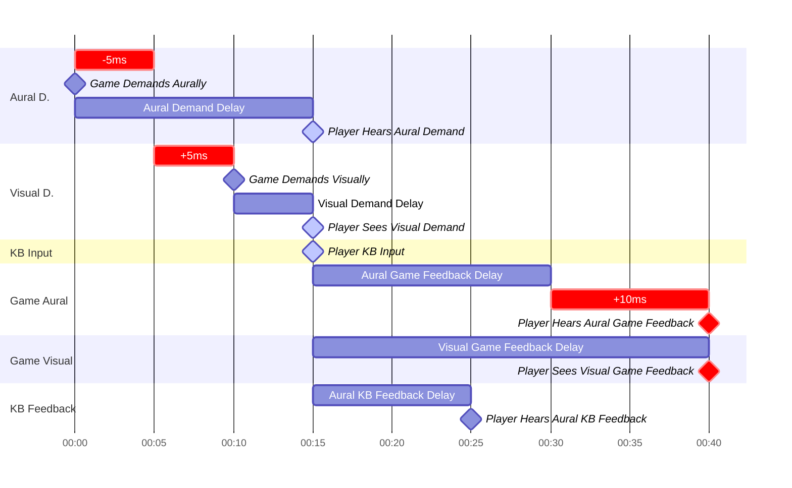

> Notice that if your Demand and Feedback offsets are linked to the same offset,
> you can't get this configuration. But to be fair, generally no one fine-tunes
> this much.

Of course, this is configurable, let's say a player is more aurally oriented,
where they want to sync the aural demand (the music) exactly on the KB feedback
sound. As a compromise, they have to physically feel the hit slightly earlier,
but the audio sync usually helps a lot. (This also mimics actual instruments
closer!)

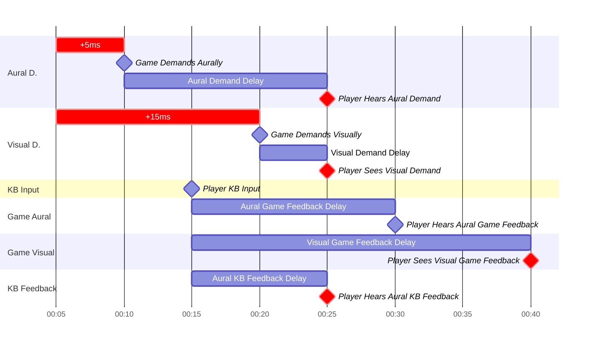

> Here, notice that if your Demand and Feedback offsets are linked, it doesn't
> matter since both Game Feedbacks are off.

We still keep the Visual Game Feedback since that's still crucial in gameplay.
But as explained earlier, it doesn't impact the sync much.

## What about w/o Visual Offset?

As mentioned, in VSRGs, players are often less sensitive to de-synced visuals
from the audio. So as a compromise, it's likely fine. To illustrate this:

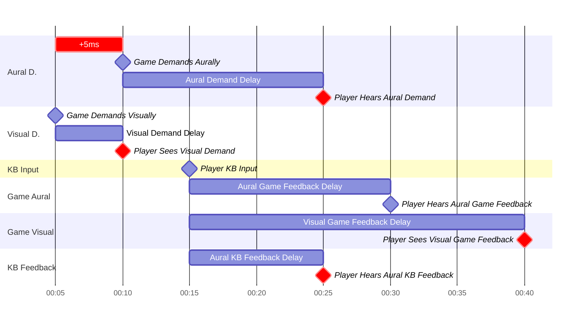

# Game Hit Sounds

Now, do hit sounds in-game actually help?

It depends on what one **wants to sync**. Though, giving the freedom of enabling
and disabling hit sounds will always make the game more accessible.

To recap, this is the general problem: we want to sync both KB Hit Sound and
Game Hit Sound as they are both major sources of feedback.
When they are de-synced, players will hear double feedback and can be
disorientating. The biggest bottleneck is that we cannot delay the KB Feedback
nor quicken the Game Aural Feedback, thus reaching a stalemate.

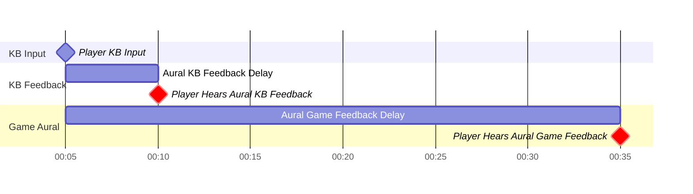

One way to work around this is to remove either source of feedback.
The other is to perform proactive game hit sound feedback, where we
predicatively play the Game Aural Feedback before the player hits the note

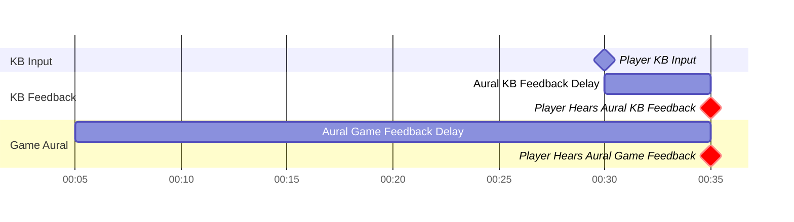

We recommend the reader to see the section for a more in-depth discussion for
this.

