Hit Sounds, Keyboard Sounds are useful sources of feedback in Rhythm Games,
though how do you sync them to songs to maximize accuracy with less effort?
Furthermore, is just Music Offset sufficient for a Rhythm Game? We introduce
the concept of an independent KB Latency Offset.

<!--more-->

# Introduction

To begin, we first lay down the importance of audio feedback. Whether it is
in the form of the keyboard hit making a "clack", or the game playing a sound
file whenever it receives your input. The first, we coin it the KB Feedback,
the second, the Game Feedback.

While there are other forms of feedback, such as

- **Visual Feedback** in the form of hit lighting, judgements.
- **Physical Feedback** from when you feel your hands hit the keyboard

We focus on **Aural Feedback** in this post mainly because it's the same medium
as the song. Its close alignment makes it worthwhile to optimize. While
**Visual Feedback** comes close second, we believe that players are generally
less time-sensitive due to it being a different medium.

> **Disclaimer:** The offsets in the graphs below are roughly estimated to
> simplify the points I'm making, though they can be analytically found through
> experiments.

## Background

To explain, let's take a look at a simple timeline on what happens when a player
plays a single note.

There are 4 critical timestamps to consider:

1. When the input is **demanded** by the game using a **Music Cue**
2. When the input is **provided** by the player
3. When the input is **received** by the game
4. When feedback is **received** by the player

We show this in a timeline

```mermaid
gantt
  dateFormat SSS
  axisFormat %L ms
  tickInterval 5millisecond
  Music Cue: active, milestone, 025,
  Music Cue Delay: active, 025, 030
  Player Hears Music Cue: active, milestone, 030,
  Player Provides KB Input: milestone, 000,
  Game Feedback Delay: 000, 030
  Player Hears Game Feedback: crit, milestone, 030,
  KB Feedback Delay: 000, 005
  Player Hears KB Feedback: crit, milestone, 005,
```

Firstly, the light blue elements indicate the music cues, **demanding** the
player to press at that specific time. Here, the game plays the cue at 25
milliseconds (ms), and due to how sound travels through air, there's some delay.
We assume that delay through sound is 5ms. Thus, the player actually hears the
cue at 30ms.

Next, we see that the player **provides** the KB Input, and similarly, there's a
huge delay between KB Input and actually hearing the Game Feedback (Hit Sound).
Therefore, players will need to input at 0ms, where the game will **receive**,
process it and play it back at 30ms.

It's no surprise that with good offset calibration, an accurate input will sync
both the Music Cue and Game Feedback, affirming that the player is accurate
without having to rely on Judgements. This is the default behavior of all Music
Games.

It's important to understand the previous paragraph lays the entire motivation
of syncing in the first place. If there was no Feedback nor Music Cues,
there's no need to sync at all. We see that we also have a KB Feedback, the
"Clack" sound. This happens much earlier because of how there's no need to be
processed by the game.

Finally, we see that, by default, if the player receives all forms of feedback,
they will hear the Game and KB Feedback at different times, which makes it
disorientating. We next explore options on how to fix this issue.

### Syncing Feedback to Music Cues

As we see above, there's 2 sources of feedback we can sync to the Music Cues,
leading us to 3 methods of syncing:

1. sync only the Game Feedback to the music
2. sync only the KB Feedback to the music
3. sync both feedback to the music

Since we have the freedom to shift the Music Cue anywhere due to offsetting,
(1.) and (2.) are easily achievable. Though (3.) is generally impossible as it's
not possible to delay the KB Feedback, nor quicken the Game Feedback Delay as
fast as the KB Feedback Delay. However, we'll discover an interesting workaround
in the **Proactive Feedback** section.

We illustrate the problem below:

```mermaid
gantt
  dateFormat SSS
  axisFormat %L ms
  tickInterval 5millisecond

  section Game Sync
    Music Cue: active, milestone, 030,
    Music Cue Delay: active, 030, 035
    Player Hears Music Cue: active, milestone, 035,
    Player Provides KB Input: milestone, 005,
    KB Feedback Delay: 005, 010
    Player Hears KB Feedback: milestone, 010,
    Game Feedback Delay: 005, 035
    Player Hears Game Feedback: crit, milestone, 035,
  section KB Sync
    Music Cue: active, milestone, 005,
    Music Cue Delay: active, 005, 010
    Player Hears Music Cue: active, milestone, 010,
    Player Provides KB Input: milestone, 005,
    KB Feedback Delay: 005, 010
    Player Hears KB Feedback: crit, milestone, 010,
    Game Feedback Delay: 005, 035
    Player Hears Game Feedback: milestone, 035,
  section Both Synced ?
    Music Cue ?: active, milestone, 020,
    Music Cue Delay ?: active, 020, 025
    Player Hears Music Cue ?: active, milestone, 025,
    Player Provides KB Input: milestone, 005,
    KB Feedback Delay: 005, 010
    Player Hears KB Feedback: crit, milestone, 010,
    Game Feedback Delay: 005, 035
    Player Hears Game Feedback: crit, milestone, 035,
```

We discuss the major solutions many games do to *partially* reach this ideal
setup.

## Reactive Feedback

From the previous sections, we've framed the problem with the constraint that
all feedback are **reactive**.
**Reactive Feedback** means the game only gives feedback **after** the
player provides an input. Most Rhythm Games use **reactive feedback**, and
because of that, Game Feedback will always lag milliseconds after KB Feedback.

Unsurprisingly, many players do not rely on both sources of feedback, therefore
it's entirely acceptable that they only use just 1, or sometimes none.

### Game Feedback Sync

To achieve this, players don headphones, mostly blocking out KB Feedback while
still enabling Game Hit Sounds.

```mermaid
gantt
  dateFormat SSS
  axisFormat %L ms
  tickInterval 5millisecond

  section Music
    Music Cue: active, milestone, 025,
    Music Cue Delay: active, 025, 030
    Player Hears Music Cue: active, milestone, 030,

  section KB Input
    Player KB Input: milestone, 000,

  section KB Feedback
    KB Feedback Delay: 000, 005
    Player Hears KB Feedback: milestone, 005,

  section Game Feedback
    Game Feedback Delay: 000, 030
    Player Hears Game Feedback: crit, milestone, 030,
```

Another solution could be to remove game feedback entirely.
This solution brings the feedback much closer to the actual physical
hit, which may feel more natural.

### KB Feedback Sync

Sometimes, players play on speakers, or with headphones that has low noise
suppression, allowing them to still hear the KB Feedback. In this case,
Game Hit Sounds are disabled.

```mermaid
gantt
  dateFormat SSS
  axisFormat %L ms
  tickInterval 5millisecond

  section Music
    Music Cue: active, milestone, 000,
    Music Cue Delay: active, 000, 005
    Player Hears Music Cue: active, milestone, 005,

  section KB Input
    Player KB Input: milestone, 000,

  section KB Feedback
    KB Feedback Delay: 000, 005
    Player Hears KB Feedback: crit, milestone, 005,

  section Game Feedback
    Game Feedback Delay: 000, 030
    Player Hears Game Feedback: milestone, 030,
```

## Proactive Feedback

Unconventionally, we could **proactively** give feedback to the player. This
means that we **expect**, ahead of time, that the player will give some input.
This means we can solve the impossible, syncing both KB and Game Feedback on the
same timestamp!

This approach is definitely uncommon, we show how it works:

### Game and KB Feedback Sync

```mermaid
gantt
  dateFormat SSS
  axisFormat %L ms
  tickInterval 5millisecond

  section Music
    Music Cue: active, milestone, 025,
    Music Cue Delay: active, 025, 030
    Player Hears Music Cue: active, milestone, 030,

  section KB Input
    Player KB Input: milestone, 025,

  section KB Feedback
    KB Feedback Delay: 025, 030
    Player Hears KB Feedback: crit, milestone, 030,

  section Game Feedback
    Game Feedback Delay: 000, 030
    Player Hears Game Feedback: crit, milestone, 030,
```

We see that because we're not limited to **reacting** to the KB Input, we have
the freedom to shift the Game Feedback Delays forward.

As expected, there's one gaping problem here:

> If we assume the player performed the input, doesn't it affect the gameplay?
> It's inconclusive due to lack of data, however it's worth to mention that
> it's successfully implemented in the game
> [Rhythm Doctor](https://rhythmdr.com/). Where its in-game hit sound is a
> crucial element in the game, which likely contributed to this design decision.

Note that this option must explicitly coded within the game, and not a simple
customizable option Players can change freely, like using headphones or not.

### Nuances in Proactive Feedback

Proactive feedback is NOT just playing the feedback independently regardless
of the player input. If the player, actively hits significantly earlier than
expected, we could override the default proactive feedback.

For example, if the player hits around 35ms earlier than expected:

```mermaid
gantt
  dateFormat SSS
  axisFormat %L ms
  tickInterval 5millisecond

  section Music
    Music Cue: active, milestone, 025,
    Music Cue Delay: active, 025, 030
    Player Hears Music Cue: active, milestone, 030,

  section KB Input
    Player KB Input: milestone, 000,

  section KB Feedback
    KB Feedback Delay: 000, 005
    Player Hears KB Feedback: crit, milestone, 005,

  section Game Feedback
    Game Feedback Delay: 000, 030
    Player Hears Game Feedback: crit, milestone, 030,
```

Though, this may not be **that** crucial when players are generally accurate.

## Expecting Input with Configurable Latency

Before we go further, we need to make a point that **latency** is different from
audio delay. When the game plays Music Cue, the time it should expect to receive
the input must add the KB Latency, which is variable.

Take for example, if we use 2 different keyboards of different latency, the
game should expect them at different timings.

```mermaid
gantt
  dateFormat SSS
  axisFormat %L ms
  tickInterval 5millisecond

  section Music
    Music Cue: active, milestone, 000,
    Music Cue Delay: active, 000, 005
    Player Hears Music Cue: active, milestone, 005,

  section KB Input 1
    Player High Latency KB Input: milestone, 000,
    High Latency: 000, 025
    Game Receives Input: crit, milestone, 025

  section KB Input 2
    Player Low Latency KB Input: milestone, 000,
    Low Latency: 000, 015
    Game Receives Input: crit, milestone, 015,

  section KB Feedback
    KB Feedback Delay: 000, 005
    Player Hears KB Feedback: crit, milestone, 005,
```

This means that the game **must** include a way to adjust for this latency,
independent of the audio delay.

## Summary

Finally, we piece together everything we find.

We have 3 feedback sync scenarios:

1. (Reactive Feedback) **Game Feedback**: This is the default behavior of many
   games, where the in-game hitsounds sync exactly to the music. Players will
   often use headphones to dampen the sound of KB Feedback.
2. (Reactive Feedback) **KB Feedback**: This is usually non-default, players
   will have to shift *forward* the Music Cue to achieve this sync.
3. (Proactive Feedback) **Game & KB Feedback**: This only applies to a selected
   set of Rhythm Games. In this case, Game Feedback are automatically played
   perfectly ahead of time to sync with KB Feedback and Music Cues.

# Offset

Surprisingly, despite years of VSRGs being made, there's still contention on
if offsetting is necessary, and what offsets are needed.

As mentioned in the previous sections, there are 2 very important offsets.

1. Music Offset: A +- millisecond config on the delay of the song.
2. KB Latency Offset: A +- millisecond config on the delay between the player
   hitting the KB and the game receiving the input.

To give an example, we show the problems that players tend to encounter during
Rhythm Games, and we'll show how these can be fixed through these offsets.

## Music Offset

### Re-syncing Music

Most commonly, due to human error, music can be de-synced. What this means is
that the "perfect" input will result in the Music Cue playing off-sync.

```mermaid
gantt
  dateFormat SSS
  axisFormat %L ms
  tickInterval 5millisecond

  section Music
    Music Cue: active, milestone, 020,
    Music Cue Delay: active, 020, 025
    Player Hears Music Cue: active, milestone, 025,

  section KB Input
    Player KB Input: milestone, 000,

  section KB Feedback
    KB Feedback Delay: 000, 005
    Player Hears KB Feedback: milestone, 005,

  section Game Feedback
    Game Feedback Delay: 000, 030
    Player Hears Game Feedback: crit, milestone, 030,
```

So, what the player will feel is that they are consistently "rushing"/"dragging"
in order to play perfectly.

The simple solution is to just allow players to add a delay to the music.

```mermaid
gantt
  dateFormat SSS
  axisFormat %L ms
  tickInterval 5millisecond

  section Music
    +5ms: crit, 020, 025
    Music Cue: active, milestone, 025,
    Music Cue Delay: active, 025, 030
    Player Hears Music Cue: active, milestone, 030,

  section KB Input
    Player KB Input: milestone, 000,

  section KB Feedback
    KB Feedback Delay: 000, 005
    Player Hears KB Feedback: milestone, 005,

  section Game Feedback
    Game Feedback Delay: 000, 030
    Player Hears Game Feedback: crit, milestone, 030,
```

We show here what we need to do for Game Syncing, this same ideal applies to KB
Sync.

### KB Sync

One of the more useful cases of offsetting is to sync the music exactly onto
the KB Feedback sound. As mentioned, this is usually the non-default behavior,
and it can vary wildly depending on the setup. But in general, this usually
results in moving the Music Cue forward by a huge amount.

```mermaid
gantt
  dateFormat SSS
  axisFormat %L ms
  tickInterval 5millisecond

  section Music
    -25ms: crit, 000, 025
    Music Cue: active, milestone, 000,
    Music Cue Delay: active, 000, 005
    Player Hears Music Cue: active, milestone, 005,

  section KB Input
    Player KB Input: milestone, 000,

  section KB Feedback
    KB Feedback Delay: 000, 005
    Player Hears KB Feedback: crit, milestone, 005,

  section Game Feedback
    Game Feedback Delay: 000, 030
    Player Hears Game Feedback: milestone, 030,
```

As mentioned, this **varies wildly**. For our setup, we use the TV speaker,
which contributes a massive delay. We often use -150ms or more of delay to sync.
It's likely attributed to audio enhancement steps within certain speakers.

```mermaid
gantt
  dateFormat SSS
  axisFormat %L ms
  tickInterval 20millisecond

  section Music
    -150ms: crit, 000, 150
    Music Cue: active, milestone, 000,
    Music Cue Delay: active, 000, 005
    Player Hears Music Cue: active, milestone, 005,

  section KB Input
    Player KB Input: milestone, 000,

  section KB Feedback
    KB Feedback Delay: 000, 005
    Player Hears KB Feedback: crit, milestone, 005,

  section Game Feedback
    Game Feedback Delay: 000, 155
    Player Hears Game Feedback: milestone, 155,
```

Regardless, this further enforces the idea that Music Offset configuration is
a **must-have** in Rhythm Games.

## KB Latency Offset

We'll borrow the standard case to illustrate why some games **may** need this
offset.

The question is, when do we **evaluate** the perfect KB Hit Input?
Ideally, it's evaluated whenever you expect the KB Input to be executed, plus
the KB Latency, which we emphasize has a large range.

Keep in mind that the time that the game **expects** the perfect input is
still independent of the Music Offset.

```mermaid
gantt
  dateFormat SSS
  axisFormat %L ms
  tickInterval 5millisecond

  section Music
    Music Cue: active, milestone, 025,
    Music Cue Delay: active, 025, 030
    Player Hears Music Cue: active, milestone, 030,

  section KB Input
    Player KB Input: milestone, 000,
    High Latency: 000, 030
    Game Receives Input: milestone, 030
    Low Latency: 000, 010
    Game Receives Input: milestone, 010

  section KB Feedback
    KB Feedback Delay: 000, 005
    Player Hears KB Feedback: milestone, 005,

  section Game Feedback
    Game Feedback Delay: 000, 030
    Player Hears Game Feedback: crit, milestone, 030,
```

So, unless the game can somehow always know the exact Keyboard Latency
(not possible), if it's even accounted for, it **should** allow the player to
nudge it.

### KB Latency Ranges

Thanks to [RTINGS Keyboard Table](https://www.rtings.com/keyboard/tools/table)
they have a large range of keyboards tested with Multi or Single Key Latency.
From a quick look, they can range from sub 1ms to 30ms.

### KB Release Latencies are different

Taking a look at any keyboard on the RTINGS Table, we see that release latency
will almost always be significantly delayed from the input latency. So
technically, for full configurability, the input and release latency needs to be
separately configured.

## Summary

For any Rhythm Game, there needs to be **at least** the ability to offset the
music, and up to ranges of likely +-250ms. More than likely, though, the most
players will not delay the music, instead, make it play earlier.

For Rhythm Games that wants to allow for **min-maxing**, KB Latency is something
to consider. To my knowledge, there isn't any Rhythm Game that allows for this
configuration, so you may have to take our word for it. It's worthwhile to note
that likely no one will use this configuration as it's obscure, but it may be
game changing for some.

# Annex

## Visual Offset

As briefly mentioned players are often less sensitive to de-synced visuals. This
is largely attributed to the fact that it's of a different "sense" than audio.
While I won't dismiss that they can be useful, especially when players approach
min-maxing, it's likely worth to discuss in another article.

> Note that only elements that are independent of the user inputs can have
> **negative offset**, so objects like notes, effects that are predefined are
> possible. Reactive elements like the hit lightning cannot be shifted forward.

## KB Feedback for Certain Games

It's not uncommon to hear that osu!standard players generally use hit sounds,
being confused on why osu!mania players don't follow. The reason is simple:

> Commonly, osu!standard players can't hear their keyboard. osu!mania players
> hear too much of their keyboard.

Unsurprisingly, osu!mania players hit their keyboard, very loudly. Therefore,
it may be worthwhile to use KB Hit Sound Sync.
However, osu!standard players generally don't, so they use Game Hit Sound Sync.
