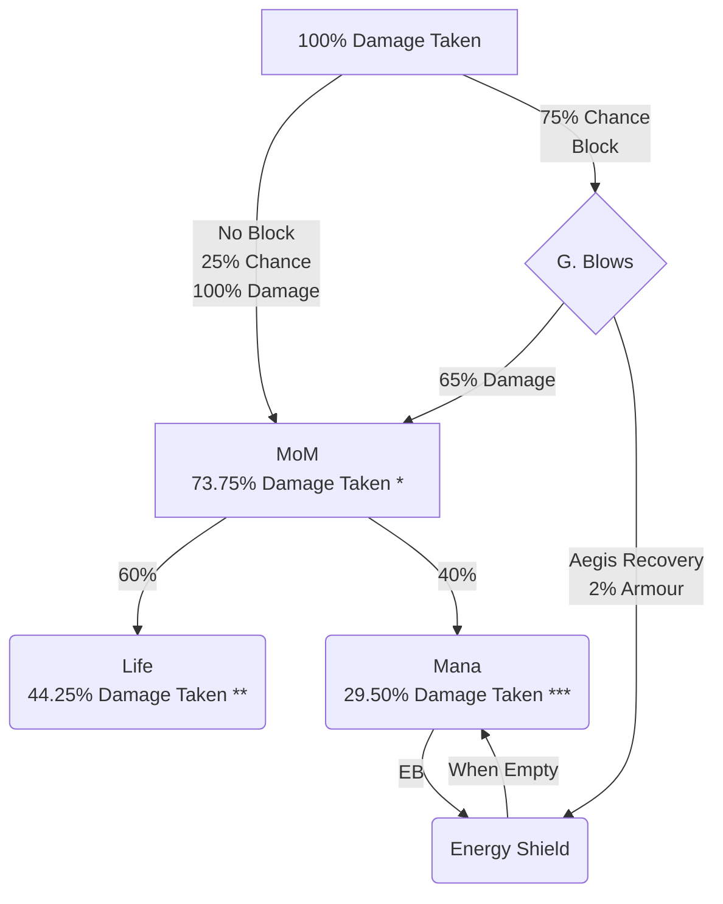
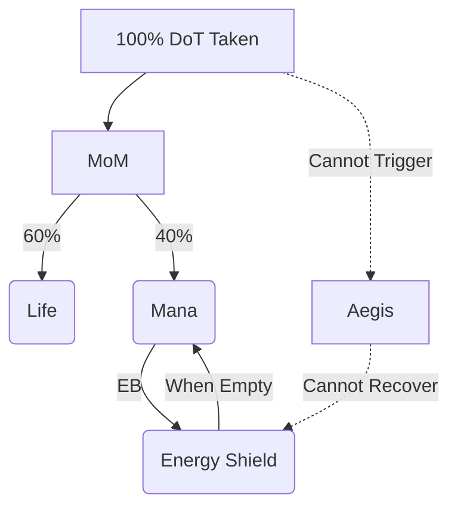

Extending Balormage's & Ghazzy's PSRS build guide for T17/Uber end-game content

<!--more-->

We'll refer to **B**alormage & **G**hazzy's guide as "BG's PSRS".

> If you're not familiar with PSRS, I highly recommend going through the
> campaign alongside BG's PSRS guide here before jumping into this:
> [https://www.poe-vault.com/guides/balormage-summon-raging-spirits-necromancer-build-guide](https://www.poe-vault.com/guides/balormage-summon-raging-spirits-necromancer-build-guide)

The purpose of this extended guide is to show how to build beyond what is
already discussed in their guide and address (understandably) overlooked details
that makes this build more T17/Uber+ comfortable.

# Our PSRS (Evening's PSRS)

Our version of the PSRS is an end-game focused variant of BG's PSRS. If you're
already invested into BG's PSRS but have additional currency to fine-tune, this
build can improve DPS by 30~50%, double EHP, and has improved QoL in many
fronts.

The full build is estimated to be around 50~100 Divines. Though, improvements to
the BG's PSRS build can be incremental. For example, small investments such as
[Dual Clusters (10D+)](#changing-single-to-dual-cluster) or
[Thread of Hope (0.1D ~ 3D)](#thread-of-hope) can make a huge difference in the
build without going deep into double-digit divines.

## Key Pieces

These are our key equips

| Category               | Our PSRS                                                                                           |
|------------------------|----------------------------------------------------------------------------------------------------|
| Helmet                 | +2 All Minion                                                                                      |
| Body Armour            | The Covenant[^covenant]                                                                            |
| Gloves                 | +2 Socketed Minion                                                                                 |
| Boots                  | 1 Abyssal Socket                                                                                   |
| Weapon                 | United in Dream[^united]                                                                           |
| Shield                 | Aegis Aurora[^aegis]                                                                               |
| Amulet                 | Aul's Uprising (Envy)[^auls]                                                                       |
| Belt                   | Darkness Enthroned 100%[^enthroned]                                                                |
| Flasks                 | Quicksilver, Basalt                                                                                |
| Jewels 1 & 2           | Void Beacon[^void-beacon] (Forbidden Flesh[^forb-flesh], Flame[^forb-flame])                       |
| Jewels 3               | Thread of Hope[^thread] at Eternal Youth[^eternal-youth]                                           |
| Jewels 4               | Amanamu's Gaze[^amanamus]                                                                          |
| Jewels 5 & 6           | Megalomaniac[^mega]                                                                                |
| Jewels 7 & 8           | Large Cluster Jewel                                                                                |
| Jewels 9, 10, 11 & 12  | Ghastly Eye Jewel[^ghastly]                                                                        |
| Anoint                 | As the Mountain[^mountain]                                                                         |
| Spectre 1              | Perfect Judgemental Spirit[^p-judgemental]                                                         |
| Spectre 2              | Perfect Warlord[^p-warlord]                                                                        |
| Spectre 3              | Hulking Miscreation[^hulking]                                                                      |
| Spectre 4              | Perfect Guardian Turtle[^p-turtle]                                                                 |
| AG Helmet              | Crown of the Tyrant (White Socket)[^tyrant]                                                        |
| AG Body Armour         | Garb of the Ephemeral[^ephemeral]                                                                  |
| AG Gloves              | Asenath's Gentle Touch[^asenaths]                                                                  |
| AG Boots               | Windscream[^windscream]                                                                            |
| Gem Links SRS          | SRS - Awk. Void Manip - Awk. Multistrike - Awk. Unleash - Awk. Unbound Ailments - Awk. Minion Damage |
| Gem Links AG - Spectre | AG - Spectre - Minion Life - Meat Shield                                                           |
| Gem Links Curse        | Arcanist Brand - Despair - Desecrate - Flesh Offering                                              |
| Gem Links Stone Golem  | Stone Golem - Feeding Frenzy                                                                       |
| Gem Links Envy         | Envy (from United in Dream[^united]) - Awk. Generosity                                             |
| Gem Links Convocation  | Convocation - Automation                                                                           |
| Gem w/o Links          | Vaal Grace, Vaal Haste, Flame Dash, Tempest Shield[^tempest-shield]                                |

## Key Changes

As a bird's eye comparison with BG's PSRS, these are the significant changes.

| Category             | BG's PSRS                                                                | Our PSRS                                                           | Notes                                                                      |
|----------------------|--------------------------------------------------------------------------|--------------------------------------------------------------------|----------------------------------------------------------------------------|
| Investment           | 5 ~ 50+D (*)                                                             | 30 ~ 50D                                                           | It's not clear on BG's investment for end-game.                            |
| DPS (Uber)           | 18M                                                                      | 27M                                                                | Non-Uber hits the DoT cap, which is not representative                     |
| EHP (No Flask/Flask) | 71K/114K                                                                 | 223K/270K                                                          | BG's uses Progenesis while we didn't, which may be a bit inflated          |
| Keystones            | Eldritch Battery[^eb], Mind over Matter[^mom], Glancing Blows[^glancing] | None                                                               |                                                                            |
| Block                | Capped with Glancing Blows                                               | Capped                                                             |                                                                            |
| Suppress             | Capped                                                                   | None                                                               |                                                                            |
| Armour               | High Priority                                                            | Medium Priority                                                    |                                                                            |
| Evasion              | Low Priority                                                             | Medium Priority                                                    |                                                                            |
| Energy Shield        | Medium Priority                                                          | Medium Priority                                                    | ES is med. priority in BG's build as MoM delegates only 40% damage to Mana |
| Life                 | High Priority                                                            | Medium Priority                                                    |                                                                            |
| Clusters             | 1                                                                        | 2                                                                  |                                                                            |
| Spectres             | P. Judgemental, P. Forest W., P. Turtle, P. Warlord                      | P. Judgemental, Hulking, P. Turtle, P. Warlord                     | (**)                                                                       |
| Flasks               | Granite, Silver, Quartz, Progenesis                                      | Quicksilver, Basalt                                                |                                                                            |
| Weapon               | United in Dream / Convoking (+1 Minion +1 Spell)                         | United in Dream                                                    |                                                                            |
| Helmet               | Suppress & +2 All Minion                                                 | +2 All Minion                                                      |                                                                            |
| Gloves               | Suppress                                                                 | +2 Socketed Minion                                                 | Roles of Gloves and Boots can swap                                         |
| Boots                | Suppress                                                                 | 1 Abyssal Socket                                                   | Roles of Gloves and Boots can swap                                         |
| Anoint               | Death Attunement (+1 Spectre)                                            | As the Mountain (+12% Attack Block)                                |                                                                            |
| Jewels               | Amanamu's, Green Nightmare, 5 Ghastly, 1 Cluster                         | Amanamu's, 2 Forbidden, 5 Ghastly, 2 Cluster, 1 Thread, 2 Mega     |                                                                            |
| Forbidden Jewels     | None                                                                     | Void Beacon                                                        |                                                                            |
| Minion Recovery      | Minion Def. Mastery: Minions Recover 5% on Minion Death                  | Life from Death: Minions Recover 4% on Minion Death                |                                                                            |
| Curse-Offering Loop  | Arcanist Brand / Convoking Trigger Wand                                  | Arcanist Brand                                                     |                                                                            |
| Auras                | Envy, Det., Haste, Malev, Disc., T. Shield, **Vit.**                     | Envy, V. Grace, V. Haste, T. Shield, **Vit.**, **Det.**, **Disc.** | **Bold: Provided by Spectres**  (***)                                      |

> (*) +3 Covenant[^covenant] is 500D+ and Progenesis is 100D+, it's not build
> critical to have these 2 pieces so we excluded it from the pricing.
>
> (**)
> - P. Judgemental: Perfect Judgemental Spirit [^p-judgemental]
> - P. Forest W.: Perfect Forest Warrior [^p-forest-warrior]
> - P. Turtle: Perfect Guardian Turtle [^p-turtle]
> - P. Warlord: Perfect Warlord [^p-warlord]
> - Hulking: Hulking Miscreation [^hulking]
>
> (***)
> - Det.: Determination (Provided by P. Turtle) [^determination]
> - Malev: Malevolence [^malevolence]
> - Disc.: Discipline (Provided by P. Judgemental) [^discipline]
> - T. Shield: Tempest Shield [^tempest-shield]
> - Vit.: Vitality (Provided by P. Warlord) [^vitality]

# BG's PSRS

As BG's PSRS guide went through, we're using Summon Raging Spirit (SRS)[^srs]
that inflicts Poison[^poison] on enemies. We can have up to 20 SRS
alive at the same time, summoning additional SRS will **kill** the earliest
summoned SRS in a first in first out fashion.

The way that each SRS Minion inflicts poisons is through **Chance to Poison
Enemies on Hit**, which commonly comes from these sources:

- United in Dream, Cutlass[^united] which provides **60%**.
- Ghastly Eye Jewels[^ghastly] which when socketed, each provides **10%-15%**.
- Chance to Poison Support[^chance-to-poison] provides **40%**.

> A common early-game set-up is to use Ghastly Eye Jewels and Chance to Poison
> Support to hit 100% Chance to poison as United in Dream can be difficult to
> get.

The poison damage dealt **per second** is 30% of the flat Physical and Chaos
damage dealt. Each poison lasts for 2 seconds by default. Therefore, the poison
dealt is 60% in total over the 2 seconds.

## Aside: End Game Min Max (Overkill) Loadout

We need to address a possible elephant in the room.
In BG's PoB[^bgpob], they provided an alternative loadout that represents what
an end-game overkill setup could look like, under "End Game Min Max (Overkill)".
In our opinion, this setup is not nearly as polished as the non-overkill
variant, we view it as more of a pipe dream than a well-calculated extension of
their SRS.

> This is not a critique on the intention of the design, as it's clearly
> intended to be less meticulous.
> We want to raise attention to its details to prevent players from falling into
> folly, blind copy and pasting of its pieces.

Our reasoning pivots on an eyeball justification of how much value each piece
could bring versus its cost. Pieces such as:

1. +3 Covenant. As of writing, it's at 500D+, but hardly moves the needle in DPS
   with consideration to its exorbitant cost.
2. Convoking with perfect 15% Ghastly Jewels: 15% jewels are already difficult
   to come by, furthermore, getting additional benefits mods such as "Additional
   Chaos Damage" exponentially explodes the price on this. As of writing, just
   getting 15% and at least 30 additional Phys/Chaos is minimally 8D. Convoking
   goes for at least 70D.

   From our calculation, it does improve damage, but we don't feel that this
   high of a price-tag justifies its investment.
3. Progenesis is probably one of the better justified investments here. Though,
   if you're willing to sink 100D into it, we recommend to review other pieces
   before the investment.

## EB & MoM & Aegis & Glancing Blows

EB & MoM & Aegis & Glancing Blows has a really tight-knit synergy that makes up
for each other's shortcomings.

Eldritch Battery (EB)[^eb] makes your Energy Shield (ES) "protect" mana instead;
spending ES before mana.
The main motivation for allocating this is so that you can fully reserve the
entire mana pool to make full advantage of auras.

This however poses a huge drawback in defenses, which is why
Mind Over Matter (MoM)[^mom] is also allocated, making incoming damage split
between the ES that's protecting the Mana pool and Life. Thus, we do not just
fully lose out on ES protecting our life.

The build also uses Aegis Aurora (Aegis)[^aegis], which allows
users to "Recover Energy Shield equal to 2% of Armour when you Block". In many
cases, without Aegis, when we take too much damage, ES will be drained, and can
be difficult to regenerate due to the recharge cooldown. Aegis mitigates this
problem by yielding instant ES when we block. Thus, as long as we're
consistently blocking, ES can be kept at a healthy level.

Capping block can be difficult, thus Glancing Blows[^glancing] can be allocated
to easily cap Attack and Spell Block at 75%. Though this comes with a huge
downside of letting 65% of damage pass through despite blocking.

This is a high level diagram on how damage taken is split to respective lifeline
layers.

> - (*) $25\% * 100\% + 75\% * 65\% = 73.75\%$
> - (**) $73.75\% * 60\% = 44.25\%$
> - (***) $73.75\% * 40\% = 29.50\%$

As an aside, as damage is split between ES and Life at the same time, life leech
from Bone Barrier[^bone-barrier] is consistently putting in work, and not just
trying to heal a full life bar, which happens often in the case without EB.

> Bone Barrier grants **1% of Damage Dealt by your Minions is Leeched to you as
> Life**

## United in Dream & Aul's Uprising

A simple yet interesting pairing is Aul's Uprising[^auls] and
United in Dream[^united]. By getting the Level 25 Envy[^envy] from
United in Dream, then nullifying the reservation requirement using Aul's,
we can cast a free Envy aura.

## Chance to Poison

One of the simpler goals is to achieve 100% Chance to poison, which can be
achieved through:

1. United in Dream[^united] which itself already gives 60%
2. Ghastly Eye Jewels[^ghastly] which can grant (10~15%)
   - Darkness Enthroned[^enthroned] can elevate this to (15~30%)

> Chance to Poison Support[^chance-to-poison]
> is also on the table, but it's often not used in end-game setups.

The minimal combination to hit 100% is United in Dream with 2 Ghastly Jewels
and Darkness Enthroned (1 can be **not socketed** with high enough rolls).

In the case of using Convoking over United in Dream, one would need at least 5
Ghastly Jewels (excluding Amanamu's[^amanamus]) that are decently high-rolled.
By our calculations, they need to be each on average 14.29% chance to poison,
which is going to get costly for good jewels.

### Amanamu's Gaze & Chance to Poison Balancing

With Amanamu's Gaze[^amanamus], you need 4 Ghastly Jewels (excluding Amanamu's).
Thus, per the above section, it's not **that** critical to hit max rolls for
chance to poison if they are expensive (unless you're using Convoking).

We feel that it's good to try to hit the cap with 2 Ghastly Jewels, 1 in
Darkness Enthroned, 1 outside. This is because getting Ghastly Jewels that have
chance to poison on hit & important stats such as additional chaos/physical
damage, attack speed, etc. tend to be extremely expensive.
This leaves us with 2 free Ghastly Jewels that can focus on more important
stats while keeping costs lower.

## Getting the Fourth Spectre

To get 4 spectres, you need the following:

- Passive: Death Attunement[^attunement]
- Level 25 Raise Spectre[^spectre]

The difficulty is getting Level 25 on Raise Spectre, which BG's PSRS achieve
using

- Corrupted Level 21 Raise Spectre
- Helmet Mod: +2 to Level of All Minion Skill Gems
- Convoking Wand Mod: +1 to Level of All Minion Skill Gems
- Convoking Wand Mod: +1 to Level of All Spell Skill Gems

> In this case, they are using a Rare Convoking Wand, United in Dream[^united]
> cannot work. We recommend the below choices to work around it.

Though, there are some other avenues:

- Boots Delve Mod: +2 to Level of Socketed Minion Skill Gems
- Empower[^empower]: +2 to Supported Skill Gems

> We don't recommend Empower unless absolutely necessary, as socketing Raise
> Spectre alongside Animate Guardian[^ag] with 2 good defense supports is
> important to keep them alive in end-game content.

To summarize

| Piece                           | +# Lv.  | Note                       |
|---------------------------------|---------|----------------------------|
| Raise Spectre Lv.21             | 21      |                            |
| Helmet Mod +2                   | 2       |                            |
| Boots Delve +2 Socketed Minion  | 2       | Must be socketed here      |
| Gloves Delve +2 Socketed Minion | 2       | Must be socketed here      |
| Convoking Wand +1 All Minion    | 1       | Sacrifices United[^united] |
| Convoking Wand +1 All Spell     | 1       | Sacrifices United[^united] |
| (Awakened) Empower              | 2-4 (*) | Must sacrifice 1 support   |

- (*) +4 is 1 mirror. +3 could be enough if you can find another source of +1.
  But still, we recommend just getting the Helmet and Boots/Gloves, much
  cheaper.

### BG's PSRS Spectres

BG's PSRS chooses the following spectres:

- Perfect Judgemental Spirit[^p-judgemental]
  > Buffs SRS with Fire and Chaos Damage & casts Discipline[^discipline]
- Perfect Forest Warrior[^p-forest-warrior]
  > Buffs SRS with Onslaught[^onslaught] and has
  > Culling Strike[^culling]
- Perfect Guardian Turtle[^p-turtle]
  > Buffs the character with Rongokurai's Boon[^rongokurais],
  > grants 5% Physical Damage Reduction and casts Determination[^determination]
- Perfect Warlord[^p-warlord]
  > Casts Vitality[^vitality] & grants Endurance charges.

We additionally recommend

- Hulking Miscreation[^hulking] as it also grants SRS more Damage and increased
  30% Attack Speed.

> Perfect Judgemental Spirit & Hulking Miscreation only works thankfully because
> SRS is both a **skeleton** and **construct**, which are necessary conditions
> respectively for the aforementioned spectres.
> See the PoeDB Entry for the SRS entity[^srs-db]

## Animate Guardian (AG)

Animate Guardian[^ag] is also a core component in the BG's PSRS build, which
they use:

- Crown of the Tyrant (White Socket)[^tyrant] which grants SRS 47 to 61 added
  Chaos Damage
- Kingmaker[^kingmaker] which grants
  > - Nearby Allies have 30% increased Item Rarity
  > - Nearby Allies have +10 Fortification[^fortification]
  > - Nearby Allies have Culling Strike
  > - Nearby Allies have +50% to Critical Strike Multiplier
- Garb of the Ephemeral[^ephemeral]
  > - Nearby Allies' Action Speed cannot be modified to below Base Value
  > - Nearby Enemies cannot deal Critical Strikes
- Windscream[^windscream]
  > - AG can apply an additional curse
- Asenath's Gentle Touch[^asenaths]
  > - AG applies Temporal Chains[^temporal-chains] on Hit
  > - Non-Aura Curses you inflict are not removed from Dying Enemies
  > - Enemies near corpses affected by your Curses are Blinded
  > - Enemies Killed near corpses affected by your Curses explode, dealing 3% of
  >   their Life as Physical Damage

Garb of the Ephemeral[^ephemeral] is a major game-changer; gaining Action Speed
not being able to be lowered below base value prevents Frozen[^frozen],
Petrified[^petrified], any slowdown debuff. It also prevents enemy Critical
Strikes, which is an additional nice to have.

Asenath's[^asenaths] applies Temporal Chains[^temporal-chains], which makes
Poison[^poison] from PSRS linger longer, making them take more damage. Asenath
also gives crowd explosions, which often procs on dense packs e.g. in
Strongboxes.

Windscream[^windscream] is necessary as we already apply Despair[^despair],
thus AG needs to be able to cast an additional curse to inflict Temporal Chains
on top.

Kingmaker[^kingmaker] granting Fortification[^fortification] gives 10% less
damage taken, which is extremely significant. Furthermore, Culling Strike gives
an additional edge in damage.

Crown of the Tyrant[^tyrant] is just a flat damage increase.

# Our PSRS Changes

Our build departs with many concepts of BG's PSRS but still keeps several tried
and tested strategies (across several leagues) intact. During our testing, we
consistently challenged core-designs with alternatives and we found many areas
of improvement which we have documented below.

There's quite a few changes: we'll explain the motivations of each with respect
to the above design choices. We'd like to emphasize that these motivations pivot
on the assumption of end-game (>=T16 Maps), thus may not be as impactful if the
character is not comfortably there yet.

## Re-evaluating EB & MoM & Aegis

Despite many benefits of synergy between these three, our test plays uncover
that it's not foolproof, with its fault amplified in late-game content.

### Poor DoT Mitigation with EB & MoM

The synergy is prone to one common fault: DoT.

When we are inflicted with any unavoidable DoT, MoM[^mom] will kick in and
drain through our ES, immediately making you not have any Mana to cast
anything, given that you fully reserve your mana pool. This bricks your travel
skills, and SRS summons. In this special case, Aegis[^aegis] cannot kick in to
regen ES, as it only works when on block.

This adapted diagram specifically for DoT shows what happens.

We were frustrated at how many times this can happen in T17/Ubers:

1. Desecrated Ground
2. T17 & Uber Sirus: Awakener's Desolation
3. Uber Shaper/Elder: Volatile Anomalies
4. Uber Exarch: Searing Rune
5. Many more

There are several ways to fix this issue:

1. Replica Sorrow of the Divine[^replica-sorrow] which allows you to pop a
   life-flask to instantly force regenerate your ES.
2. Reducing ES Recharge Start delay through the passive tree, like through
   Wicked Ward[^wicked-ward], Essence Surge[^essence-surge], etc.

Though, as much as we try, we find that we're not really satisfied with these
band-aid solutions. Furthermore, these seem to just pile onto the problem
instead of truly fixing the root issue.

We took a gamble and tried without EB and MoM.

### Dropping EB & MoM for just Mana

Again, the purpose of EB & MoM in BG's PSRS is to solve the issue where
you want as many auras as possible yet still want to cast SRS consistently.
We present an alternative solution, which is to just **not reserve all mana**
instead, just enough to cast SRS.

By going with this design, we need to fix these:

1. Maximum Mana & Mana Reservation
2. Mana Regeneration
3. Mana Cost

As an example, in our build, the SRS mana cost is 54, thus, we designed ours to
have a little more than 54 unreserved mana. We also have ~54 Mana/s regeneration,
making us able to cast SRS every second.

There are many ways to solve the above, we list some that we've tried or used:

- Max Mana & Reservation
  1. **Large Cluster Jewel**: +# to Maximum Mana
  2. **Passives: Sovereignty**: 12% increased Mana Reservation Efficiency of
     Skills
  3. **Passives: Mana Mastery**: 12% increased Mana Reservation Efficiency of
     Skills
  4. **Eater Eldritch: Helmet**: 9% increased Mana Reservation Efficiency of
     Skills
- Mana Regen:
  1. **Passives: Shaper**: 40% increased Mana Regeneration Rate
  2. **Passives: Dreamer**: 30% increased Mana Regeneration Rate, 10% reduced
     Mana Cost of Skills
  3. **Passives: Mystic Bulwark**: 1% increased Mana Regeneration Rate per 1%
     Chance to Block Spell Damage
  4. **Large Cluster Jewel**: #% increased Mana Regeneration Rate
- Mana Cost:
  1. **Life Mastery**: Skills Cost Life instead of 15% of Mana Cost
  2. **Ring Craft**: Non-Channelling Skills have -7 to Total Mana Cost

These options are non-exhaustive, we can even sometimes fix Mana Regeneration
with an **Enduring Mana Flask**. This is often a good flask to have as you may
encounter map mods that stop/reduce mana regen.

> **Enduring**:
> - Effect is not removed when Unreserved Mana is Filled
> - Effect does not Queue
> - 66% reduced Amount Recovered

With these checked out, we find that it's significantly more manageable than
using EB & MoM.

Though, we have to acknowledge that this requires significantly more investment
than just allocating EB & MoM. Furthermore, since our ES protects our life
entirely, life leech from Bone Barrier[^bone-barrier] will be less effective
overall. However, we argue that since it's a defensive layer for Chaos damage,
it may be desirable.

### EB & MoM against 1 Shot hits

> **Mind Over Matter**[^mom]
> - 40% of Damage is taken from Mana before Life

MoM makes it such that 40% of Damage is relegated to Mana (ES with EB), our
max damage taken is affected. For example, given that we have 3000 HP and
3000 ES with 0 unreserved Mana, we can take:

- $3000 \text{Life} + 3000 \text{ES} = 6000$ Damage in 1 hit without EB + MoM
- $3000 \text{Life} + 2000 \text{ES} = 5000$ Damage in 1 hit with EB + MoM

We can see that in special cases, where $\text{ES}>\frac{2}{3}\text{Life}$,
EB + MoM reduces our maximum damage taken in 1 hit.

We find that in many of our playthroughs when we specialize into ES equipment,
our Life is usually $\approx$ our ES. This means that EB[^eb] and MoM[^mom] will
result in a lower max damage taken.

### Re-allocating passives without EB

If we drop EB[^eb], notice that the top right of the passive tree is spread
thin, spending way too many points to fetch:

1. **Instinct**: 22% Suppress & ES Regen
2. **Influence**: Aura stats
3. **Written in Blood**: Life & ES
4. **Large Cluster** near EB

We felt that this wasn't worthwhile for a whopping 37 points, in our version, we
re-allocate it to mostly focusing on the left side of the passive tree.

> 37 if you break the branch at the Intelligence node right below Wandslinger.

This is also a supporting reason why we choose to not focus on suppress as
mentioned in our
[next section](#swapping-suppress--glancing-blows-for-evasion--block-cap)

### How often do you need to cast SRS?

One of the problems when dropping EB[^eb] is the SRS[^srs] cast rate necessary
in order to:

1. Trigger _Minions Recover #% of Life on Minion Death_ for sufficient Spectre &
   AG survivability.
2. Maintain a maximum 20 SRS uptime.

Surprisingly, the answer is **not very often**.

Consider the case where we have a 20/20 SRS[^srs] Gem linked to a 5/# Awakened
Unleash gem. We get the following traits:

> - 30% chance to summon an extra Minion
> - Supported Spells gain a Seal every 0.66 seconds, to a maximum of 4 Seals

If we are able to **cast SRS every second**, we'd summon on average
$1.3 * (1 + \frac{1}{0.66}) \text{SRS}/s\approx3.27\text{SRS}/s$.
Our SRS would live for base $5s$, extended to $(5 * 144\%)s=7.2s$
with the Enduring Bond passive ring.
Thus, if we held down SRS, we will be able to summon a peak of
$3.27 \text{SRS}/s * 7.2s\approx23.5\text{SRS}$. This thus also gives us some
excess SRS to trigger our _Minions Recover #% of Life on Minion Death_ ability,
or just some lee-way to maintain our SRS.

Some may consider this to be a bit too little lee-way, since we always have
large downtime. It's possible to fix this with an Enduring Mana Flask or
Mana Regen on clusters.

However, we recommend to **not** have too much lee-way to not expire SRS too
early. We need to take into consideration that spamming SRS at a distance will
counter-intuitively reduce damage, this is because SRS needs to travel to the
target, which usually takes around ~1s.

### What about Aegis?

Despite dropping EB[^eb] & MoM[^mom], Aegis[^aegis] is still an insanely good
shield. There are other contenders such as The Surrender[^surrender] and
Svalinn[^svalinn]. We stuck with Aegis as we upgrade from BG's PSRS, we didn't
really find much need to move to either.

While we do recognize that Svalinn is significantly powerful in increasing EHP,
its investment is a bit steep compared to many other pieces we have.

## Swapping Suppress & Glancing Blows for Evasion & Block Cap

In BG's PSRS, their main defenses are:

1. Life
2. Armour
3. ES (with MoM[^mom])
4. Block (With Glancing Blows[^glancing])
5. Suppression Capped

However, we find that in many cases (including other builds), specializing in
specific lines of defenses can get extremely costly, _especially suppress_,
often leading to diminishing benefits for larger currency sunk. We felt that
achieving suppress cap was extremely difficult without a Rare chestpiece and
trying to hit a Suppress & +2 Socketed Minion Gem mod on either Gloves or Boots
usually goes to many divines. Thus, it's more budget conscious to consider other
more accessible defensive layers first.

Furthermore, we noticed that Glancing Blows[^glancing] is not necessary as
achieving a high block isn't incredibly difficult if we spec into:

1. Safeguard[^safeguard]
   > - +3% to maximum Chance to Block Spell Damage
   > - +10% chance to Block Spell Damage while holding a Staff or Shield
2. Mystic Bulwark[^mystic]
   > - 6% Chance to Block Spell Damage
3. As The Mountain[^mountain] (via Anoint)
   > - +12% Chance to Block Attack Damage while Dual Wielding or holding a Shield
   > - +3% to maximum Chance to Block Attack Damage
4. Enduring Ward[^enduring]
   (via 2 Megalomaniacs[^mega])
   > - +10% Chance to Block Attack Damage while at Maximum Endurance Charges
   >
   > We achieve Max Endurance Charge with the
   > Perfect Warlord[^p-warlord] Spectre

Thus, we recommend taking as many lines of defenses as necessary, whichever
comes first. If suppress just so happens to be cheaper, then it's also
recommended to go for that

1. Life
2. Armour/Evasion/Suppress whichever cheaper
3. ES (without MoM[^mom])
4. Block (Without Glancing Blows[^glancing])

## Changing Single to Dual Cluster

If you've played around in PoB, you'd notice that perfect clusters tend to have
small passives that grant even more damage (and some utility) than the natural
tree passives.

For example, branching into
- Redemption[^redemption]
- Spiritual Command[^spiritual]
- Sacrifice[^sacrifice]
- Sacrifice[^sacrifice]

May be less effective than sending points into the cluster.

We find that the optimal cluster jewel is

> **Large Cluster Jewel**
> - Adds **12** Passive Skills
> - Added Small Passive Skills grant: Minions deal 10% increased Damage
> - [Prefix] Added Small Passive Skills have **35%** increased Effect
> - [Suffix] Added Small Passive Skills also grant: Minions have **3%**
>   increased Attack and Cast Speed

Additionally, we find that the following are potentially useful

> - [Suffix] Added Small Passive Skills also grant: +#% to all Elemental
>   Resistances
> - [Suffix] Added Small Passive Skills also grant: +# to All Attributes
> - [Suffix] Added Small Passive Skills also grant: +# to Dex
> - [Suffix] Added Small Passive Skills also grant: +# to Str
> - [Suffix] Added Small Passive Skills also grant: #% increased Mana
>   Regeneration Rate
> - [Prefix] Added Small Passive Skills also grant: +# to Maximum Life
> - [Prefix] Added Small Passive Skills also grant: +# to Maximum Mana

> For Mana mods, it's to help when we drop EB

We also place these 2 cluster jewels on near **Divine Shield** and the other
near **Death Attunement**[^attunement].
(This means we don't anoint it, we instead path to it).

## Jewel Socketing

In BG's PSRS, there's significant leeway in jewels that you can socket; though
we find that for our design, there's a recommended set of jewels you should
try to achieve. We firstly need to discuss the number of sockets we have:

1. 1 Socket near **MoM**[^mom]
2. 1 Socket near **Eternal Youth**[^eternal-youth]
3. 1 Socket near **Mystic Bulwark**[^mystic]
4. 1 Socket from any equip that has **Has 1 Abyssal Socket**
5. 2 Sockets from Darkness Enthroned[^enthroned]
6. 2 Sockets from Large Cluster Jewel socketed near **Divine Shield**
7. 2 Sockets from Large Cluster Jewel socketed near
   **Death Attunement**[^attunement]

We recommend the following:

- 1 socket near **MoM**[^mom] can socket any Ghastly (G1)
- 1 socket near **Eternal Youth**[^eternal-youth] should socket a
  Thread of Hope[^thread] Massive Ring
- 1 socket near **Mystic Bulkwark**[^mystic] can socket any Ghastly (G2)
- 1 socket from the 1 Abyssal Socket equip can socket any Ghastly (G3)
- 2 sockets from Darkness Enthroned[^enthroned] must socket Ghastly Jewels,
  it mustn't socket Amanamu's Gaze[^amanamus]
  - One socket of Darkness Enthroned must have a Ghastly Eye Jewel with (14~15%)
    chance for Minions to Poison on Hit. (G4)
    - We can pick any other non-Darkness Enthroned socket for a Ghastly with
      (10~12%) to hit the poison chance cap
  - The other can socket any Ghastly (G5)
- 2 sockets from Large Cluster Jewels must socket total 2
  **Megalomaniac**[^mega] with
  - Block passives
    - Enduring Ward[^enduring]
    - Flexible Sentry[^flexible]
    - ... and many more
      (ref: Megalomanic[^mega]) and
      search for block passives until you can cap.
  - At least 1 has Blessed Rebirth[^blessed-rebirth]
  - At least 1 has Life from Death[^life-from-death]
- 2 sockets from Large Cluster Jewels must socket
  Forbidden Flesh[^forb-flesh]
  Forbidden Flame[^forb-flame]
  for Void Beacon[^void-beacon]

Ghastly Jewels (including Amanamu's), can have free-reign in placement, though
we recommend the jewels socketed G4 & G5 must have 1 that has high poison chance
on hit so you just need 1 other jewels to cap it out. Very importantly, do not
socket Amanamu's into Darkness Enthroned as it doesn't increase the cap.

> For the mod
> - Minions have (10-15)% chance to Poison Enemies on Hit
>
> Notice that you can **Divine** it, so if you find a jewel with lower roll on
> this chance with good T1 mods, you can consider re-rolling.

### Thread of Hope

One of the best Thread of Hope[^thread] placement is next socket near
**Eternal Youth**[^eternal-youth].
The ring intersects perfectly with many useful passives:

- **Nomadic Teachings**[^nomadic-teachings]
  > - +2% to all maximum Elemental Resistances
- **Versatility**[^versatility]
  > - 15% increased Global Accuracy Rating
  > - 5% increased Movement Speed
  > - +20 to Dexterity and Intelligence
- **Heart of the Warrior**[^heart-of-the-warrior]
  > - +20 to maximum Life
  > - 10% increased maximum Life
  > - +10 to Strength
- **Constitution**[^constitution]
  > - +20 to maximum Life
  > - 10% increased maximum Life
- **Shaper**[^shaper]
  > - 40% increased Mana Regeneration Rate
  > - Regenerate 1% of Life per second
- **Dreamer**[^dreamer]
  > - 30% increased Mana Regeneration Rate
  > - 10% reduced Mana Cost of Skills

We allocate all of these, but you can opt to skip them before Level 100.

### Void Beacon

> Void Beacon[^void-beacon]
> - Nearby Enemies have -20% to Cold Resistance
> - Nearby Enemies have -20% to Chaos Resistance
> - Nearby Enemies have 100% reduced Life Regeneration rate

Per the calculation in PoB, Void Beacon is more powerful than using 2 other
Ghastly Jewels. Though by hijacking 2 Jewel slots, we find that we need
additional equipment with an Abyssal socket, so it's a bit of a pain to work
around.

It's also useful for mitigating life regen with Maven Witness regenerations.

### Megalomaniacs

Megalomaniacs are the reason why we can easily Block Cap, in our build, they
provide 24% Chance to Block Attack Damage and 4% Chance to Block Spell Damage
through 2 **Enduring Ward**[^enduring] and 1 **Flexible Sentry**[^flexible].

> **Enduring Ward**[^enduring]
> - +10% Chance to Block Attack Damage while at Maximum Endurance Charges

> **Flexible Sentry**[^flexible]
> - 4% Chance to Block Spell Damage
> - +4% Chance to Block Attack Damage

It's important that you **don't** need to get the same exact Megalomaniacs,
you just need them to be enough to help cap blocks. In this case,
**Flexible Sentry** is nowhere near a good pick, but we needed the extra Spell
block, thus this does the job fine.

Furthermore, Megalomaniacs provide 2 crucial mods

> **Life from Death**[^life-from-death]
> - Minions have 15% increased maximum Life
> - Regenerate 2% of Life per second if a Minion has Died Recently
> - Minions Recover 4% of Life on Minion Death

> **Blessed Rebirth**[^blessed-rebirth]
> - Minions have 20% increased maximum Life
> - Minions created Recently cannot be Damaged
>   (Recently[^recently] means 4s ago)

Life from Death[^life-from-death] is necessary which I explain in
[this section](#dropping-minion-defence-mastery-for-life-from-death) where I
drop the Minion Defense Mastery for Life from Death.

Blessed Rebirth[^blessed-rebirth] is a perfect
QoL for SRS as we usually spam summon them. This prevents any wipe of our recent
SRS.

## Dropping Minion Defence Mastery for Life from Death

Generally, people take Minion Defense Mastery[^minion-defence-mastery] to
spec into _Minions Recover 5% of Life on Minion Death_, which is one of the
backbones of keeping Spectres[^spectre] & Animate Guardian[^ag] alive.
Without it, losing it in T17/Ubers is almost always the case.

Since we drop the Sacrifice[^sacrifice] ring, we end up with no avenues for any
**Minion Defence Mastery**. There's an alternative in the Decay
Ward[^decay-ward] ring, though it's a whopping 6 points to allocate it.

Instead, we recommend a simpler alternative, which is to get a
Megalomaniac[^mega] with a Life from Death[^life-from-death] passive, which
provides _Minions Recover 4% of Life on Minion Death_. Not as much, but it's
a good enough replacement.

## Prefer United in Dream over Convoking

The biggest drawback of using Convoking over United in Dream[^united] is
dropping Envy[^envy] by a whopping 10 levels, falling back to the Lv.15 Envy
provided from Aul's Uprising[^auls]. In exchange, we get the benefit of +2
Minion Gems, and additional Minion mods.

In our calculations, it does increase damage, though we don't find that it's
worth it. A quick market survey of a subpar replica costs around 70D. We feel
that it's just better to stick with United in Dream.

## Changes to Auras/Buffs

We revise the auras/buffs that is used. Some aren't "auras" but we just lump
them together for simplicity.

| Aura               | BG's                                                            | Ours                                       |
|--------------------|-----------------------------------------------------------------|--------------------------------------------|
| Envy               | United in Dream[^united] (Lv. 25), Convoking (Lv.15)[^auls] (*) | United in Dream Lv.25                      |
| Malevolence        | Self-Cast                                                       | No                                         |
| Determination      | Self-Cast & Perfect Guardian Turtle[^p-turtle]                  | Perfect Guardian Turtle[^p-turtle]         |
| Discipline         | Self-Cast & Perfect Judgemental Spirit[^p-judgemental]          | Perfect Judgemental Spirit[^p-judgemental] |
| Vitality           | Perfect Warlord[^p-warlord]                                     | Perfect Warlord[^p-warlord]                |
| Haste              | Self-Cast                                                       | Self-Cast (Vaal)                           |
| Grace              | No                                                              | Self-Cast (Vaal)                           |
| Tempest Shield     | Self-Cast                                                       | Self-Cast                                  |
| Summon Stone Golem | Self-Cast                                                       | Self-Cast                                  |
| Fortify            | AG[^ag] Kingmaker[^kingmaker]                                   | AG[^ag] Kingmaker[^kingmaker]              |
| Ephemeral          | AG[^ag] Garb of the Ephemeral[^ephemeral]                       | AG[^ag] Garb of the Ephemeral[^ephemeral]  |

We felt that it's rather wasteful to double cast Determination[^determination]
and Discipline[^discipline], thus we just left them for spectres.

We also note that there's 1 less 50%-Reservation Aura we cast compared to BG's
PSRS. Notably, we would've included Malevolence[^malevolence] in the build if we
had more sockets.

> If we took out the Abyssal Socket, we'd lack 1 socket to max out Amanamu's
> Gaze[^amanamus]. Malevolence does increase the DPS more than the lost DPS,
> but we still do not have enough Mana Reservation to account for the massive
> 50%.
>
> To solve that, we need to slot in an Enlighten[^enlighten]... and respec some
> passives to Mana Reservation, or perhaps roll Mana Reservation on a helmet.
> These are all workarounds that in the end, will result in barely any net gain.

## Changes to Spectres

> To get 4 spectres, you need to path to Death Attunement[^attunement] and
> have Level 25 Raise Spectre[^spectre], see our
> [previous section](#getting-the-fourth-spectre) to learn how to do that.
>
> We recommend using a Lv.21 Raise Spectre, +2 Helmet and +2 Gloves or Boots to
> hit Level 25.

There are a few spectres we can pick from:

| Spectre                                      | Purpose                        | Priority | BG's | Ours  |
|----------------------------------------------|--------------------------------|----------|------|-------|
| Hulking Miscreation [^hulking]               | Damage                         | High     |      | Yes   |
| Perfect Judgemental Spirit [^p-judgemental]  | Discipline & Damage            | High     | Yes  | Yes   |
| Perfect Guardian Turtle [^p-turtle]          | Determination & Phys Reduction | Mid      | Yes  | Yes   |
| Perfect Warlord [^p-warlord]                 | Endurance Charge & Vitality    | Mid      | Yes  | Yes   |
| Perfect Primal Thunderbird [^p-primal]       | Grace                          | Mid      |      | Maybe |
| Perfect Forest Warrior [^p-forest-warrior]   | Onslaught & Culling Strike     | Low      | Yes  |       |

We recommend picking the first 4, notably starting with Hulking Miscreation as
it's one of the cheapest yet most impactful spectres. Followed by Perfect
Judgemental Spirit, which provides Discipline & Damage. Perfect Guardian Turtle
and Perfect Warlord provides a lot of defenses.

We also recommend Primal Thunderbird as it's usually overlooked, thus cheap.
If you don't use Vaal Grace, this can be a good substitute to ramp up another
layer of defense.

Perfect Forest Warrior is low on the list as it's effectively only providing
Onslaught given that our AG has Kingmaker[^kingmaker], which gives
Culling[^culling] already.

## Anointment

You may notice that since we path to Death Attunement[^attunement], we don't
need to anoint to get it anymore. We change our anoint to
As The Mountain[^mountain] as mentioned in our
[section for defenses](#swapping-suppress--glancing-blows-for-evasion--block-cap).

## Annex

### Instant Leech

> This was dropped in later revisions of BG's PSRS but I think it's worthwhile
> to still discuss at a high-level.

Instant Leech can be easily fetched with the Leech Mastery Node[^leech-mastery],
however, given that:

1. 5% of Leech is Instant was nerfed from 10% in 3.26[^leech-mastery]
2. It's far away if you don't spec into EB

It's generally not recommended even if you go for BG's PSRS.

In my opinion, Instant Leech is only useful if you have these conditions
fulfilled

- You don't die to 1 big hit
- Your SRS are attacking something
- You're not on full-life

For many end-game content, rarely these all are happening at the same time. Many
cases I find myself dying mainly to 1-shots, or large DoTs and rarely my SRS are
in combat all at the same time. Thus, much like how BG's PSRS drops the Leech
Mastery, we recommend too.

### Fun Fact: Original Sin doesn't help

Surprisingly enough, Original Sin[^osin] will reduce our damage output. This is
because it sets enemies' Chaos resistance to 0, but in our build with
Despair[^despair] (-30%+), Void Beacon[^void-beacon] (-20%), Crown of the
Tyrant[^tyrant] (-10%), it actually reduces our enemies' Chaos resistance much
lower than 0%.

[^aegis]: [Aegis Aurora](https://www.poewiki.net/wiki/Aegis_Aurora)
[^ag]: [Animate Guardian](https://www.poewiki.net/wiki/Animate_Guardian)
[^amanamus]: [Amanamu's Gaze](https://www.poewiki.net/wiki/Amanamu%27s_Gaze)
[^asenaths]: [Asenath's Gentle Touch](https://www.poewiki.net/wiki/Asenath%27s_Gentle_Touch)
[^attunement]: [Death Attunement](https://www.poewiki.net/wiki/Death_Attunement)
[^auls]: [Aul's Uprising](https://www.poewiki.net/wiki/Aul%27s_Uprising)
[^bgpob]: [BG's PoB](https://pobb.in/dV7ACTgbRrtd)
[^blessed-rebirth]: [Blessed Rebirth](https://www.poewiki.net/wiki/Blessed_Rebirth)
[^bone-barrier]: [Bone Barrier](https://www.poewiki.net/wiki/Bone_Barrier)
[^chance-to-poison]: [Chance to Poison Support](https://www.poewiki.net/wiki/Chance_to_Poison_Support)
[^constitution]: [Constitution](https://www.poewiki.net/wiki/Constitution)
[^covenant]: [The Covenant](https://www.poewiki.net/wiki/The_Covenant)
[^culling]: [Culling Strike](https://www.poewiki.net/wiki/Culling_strike)
[^decay-ward]: [Decay Ward](https://www.poewiki.net/wiki/Decay_Ward)
[^despair]: [Despair](https://www.poewiki.net/wiki/Despair)
[^determination]: [Determination](https://www.poewiki.net/wiki/Determination)
[^discipline]: [Discipline](https://www.poewiki.net/wiki/Discipline)
[^dreamer]: [Dreamer](https://www.poewiki.net/wiki/Dreamer)
[^eb]: [Eldritch Battery](https://www.poewiki.net/wiki/Eldritch_Battery)
[^empower]: [Empower](https://www.poewiki.net/wiki/Empower_Support)
[^enduring]: [Enduring Ward](https://www.poewiki.net/wiki/Enduring_Ward)
[^enlighten]: [Enlighten](https://www.poewiki.net/wiki/Enlighten)
[^enthroned]: [Darkness Enthroned](https://www.poewiki.net/wiki/Darkness_Enthroned)
[^envy]: [Envy](https://www.poewiki.net/wiki/Envy)
[^ephemeral]: [Garb of the Ephemeral](https://www.poewiki.net/wiki/Garb_of_the_Ephemeral)
[^essence-surge]: [Essence Surge](https://www.poewiki.net/wiki/Essence_Surge)
[^eternal-youth]: [Eternal Youth](https://www.poewiki.net/wiki/Eternal_Youth)
[^flexible]: [Flexible Sentry](https://www.poewiki.net/wiki/Flexible_Sentry)
[^forb-flame]: [Forbidden Flame](https://www.poewiki.net/wiki/Forbidden_Flame)
[^forb-flesh]: [Forbidden Flesh](https://www.poewiki.net/wiki/Forbidden_Flesh)
[^fortification]: [Fortification](https://www.poewiki.net/wiki/Fortification)
[^frozen]: [Frozen](https://www.poewiki.net/wiki/Freeze)
[^ghastly]: [Ghastly Eye Jewels](https://www.poewiki.net/wiki/Ghastly_Eye_Jewel)
[^glancing]: [Glancing Blows](https://www.poewiki.net/wiki/Glancing_Blows)
[^heart-of-the-warrior]: [Heart of the Warrior](https://www.poewiki.net/wiki/Heart_of_the_Warrior)
[^hulking]: [Hulking Miscreation](https://www.poewiki.net/wiki/Hulking_Miscreation)
[^kingmaker]: [Kingmaker](https://www.poewiki.net/wiki/Kingmaker)
[^leech-mastery]: [Leech Mastery Node](https://www.poewiki.net/wiki/Leech_Mastery)
[^life-from-death]: [Life from Death](https://www.poewiki.net/wiki/Life_from_Death)
[^malevolence]: [Raise Spectre](https://www.poewiki.net/wiki/Malevolence)
[^mega]: [Megalomaniac](https://www.poewiki.net/wiki/Megalomaniac)
[^minion-defence-mastery]: [Minion Defence Mastery](https://www.poewiki.net/wiki/Minion_Defence_Mastery)
[^mom]: [MoM](https://www.poewiki.net/wiki/Mind_Over_Matter)
[^mountain]: [As the Mountain](https://www.poewiki.net/wiki/As_the_Mountain)
[^mystic]: [Mystic Bulwark](https://www.poewiki.net/wiki/Mystic_Bulwark)
[^nomadic-teachings]: [Nomadic Teachings](https://www.poewiki.net/wiki/Nomadic_Teachings)
[^onslaught]: [Onslaught](https://www.poewiki.net/wiki/Onslaught)
[^osin]: [Original Sin](https://www.poewiki.net/wiki/Original_Sin)
[^petrified]: [Petrified](https://www.poewiki.net/wiki/Petrified)
[^poison]: [Poison](https://www.poewiki.net/wiki/Poison)
[^p-forest-warrior]: [Perfect Forest Warrior](https://www.poewiki.net/wiki/Perfect_Forest_Warrior)
[^p-judgemental]: [Perfect Judgemental Spirit](https://www.poewiki.net/wiki/Perfect_Judgemental_Spirit)
[^p-primal]: [Perfect Primal Thunderbird](https://www.poewiki.net/wiki/Perfect_Primal_Thunderbird)
[^p-turtle]: [Perfect Guardian Turtle](https://www.poewiki.net/wiki/Perfect_Guardian_Turtle)
[^p-warlord]: [Perfect Warlord](https://www.poewiki.net/wiki/Perfect_Warlord)
[^recently]: [Recently](https://www.poewiki.net/wiki/Recently)
[^redemption]: [Redemption](https://www.poewiki.net/wiki/Redemption)
[^replica-sorrow]: [Replica Sorrow of the Divine](https://www.poewiki.net/wiki/Replica_Sorrow_of_the_Divine)
[^rongokurais]: [Rongokurai's Boon](https://www.poewiki.net/wiki/Rongokurai%27s_Boon)
[^sacrifice]: [Sacrifice](https://www.poewiki.net/wiki/Sacrifice)
[^safeguard]: [Safeguard](https://www.poewiki.net/wiki/Safeguard)
[^shaper]: [Shaper](https://www.poewiki.net/wiki/Shaper)
[^spectre]: [Raise Spectre](https://www.poewiki.net/wiki/Raise_Spectre)
[^spiritual]: [Spiritual Command](https://www.poewiki.net/wiki/Spiritual_Command)
[^srs]: [Summon Raging Spirit (SRS)](https://www.poewiki.net/wiki/Summon_Raging_Spirit)
[^srs-db]: [PoeDB Entry for the SRS entity](https://poedb.tw/us/Summon_Raging_Spirit#RagingSpiritSummonedSkull)
[^surrender]: [The Surrender](https://www.poewiki.net/wiki/The_Surrender)
[^svalinn]: [Svalinn](https://www.poewiki.net/wiki/Svalinn)
[^tempest-shield]: [Raise Spectre](https://www.poewiki.net/wiki/Tempest_Shield)
[^temporal-chains]: [Temporal Chains](https://www.poewiki.net/wiki/Temporal_Chains)
[^thread]: [Thread of Hope](https://www.poewiki.net/wiki/Thread_of_Hope)
[^tyrant]: [Crown of the Tyrant](https://www.poewiki.net/wiki/Crown_of_the_Tyrant)
[^united]: [United in Dream](https://www.poewiki.net/wiki/United_in_Dream)
[^versatility]: [Versatility](https://www.poewiki.net/wiki/Versatility)
[^vitality]: [Vitality](https://www.poewiki.net/wiki/Vitality)
[^void-beacon]: [Void Beacon](https://www.poewiki.net/wiki/Void_Beacon)
[^wicked-ward]: [Wicked Ward](https://www.poewiki.net/wiki/Wicked_Ward)
[^windscream]: [Windscream](https://www.poewiki.net/wiki/Windscream)

