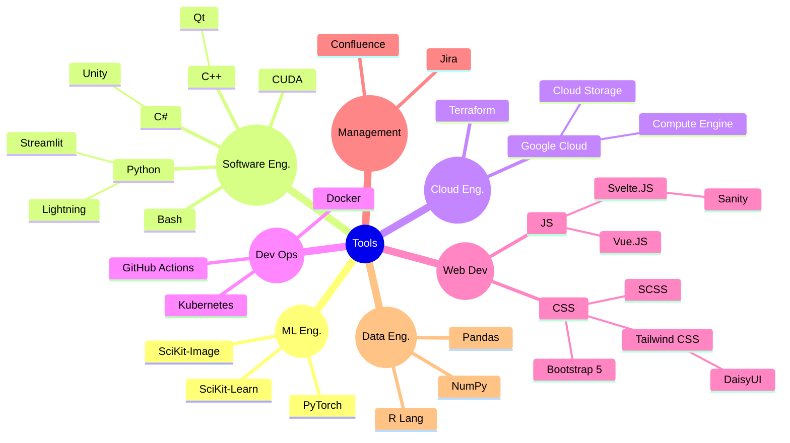

I used [jekyll-TeXt-theme](https://github.com/kitian616/jekyll-TeXt-theme/) to
build this website.

# About Me

I'm Evening, I do programming, game-level design, and naturally game a lot.

I mostly work on projects around Vertical Scrolling Rhythm Games, which you
can see [here]({{site.baseurl}}/projects).

Professionally, I'm specializing in Machine Learning Engineering, which
bridges the gap between ML Research and Software Engineering.

## Tools

## Want to know more?

- Connecting professionally? LinkedIn in the footer.
- Connecting unprofessionally? Twitter in the footer.

