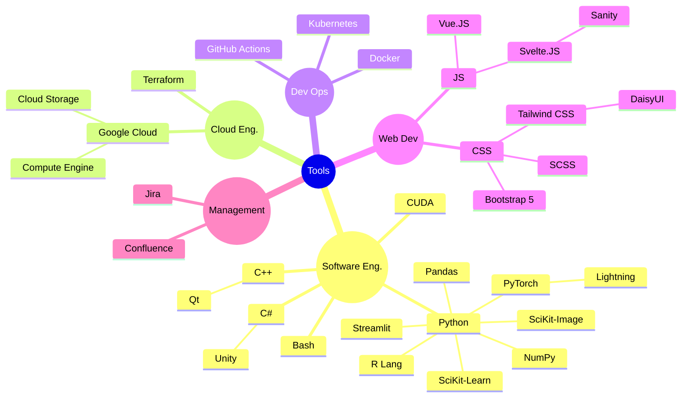

# About Me

I'm Evening, I do programming, game-level design, and naturally game a lot.

I mostly work on projects around Vertical Scrolling Rhythm Games, which you
can see [here]({{site.baseurl}}/projects).

Professionally, I'm specializing in Machine Learning Engineering, which
bridges the gap between ML Research and Software Engineering!

## Philosophy

I believe that one of my life's missions is to at least yield a net positive
impact, simply because if everyone achieves that the world is improving bit
by bit :+1:

I'm _blessed_ with the fact that I'm passionate about everything programming
despite a large population having negative sentiments about software
engineering. *And no, I'm not forcing myself to like programming, it's just
naturally easy for me.*

Most of my programs aim to cut time-taken for you to achieve a certain task,
for example, one of my more popular tools
[re:amber](https://github.com/Eve-ning/reamber) saved mappers thousands of hours
punching a calculator or populating Excel sheets. If I've saved an hour, across
24 people, the 1-day effort is worth the time.

## Tools

I use the following suite of tools. Nodes with a full border are my
stronger skills.

Most skills here, I've learnt on the fly in weeks to a few months.
Considering how fast technologies come and go, I believe
that the value of a programmer isn't tied to the total time-sunk into
respective technologies, instead, the time-taken to learn a new one.

We should not only consider the time saved **now**, but also the time saved
later, thus I'm always exploring the most popular least headache approach to do
things.

